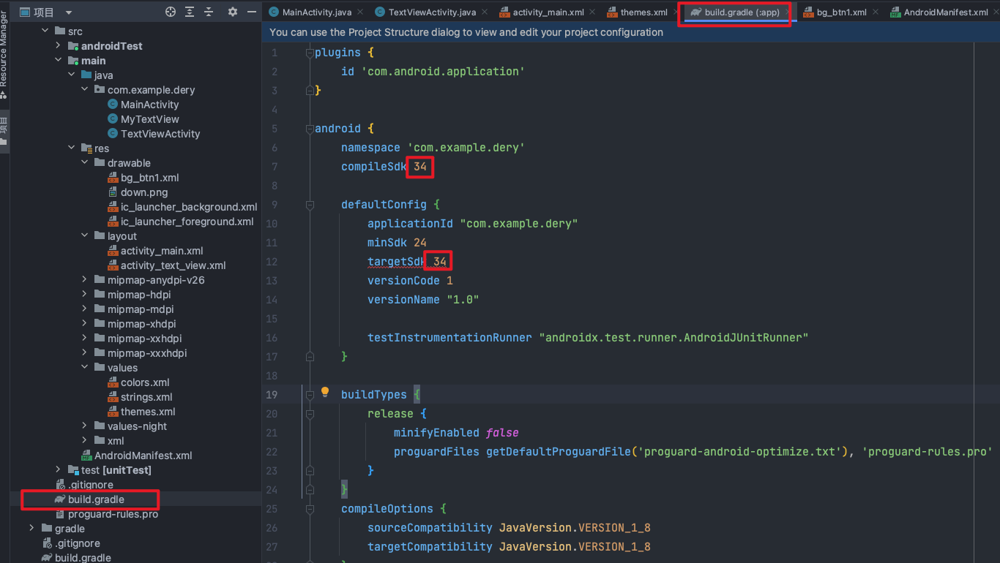

### sdk版本出错，导致不能启动app
编译时报错：
```python
An issue was found when checking AAR metadata:

1.  Dependency 'androidx.activity:activity:1.8.0' requires libraries and applications that
depend on it to compile against version 34 or later of the
Android APIs.

:app is currently compiled against android-33.

Also, the maximum recommended compile SDK version for Android Gradle
plugin 8.1.0 is 33.

Recommended action: Update this project's version of the Android Gradle
plugin to one that supports 34, then update this project to use
compileSdk of at least 34.

Note that updating a library or application's compileSdk (which
allows newer APIs to be used) can be done separately from updating
targetSdk (which opts the app in to new runtime behavior) and
minSdk (which determines which devices the app can be installed
on).
```
将下图中框住的sdk版本号由33（原本的，会导致报错的）改为34（报错中推荐的）。<br />
### Button组件background熟悉不生效
> [https://blog.csdn.net/weixin_52089884/article/details/122616834](https://blog.csdn.net/weixin_52089884/article/details/122616834)

将`app/src/main/res/values/themes.xml`中的：
```python
<style name="Base.Theme.Dery" parent="Theme.Material3.DayNight.NoActionBar">
```
改为：
```python
<style name="Base.Theme.Dery" parent="Theme.MaterialComponents.DayNight.DarkActionBar.Bridge">
```
