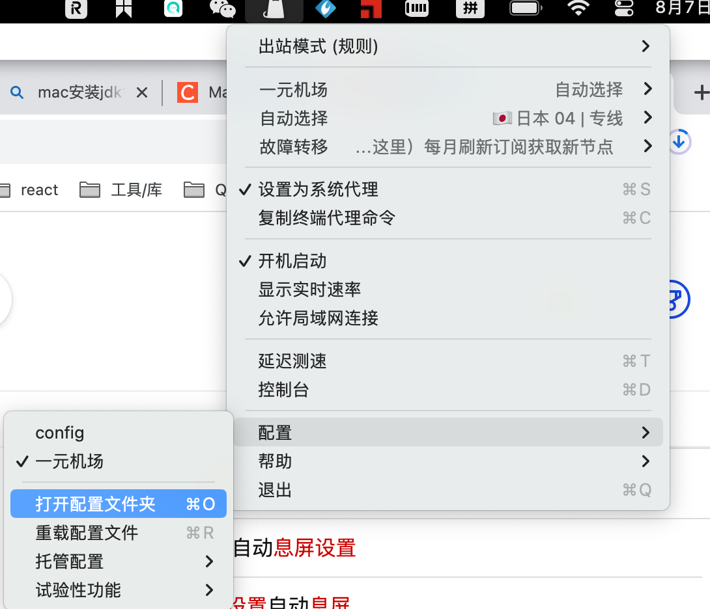
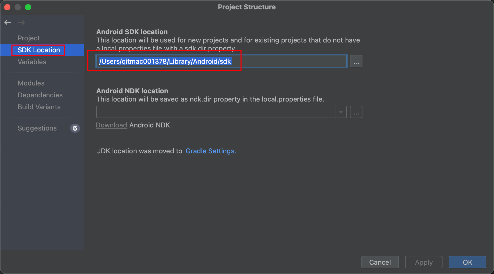
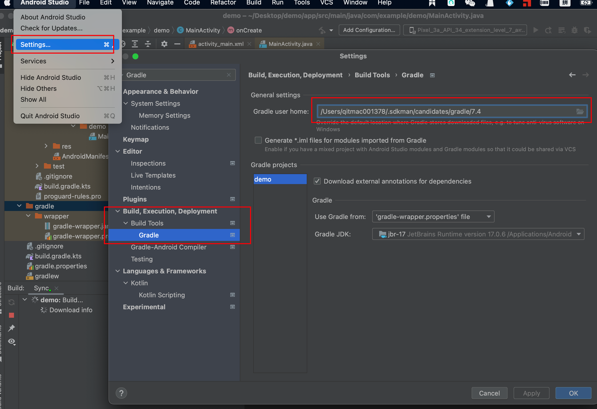
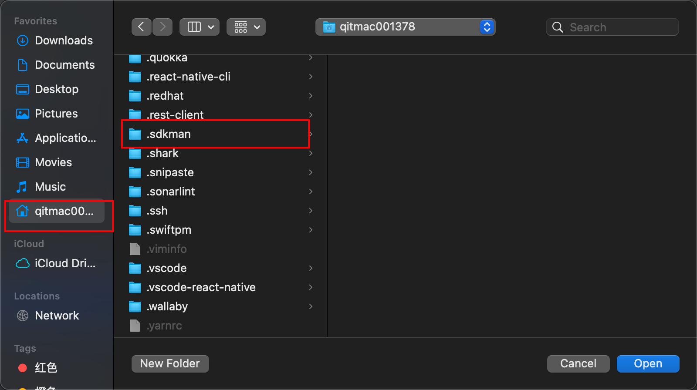
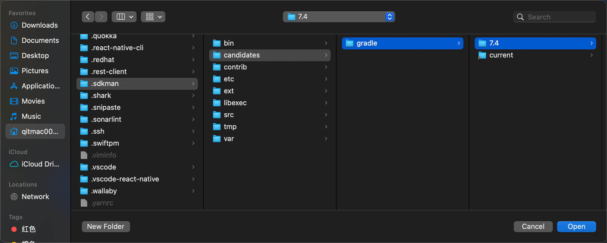
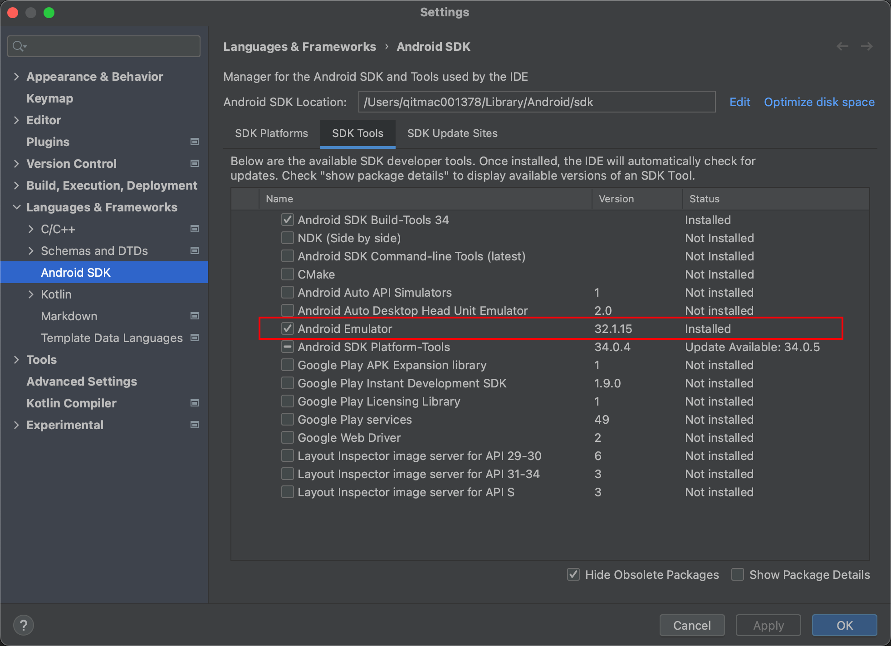

### **一、安装 JDK**
**下载地址：**[https://www.oracle.com/cn/java/technologies/downloads/#java11-mac](https://www.oracle.com/cn/java/technologies/downloads/#java11-mac)<br />**建议安装jdk8和jdk11两个版本。（两个都要装）**
> **jdk8下载地址：**[**https://download.oracle.com/otn/java/jdk/8u381-b09/8c876547113c4e4aab3c868e9e0ec572/jdk-8u381-macosx-x64.dmg**](https://download.oracle.com/otn/java/jdk/8u381-b09/8c876547113c4e4aab3c868e9e0ec572/jdk-8u381-macosx-x64.dmg)

> **jdk11下载地址：**[**https://www.oracle.com/java/technologies/javase/jdk11-archive-downloads.html**](https://www.oracle.com/java/technologies/javase/jdk11-archive-downloads.html)

安装完成后，在终端执行：`java -version`即可查看java版本，`java version "1.8.0_381"`表示的就是jdk8。
### **二、安装 Gradle**
推荐用sdkman安装gradle，方便版本切换
#### 安装sdkman：https://sdkman.io/install

1. 打开终端，执行如下命令：
```
curl -s "https://get.sdkman.io" | bash
```

2. 新建一个终端，执行如下命令：
```bash
source "$HOME/.sdkman/bin/sdkman-init.sh"
```
若执行`sdk version`出现`sdkman 5.18.2`则表示安装成功
#### 安装sdkman失败记录
执行`curl -s "[https://get.sdkman.io"](https://get.sdkman.io") | bash`后，执行`source "$HOME/.sdkman/bin/sdkman-init.sh"`失败，发现`.sdkman`目录下没有生成bin文件夹。<br />关闭代理（clashx）后，删除`.sdkman`文件夹`rm -rf ~/.sdkman`，在终端执行：`export https_proxy=http://127.0.0.1:7890;export http_proxy=http://127.0.0.1:7890;`重新执行安装步骤，成功。<br />`export https_proxy=http://127.0.0.1:7890;export http_proxy=http://127.0.0.1:7890`命令是一次性的，只在当前终端生效，7890端口为clash的端口，查看方式如下：<br /><br />配置文件夹下打开config.yaml文件，查看端口号，即mixed-port: 7890
#### 用sdkman安装gradle，如安装gradle7.4版本命令如下：
```
sdk install gradle 7.4
```
### **三、安装 Android Studio**
#### （一）下载 Android Studio
下载地址：[https://developer.android.google.cn/studio](https://developer.android.google.cn/studio) 直接下载最新的dmg文件，安装，一直点 Next 下一步直到完成。
#### （二）设置Proxy

1. 打开新安装的 Android Studio
2. 点击 Android Studio——>settings——>Appearance & Behavior——>System Settings ——>Http Proxy
3. 选择 Manual proxy configuration - HTTP
4. 填写 Host name : `mirrors.neusoft.edu.cn`
5. 填写 Port number : `80`
6. 点击右下角的 Apply
7. 点击右下角的 OK
#### （三）配置SDK

1. 打开新安装的 Android Studio
2. 点击 Android Studio——>settings——>Languages & Fragment ——>Android SDK
3. 配置AndroidSDK目录
4. SDK Platforms勾选33、34
5. SDK Tools选择Android SDK Build-Tools 34、Android SDK Platform-Tools
6. 勾选右下角“Apply” 进行下载
### **四、配置环境变量**

- 进入当前用户的home目录，查看是否有.bash_profile文件
```
cd ~
ls -la | grep 'bash_profile'
#如果没有文件则执行下边命令创建
touch .bash_profile
```

- 执行`open .bash_profile`打开该文件
- 配置jdk、Gradle、AndroidTools全局环境变量(**/jdk-1.8.jdk/目录需要根据自己安装的版本进行配置**)
> Mac电脑上adb的安装与配置：
> [https://zhuanlan.zhihu.com/p/415513259](https://zhuanlan.zhihu.com/p/415513259)

查看sdk路径：<br />
```
source /opt/homebrew/opt/nvm/nvm.sh
#export JAVA_HOME=/Library/Java/JavaVirtualMachines/jdk-1.8.jdk/Contents/Home
#THIS MUST BE AT THE END OF THE FILE FOR SDKMAN TO WORK!!!
export SDKMAN_DIR="$HOME/.sdkman"
[[ -s "$HOME/.sdkman/bin/sdkman-init.sh" ]] && source "$HOME/.sdkman/bin/sdkman-init.sh"

export JAVA8_HOME=/Library/Java/JavaVirtualMachines/jdk-1.8.jdk/Contents/Home
export JAVA11_HOME=/Library/Java/JavaVirtualMachines/jdk-11.jdk/Contents/Home
#快速在命令行切换jdk版本命令
alias jdk8='export JAVA_HOME=$JAVA8_HOME'
alias jdk11='export JAVA_HOME=$JAVA11_HOME'
#default java11
export JAVA_HOME=$JAVA11_HOME

#设置Android相关环境变量
#export ANDROID_HOME=~/android-sdks;
export ANDROID_HOME=/Users/qitmac001378/Library/Android/sdk;	#这种配置sdk环境变量的方式比较好，上面那种方式不能使用adb命令
export ANDROID_HOME_TOOLS=${ANDROID_HOME}/platform-tools;
export ANDROID_TOOLS=${ANDROID_HOME}/tools:${ANDROID_HOME}/build-tools/33.0.0:${ANDROID_HOME}/cmdline-tools/latest/bin;
export ANDROID_NDK_HOME=${ANDROID_HOME}/ndk-bundle;
#设置Gradle相关环境变量
export GRADLE_HOME=~/.sdkman/candidates/gradle/current/bin;
export PATH=${PATH}:${ANDROID_HOME}:${ANDROID_HOME_TOOLS}:${ANDROID_TOOLS}:${GRADLE_HOME}:${ANDROID_NDK_HOME}/toolchains/aarch64-linux-android-4.9/prebuilt/darwin-x86_64/bin;
 
```

- cmd + s 保存文件，切到终端窗口，执行如下命令：
```
source .bash_profile
```

- 查看gradle版本号，在终端执行如下命令：`gradle -v`，出现下边提示，就代表gradle配置成功了
```
qitmac001378@bogon ~ % gradle -v           

Welcome to Gradle 7.4!

Here are the highlights of this release:
 - Aggregated test and JaCoCo reports
 - Marking additional test source directories as tests in IntelliJ
 - Support for Adoptium JDKs in Java toolchains

For more details see https://docs.gradle.org/7.4/release-notes.html


------------------------------------------------------------
Gradle 7.4
------------------------------------------------------------

Build time:   2022-02-08 09:58:38 UTC
Revision:     f0d9291c04b90b59445041eaa75b2ee744162586

Kotlin:       1.5.31
Groovy:       3.0.9
Ant:          Apache Ant(TM) version 1.10.11 compiled on July 10 2021
JVM:          11.0.19 (Oracle Corporation 11.0.19+9-LTS-224)
OS:           Mac OS X 13.0 aarch64

```

- 最后Android Studio配置gradle

在Android Studio，选择 Preferences ，选择Build,Execution, Deployment -->Build Tools -->Gradle，配置 Gradle user home：~/.sdkman/candidates/gradle/7.4，点击右下角的 Apply，然后点击右下角的 OK。<br />上述方式设置的是相对路径，可能会有找不到gradle的问题，按下图设置绝对路径解决问题：<br /><br />mac快捷键：`command + shift + .`可以查看隐藏文件，找到.sdkman，一路向下找到gradle。<br /><br />

**五、构建项目**<br />如果构建项目时报错，无法下载com.android.tools.build:gradle:x.x.x' "HTTP/1.1 400 Bad Request 之类的信息。就配置成clashx的代理。
```
1. 打开 Android Studio
2. 点击 Android Studio——>settings——>Appearance & Behavior——>System Settings ——>Http Proxy
3. 选择 Manual proxy configuration - HTTP
4. 填写 Host name : localhost
5. 填写 Port number : 7890
6. 点击右下角的 Apply
7. 点击右下角的 OK
```

### 六、启动项目报错
> 参考：[https://blog.csdn.net/g984160547/article/details/118612073](https://blog.csdn.net/g984160547/article/details/118612073)

安卓模拟器下载失败，按下图把Emulator下载上问题解决。<br />
