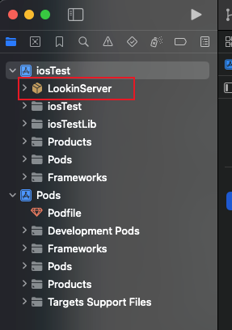
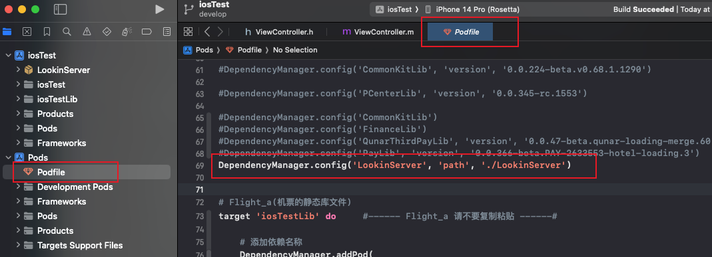
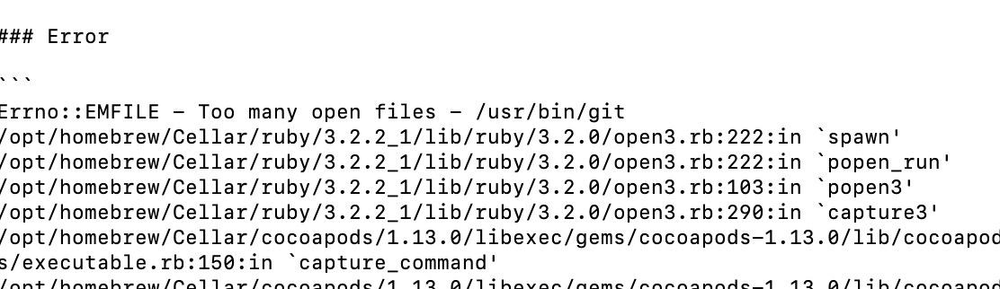
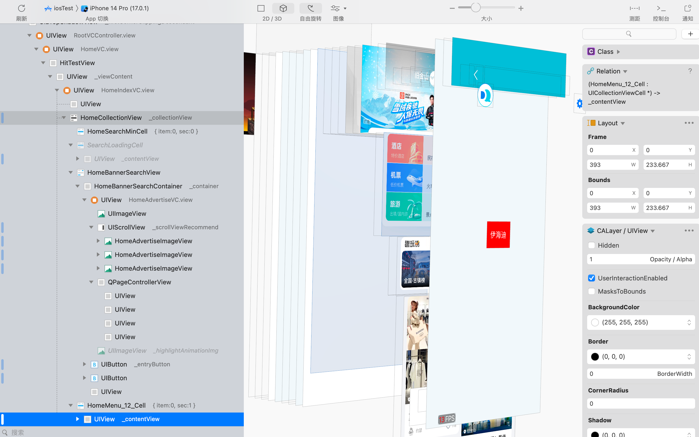

### 在工程中引入LookinServer
#### 从github下载 LookIn 源码 [https://github.com/QMUI/LookinServer/](https://github.com/QMUI/LookinServer/)
#### 2.将源码直接拷贝到大客户端工程目录下
#### 
#### 在 podfile 文件中，添加库依赖 `DependencyManager.config('LookinServer', 'path', './LookinServer')`
 这里需要注意，添加的库依赖路径：`./LookinServer`需要与你下载的LookIn源码文件夹名字一致。
#### pod update
这里pod update有可能报错：Too many open files  **解决方式，终端执行：**`ulimit -n 2048`
#### 从官网下载 LookIn [https://lookin.work/](https://lookin.work/)
#### 启动app，并打开 LookIn
先在Xcode启动app，再打开LookIn软件，就可以自动弹出UI调试界面。 

