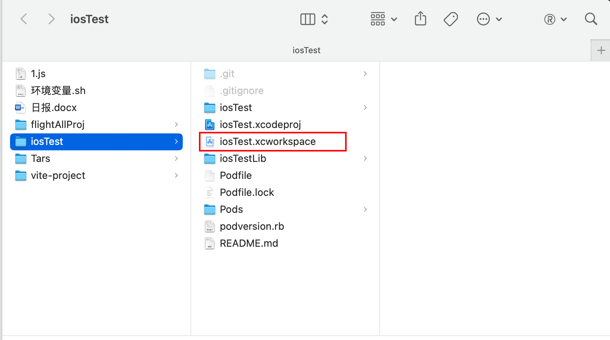
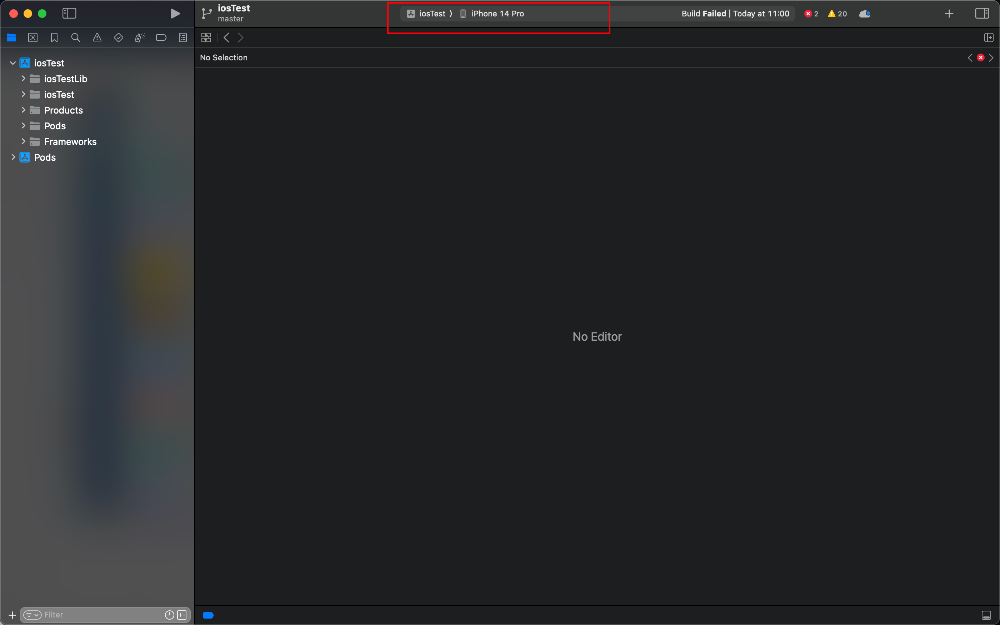

### 安装cocoapods
终端执行：`brew install cocoapods`安装cocoapods，执行`pod setup`使生效，执行`pod --version`如出现版本号则说明安装成功。
### 拉取课程代码并安装依赖
> 代码地址：git@gitlab.corp.qunar.com:yu.cui/iosTest.git

拉取代码后进入工程根目录，执行`pod install`安装依赖
### 打开工程
进入项目文件夹，双击`iosTest.xcworkspace`打开工程。 
### 安装依赖
打开工程后，下图位置会提示安装IOS17模拟器，点击get安装。 
