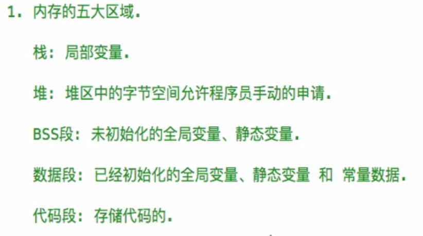

## 语法总结
### %p和%@
`%p`打印的是指针变量的值。<br />`%@`打印的是指针变量指向的对象。
```objectivec
int main(int argc, const char * argv[]) {
    // @autoreleasepool：自动释放池
    @autoreleasepool {
        NSString *i = @"try";
        NSLog(@"%@", i);    // try
        NSLog(@"%p", i);    // 0x100004048（指针变量存储的是地址，所以指针变量的值就是一个地址）
    }
    return 0;
}
```

## 内存相关

