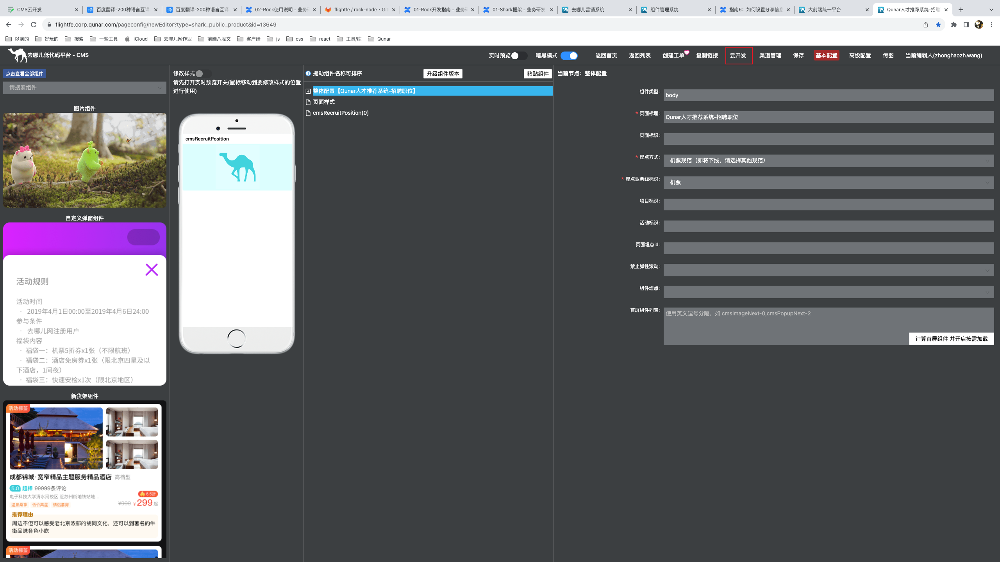
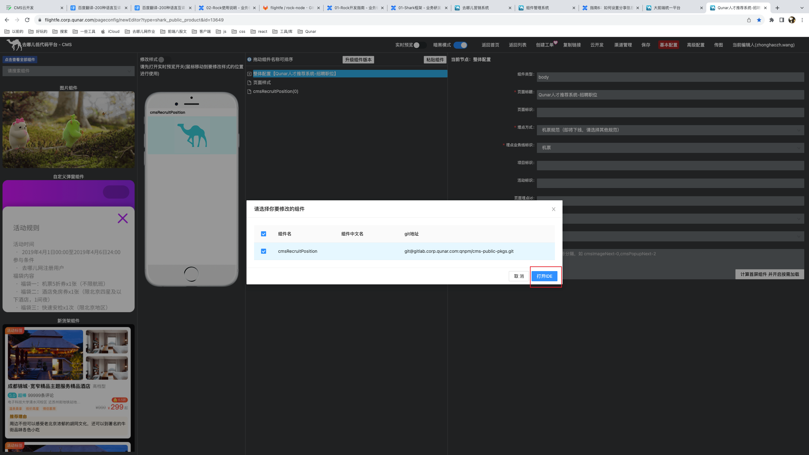
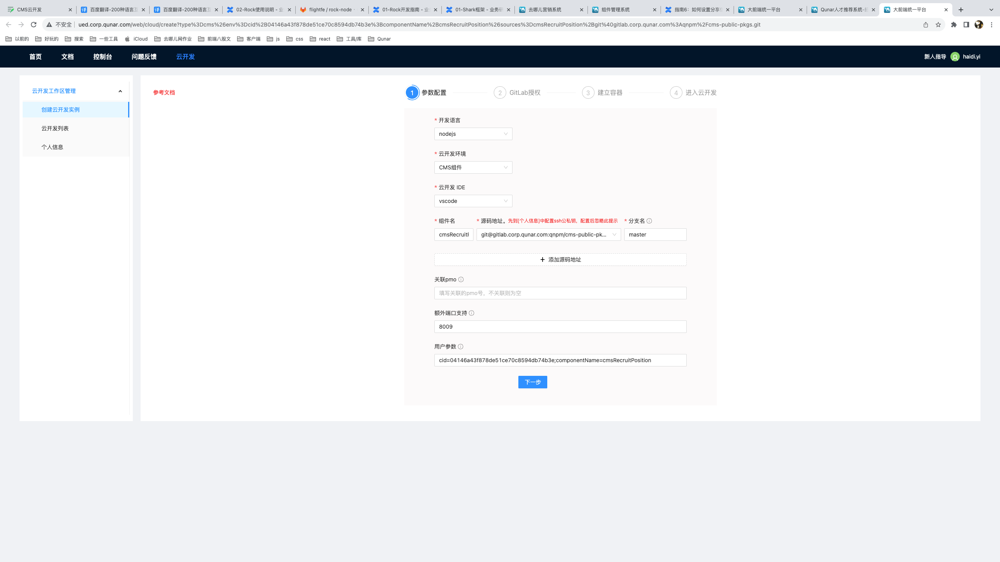

> 地址：[https://flightfe.corp.qunar.com/pageconfig/newEditor?type=shark_public_product&id=13649](https://flightfe.corp.qunar.com/pageconfig/newEditor?type=shark_public_product&id=13649)

 上图配置都是默认的，没有改过。点击下一步就会在新标签页打开webide。 在webide中打开终端，`cd ..`进入根目录，执行`shark dev`即可启动项目。
### CMS启动多个组件

