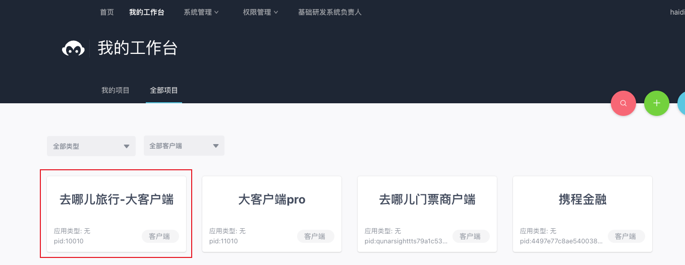
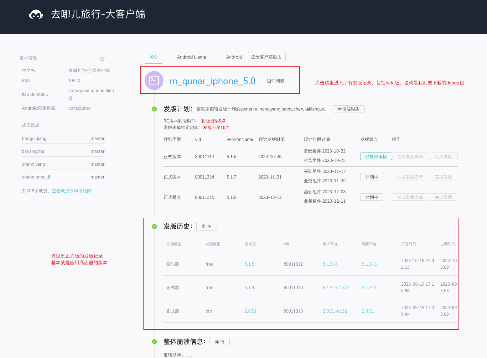
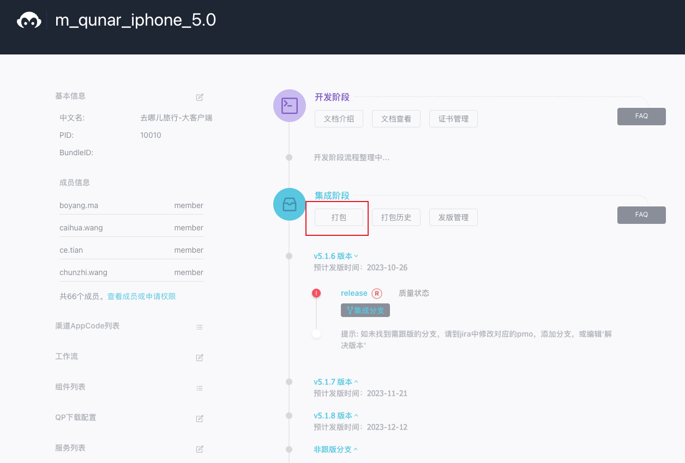
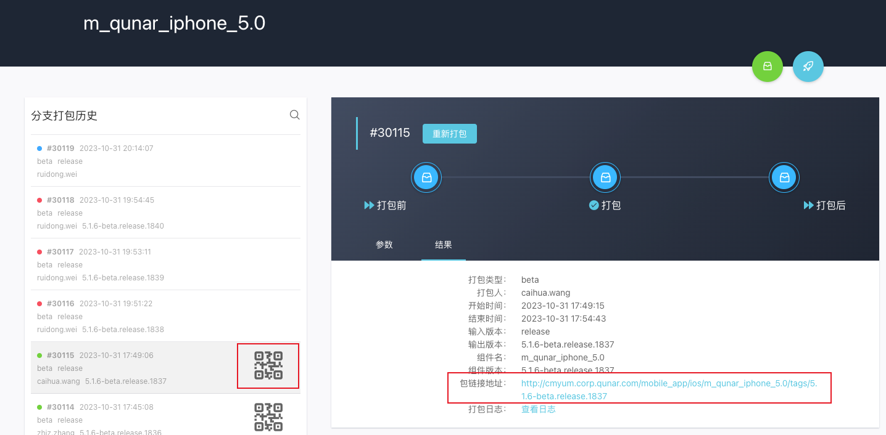
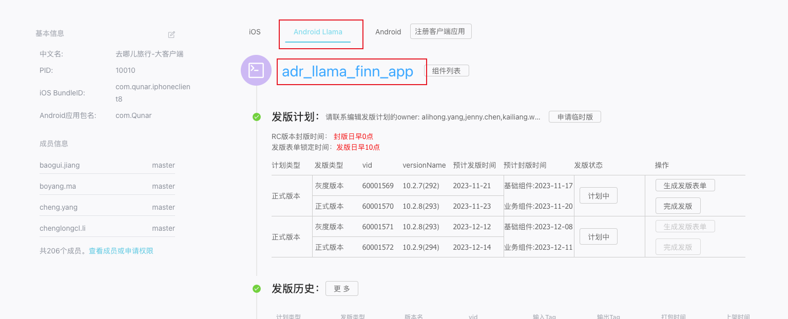

### MD平台选择：“去哪儿旅行-大客户端”

### IOS按下图操作
####  

####  

#### 扫码或点击链接下载beta包即可。

### Adr按下图操作
切换到Adr，且他和IOS一样。 

### 模拟器中安装的包
> 下载链接：[http://cmyum.corp.qunar.com/mobile_app/ios/m_qunar_iphone_5.0/tags/5.1.9-beta.release.2223/](http://cmyum.corp.qunar.com/mobile_app/ios/m_qunar_iphone_5.0/tags/5.1.9-beta.release.2223/)

模拟器中安装的包和真机中不同，需要在md平台打包时选择打包类型为模拟器。

### Jeeves下载
> 链接：[https://fir.xcxwo.com/Jeeves](https://fir.xcxwo.com/Jeeves)

