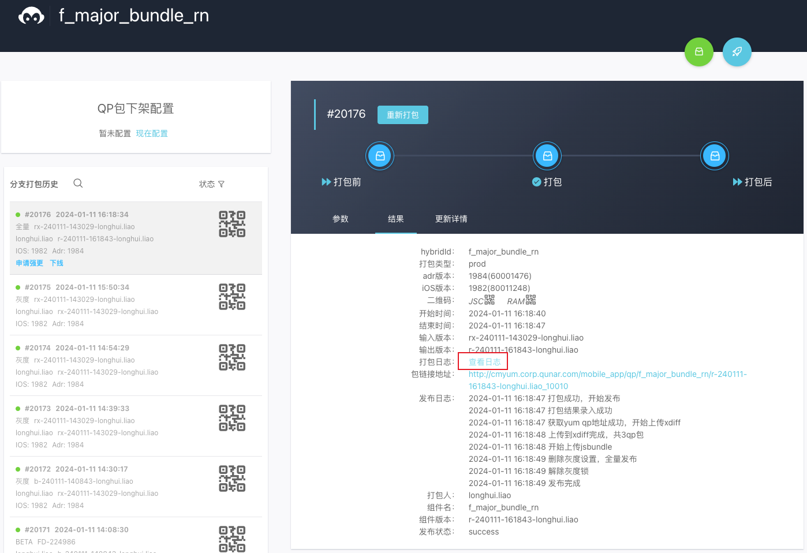

## MD平台打包
> MD平台地址：[https://md.corp.qunar.com/home](https://md.corp.qunar.com/home)

打包`flight_major_bundle`库：在MD平台中，此库的名字叫`f_major_bundle_rn`
### 打开MD平台，点击热发组件
### 全部项目中搜索到f_major_bundle_rn库

### 点击查看，进入后点击打包

### 将PMO号填入源码分支位置，点击一下ISO版本或Adr版本区域，点击开始打包即可

### 打包完成后，可以看到打包的信息和QP包的二维码

## 手机debug包验证
### DebugSetting -> QP调试 -> 扫描替换qp包
扫描MD平台打包之后生成的二维码，即可将手机上的debug包替换为MD平台打包后的包(MD平台的包，除了基础功能外，只具有当前PMO的新功能) 
### 点击RNTools -> 查看设备信息 -> QP包信息，查看版本号信息与刚刚打包的是否一样
版本号信息与刚刚打包的如果一样，说明QP包替换成功了，否则就得再执行一次扫描替换qp包步骤。
> 我这个图里的版本号是随便截的。

### 手机debug包QRN调试界面，选择Release
此时已经把包发布了，不需要连接电脑上的代码了，所以选择release可以运行更快些。
### 配置软路由（如果后端把代码发布到了软路由环境的话）
### 功能测试完后，可以点击QP调试界面右上角的清空本地qp包，把刚才扫描替换的qp包清除。
### 注：和并master分支后，如果qrn.lock存在冲突，则直接把qrn.lock文件删除，重新qrn install。
## 发灰度
### 发灰度0%：选择打好的bete包，点击发灰度，将灰度的手机uid填写好(uid间用英文逗号分隔)

#### 查看设备uid(方法一，推荐)
> 大前端统一平台(开发工具中有apphelper平台链接)：[https://ued.corp.qunar.com/web](https://ued.corp.qunar.com/web)
> apphelper平台：[https://ued.corp.qunar.com/apphelper/#infos-app](https://ued.corp.qunar.com/apphelper/#infos-app)

##### 信息查询界面划到底部点击开始查询

##### 在弹出的选择框中点击生成数字码

##### 用手机任意去哪app我的界面的扫一扫功能扫描此二维码，即可获得手机设备的一些信息，uid就在其中。

#### 查看设备uid(方法二)
去哪app中点击`RNTools`功能球，点击查看设备信息选项，即可看到uid信息 
### 发灰度时可能会要求进行自动化测试
#### 在PMO中点击TARS自动化进入Tars平台

#### 在PMO进入直接就到了下图界面，选好项目分支即可点击开始打包，等case执行完毕且成功了90%以上时，就可以发灰度了。

### 灰度0%之后，产品和自己验证都没问题，可以发灰度10%（此时需要看监控了）
#### 点击重新打包，把灰度百分比调整为10即可。

#### 看监控
> 监控链接：
> [https://watcher.corp.qunar.com/dashboard/team/?path=qunar.team.flight.userproduct.core_monitor_P1.ANR_crash_RN&from=now-2d&to=now](https://watcher.corp.qunar.com/dashboard/team/?path=qunar.team.flight.userproduct.core_monitor_P1.ANR_crash_RN&from=now-2d&to=now)
> [https://watcher.corp.qunar.com/dashboard/team/?path=qunar.team.fe.performance.flight&from=now-2d&to=now](https://watcher.corp.qunar.com/dashboard/team/?path=qunar.team.fe.performance.flight&from=now-2d&to=now)

上面链接对应下图中的两个监控，界面右上角可以调节横坐标间隔，以及页面自动刷新事件（默认不自动刷新，调整成30s吧）  
#### 看apm移动监控平台
> 地址：
> [http://apm.corp.qunar.com/crash/advanced-search?pid=10010-adr&logType=prod&tabs-type=aggBug&biz=2&appCode=f_major_bundle_rn&pageNum=1](http://apm.corp.qunar.com/crash/advanced-search?pid=10010-adr&logType=prod&tabs-type=aggBug&biz=2&appCode=f_major_bundle_rn&pageNum=1)

进入apm平台后，点击高级搜索，在红框中输入工程名，然后点击搜索，下方将出现崩溃情况，可以看到在自己发布后是否有崩溃。 

### 灰度10%后，半小时内，如果没有发生啥异常，且设备更新数(Adr+IOS)到了4000以上，可以发全量，如果半小时内设备更新数没到4000，则可以将灰度往大了调些(比如调整到50%)。

## 看size
  
