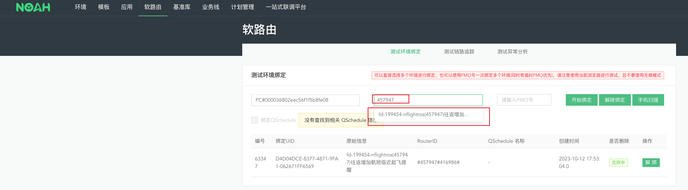
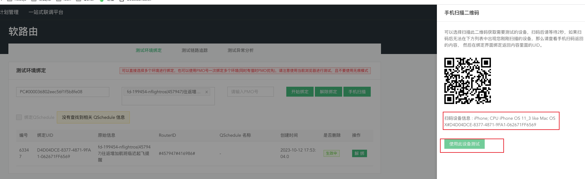
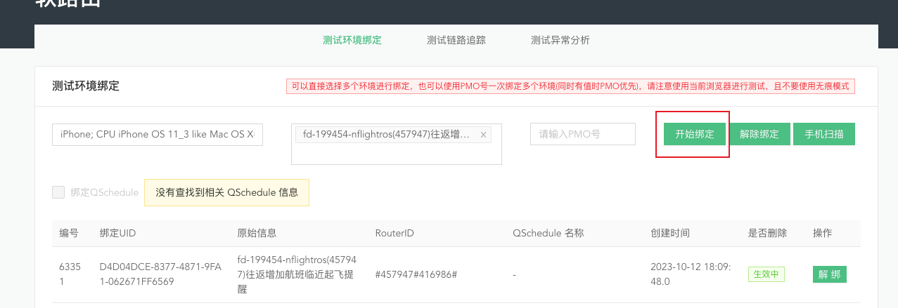
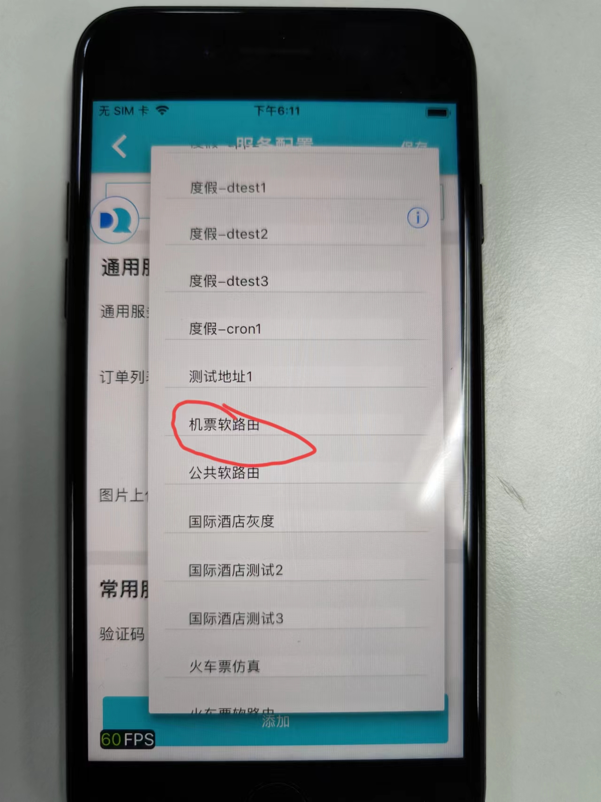

> NOAH地址：[https://noah3.corp.qunar.com/webapp/index.html#/softroute](https://noah3.corp.qunar.com/webapp/index.html#/softroute)

### 进入NOAH后点击软路由，根据后端给的链接中的id搜索
后端给的链接：[https://noah3.corp.qunar.com/webapp/index.html#/env/checkEnv?id=457947](https://noah3.corp.qunar.com/webapp/index.html#/env/checkEnv?id=457947)  

### 选中环境后点击右侧手机扫描按钮，使用手机debug包的我的界面右上角的扫一扫扫描NOAH平台出现的二维码
手机debug包扫描后出现设备信息，点击`使用此设备测试`按钮。 
### NOAH中点击“开始绑定”按钮

### 手机debug包中切换服务为“机票软路由”
服务配置 -> 通用服务 
