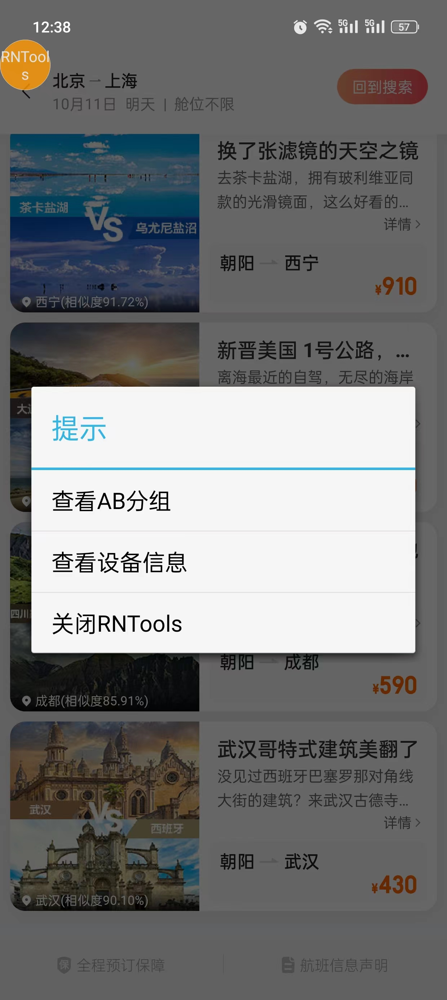
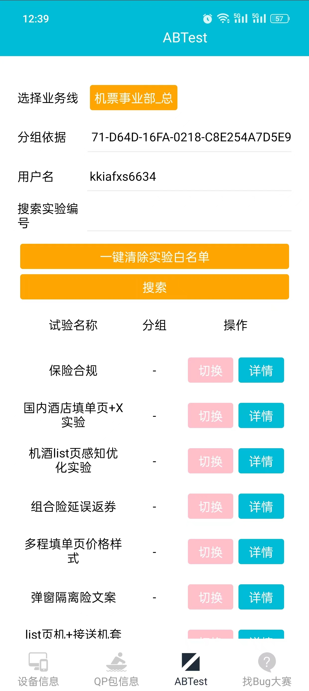
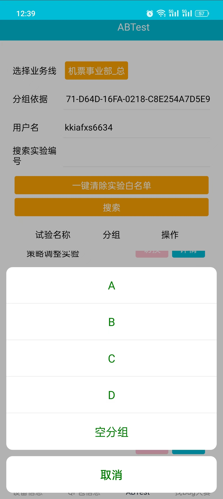

1. 进入机票首页一屏
2. 点击RNTools，出现选项如下图，随意点击一项进入设置页面

3. 点击ABTest进入AB实验样式设置界面（这里包含了所有设置了AB实验的模块）

4. 找到自己需要修改AB实验样式的模块，点击切换，选择要切换的样式序号即可

### 备注
debug包默认进入机票首页一屏就有`RNTools`按钮。线上包可以在机票首页二屏底部左下角连点5下（如下图红圈部分），调出`RNTools`按钮（一次性的，设置后或者关闭app后就消失了，再想用还需要再次点击5下） 
