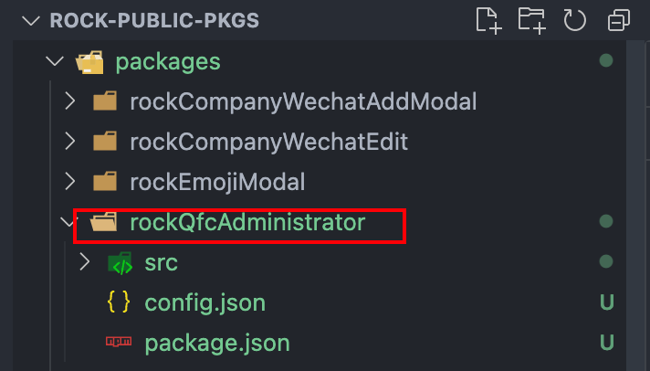

> 将rock-client文件夹中的组件，迁移到rock-public-pkgs文件夹中。

以迁移qfcAdministrator组件为例，qfcAdministrator组件在rock-client中的地址为：/rock-client/src/components/qfc/qfcAdministrator，目标迁移到：rock-public-pkgs/packages/rockQfcAdministrator，rockQfcAdministrator文件夹在rock-public-pkgs需要使用命令创建的。
### 进入rock-public-pkgs文件夹根目录，执行rock add rockQfcAdministrator创建新组件
rock add创建的组件必须以rock开头，<br />此命令的执行结果如下：
```powershell
qitmac001378@QITMAC001378deMacBook-Pro rock-public-pkgs % rock add rockQfcAdministrator
准备添加组件。。。
1.创建组件目录
2.创建组件配置文件
3.创建组件入口文件
组件添加成功！
```
会在rock-public-pkgs/packages文件夹下创建<br />

### 将原本/rock-client/src/components/qfc/qfcAdministrator下的js和css文件复制到rock-public-pkgs/packages/rockQfcAdministrator下，子组件不能复制，子组件要rock add新创建。

