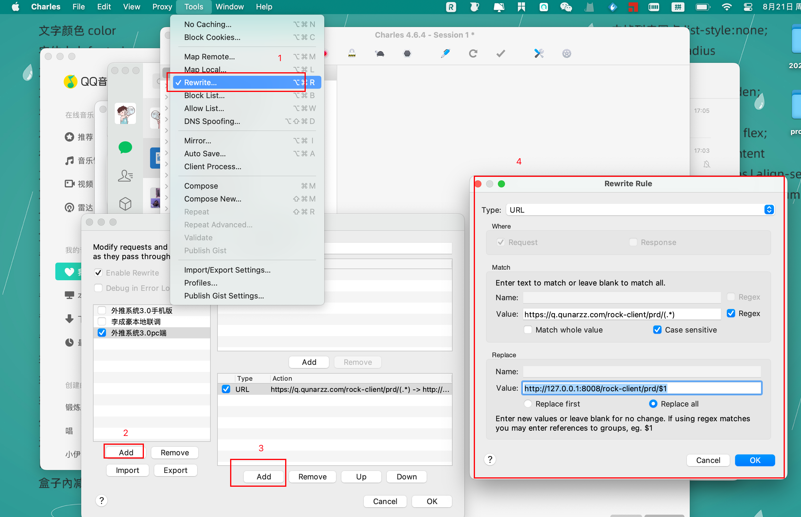

> 这篇文档中启动的是QFC外推系统项目，pc端。

### 1. Clone 项目
首先clone rock-client和 rock-public-pkgs项目，最好放在一个文件夹下。
```
git clone git@gitlab.corp.qunar.com:fe/rock-client.git
git clone git@gitlab.corp.qunar.com:qnpm/rock-public-pkgs.git
```
### 2.安装相关依赖
#### 切换node版本
```
# node 版本需要 >=10
nvm install 10
nvm use 10
```
我使用的node版本是14.20.1，也是可以的
#### 安装依赖：yikt3、 hiproxy、 rock
```
# 安装 ykit3
npm i @qnpm/ykit3-cli@0.0.54 -g

# 安装 hiproxy
npm install hiproxy -g

# 安装 rock
npm install -g @qnpm/rock-cli
```
### 3.运行项目
此时目录结构应为：
```
# 存放项目代码的文件夹 rock-dir
-  rock-dir 
|- rock-client
|- rock-public-pkgs
```
首先在文件夹 rock-dir 下执行命令：
```
rock sync ./rock-client ./rock-public-pkgs
```
新建终端，进入 rock-client 执行
```
npm install
npm run server
```
再新建终端，进入 rock-client执行 ：
```
hiproxy start --open
```
之后会弹出浏览器 hiproxy 页面，在此浏览器新建标签页，输入项目链接。项目链接：[https://talent.qunar.com/](https://talent.qunar.com/)<br />链接复制到`hiproxy`弹出的浏览器后，页面可能为空(没有渲染出来)，需要打开控制台：Network->双击打开红框处链接，打开这个链接后回来此页面刷新，页面内容就可以显示。<br />

### 使用Charles代理，不使用hiproxy了
Charles代理配置如下：<br /><br />使用Charles代理后，在rock-client文件夹下执行npm run server后，直接在浏览器打开项目链接：[https://talent.qunar.com/](https://talent.qunar.com/)即可。
