### 查看watcher面板
### 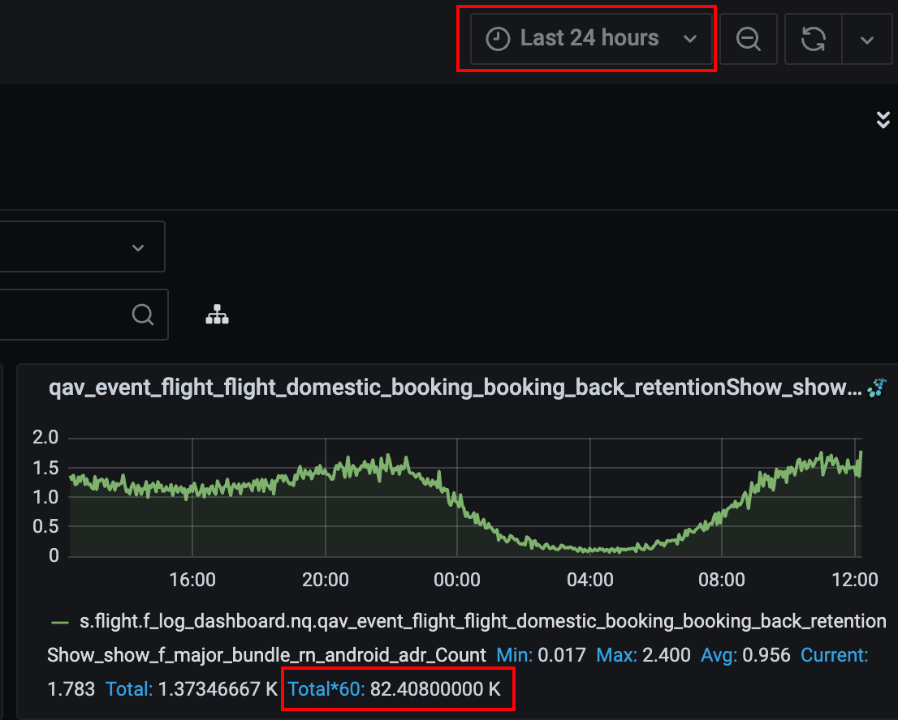
统计的是pv指标。<br />纵坐标：标识单位时间的量（单位时间具体是几秒还是几分钟不知道）<br />横坐标：时间区间<br />Total * 60：当前选中区间的面板中的所有量，比如选中过去24小时，表示的就是过去1天的量。<br />watcher面板上的折线图只能看趋势，纵坐标其实意义不大，没办法直观知道确切的一个时间点的量，想要看量，需要看Total * 60指标，在红框位置选择要看量的区间即可。<br />自己增加的面板可以按下图流程显示`total * 60`指标：<br />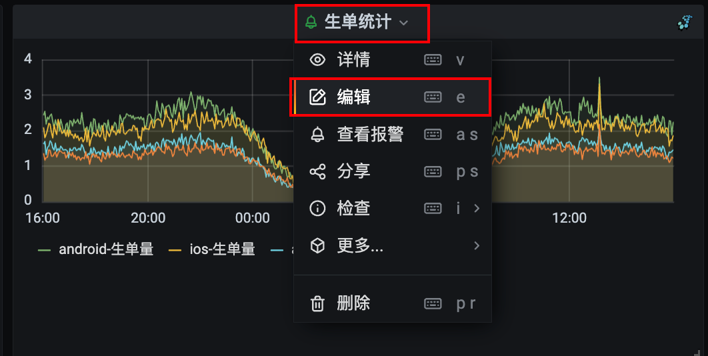<br />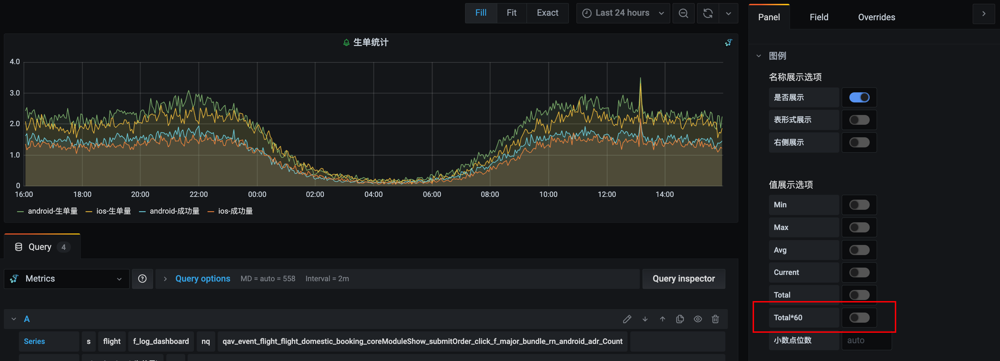
### 增加监控指标
> watcher函数：[http://docs.corp.qunar.com/docs/watcher/function](http://docs.corp.qunar.com/docs/watcher/function)
> [https://wiki.corp.qunar.com/pages/viewpage.action?pageId=702921205](https://wiki.corp.qunar.com/pages/viewpage.action?pageId=702921205)
> [https://wiki.corp.qunar.com/pages/viewpage.action?pageId=509403862](https://wiki.corp.qunar.com/pages/viewpage.action?pageId=509403862)

#### alias：定义变量并重命名
alias的第一个参数为埋点名，第二个参数是实际显示的名字，例：`alias(s.corp.m_pub_loganalysts.nq.app_apm_monitor_default_show_render_ext_tti_com_mqunar_atom_flight_modules_home_HomeActivity_adr_1Hour_P50, 'TTI_adr_1Hour_P50')`<br />埋点名字可以在mark平台按下述步骤获取：<br />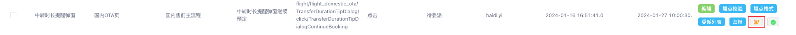<br />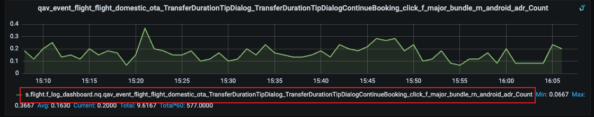
#### sumSeries：加法
sumSeries的两个参数分别是待相加的埋点名字或者已经通过alias方法定义的变量名，例：<br />`alias(sumSeries(#E,#F),'保险挽留弹窗点击量(包含是和否按钮)')`
#### diffSeries：减法
用法与加法一致。
#### asPercent：除法
用法与加法一致。
#### timeShift：前移固定的时间的值
例：alias(timeShift(#A, ‘1d’),'A变量值前移1天')，将A变量的值整体前移1天，重命名为`A变量值前移1天`，可以方便看出A指标同一时间点当前与1天前的对比，做减法后还能根据结果正负判断指标是增加了还是减少了，可以用来做监控。
#### 报警常用公式：
alias(timeShift(#D, '7d'),'7天前数据')<br />alias(diffSeries(#D, #O), 'ios_p90 TTI时间 7天增长')
### 复制单个面板
首先在想要复制的面板处点击：`复制Panel`选项<br />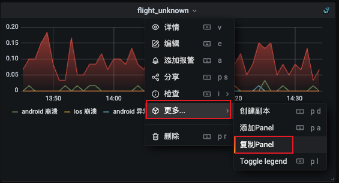<br />然后在新建面板时会有`Paste copied panel`选项，点击即可粘贴刚刚复制的面板<br />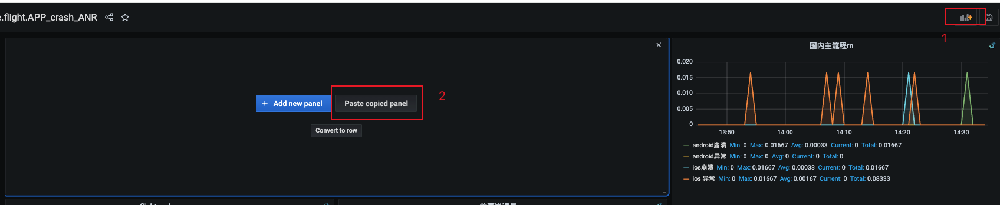
### 复制整个路径下的所有面板
在仪表盘设置中找到`json模式`，复制json中的所有内容，这里面的内容被解析出来就是我们的所有面板。<br />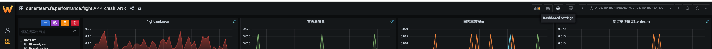<br />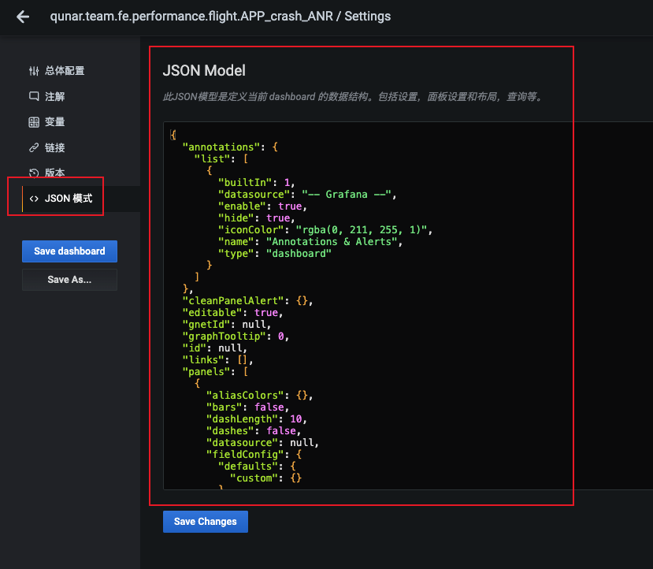<br />在想要粘贴的位置把复制好的json粘贴即可，注意！，若被粘贴的节点不是空的，会覆盖原本节点下的内容。
### 添加报警指标
> [https://wiki.corp.qunar.com/pages/viewpage.action?pageId=92352088](https://wiki.corp.qunar.com/pages/viewpage.action?pageId=92352088)

#### 添加基础信息
在想要添加报警的watcher面板上，点击`添加报警`进去报警添加面板<br />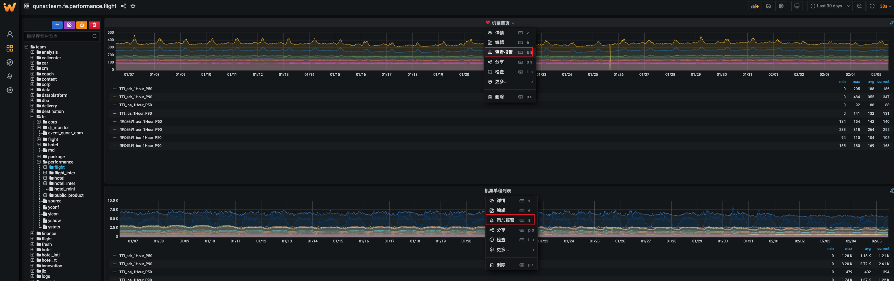<br />在基础信息界面添加报警名称（报警路径应该是会默认带过来的，不用修改）。<br />联系人名单：
```objectivec
@yu.cui,@shuang.xu,@chunzhi.wang,@qimeng.huang,@yanchen.chen,@zhiz.zhang,@junying.zhao,@xinju.dan,@longhui.liao,@taot.chen,@haidi.yi
```
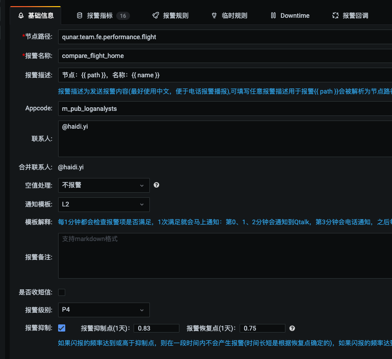
#### 添加报警指标
可以添加多个报警指标，首先在`报警指标`栏将需要报警的watcher监控加上，然后点亮报警图标。<br />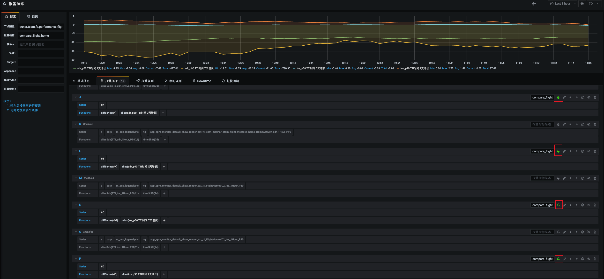

#### 添加报警规则
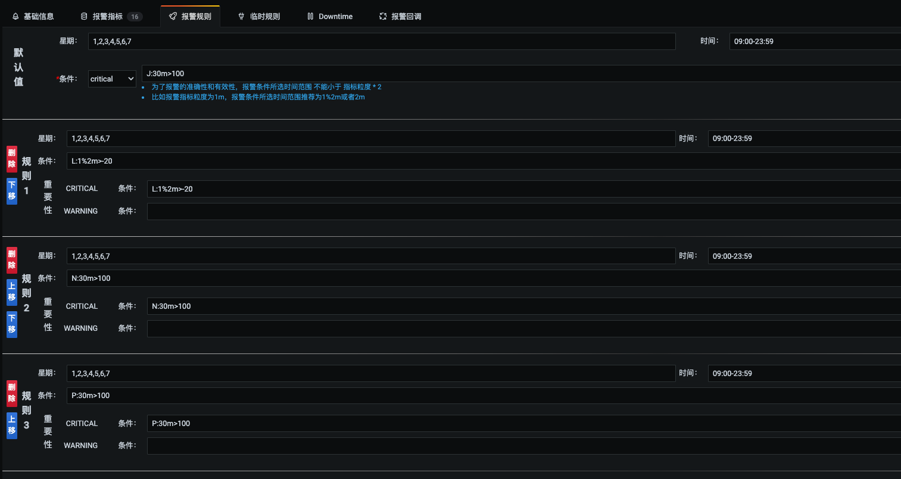
### 国内机票联系人名单
```python
@yu.cui,@shuang.xu,@chunzhi.wang,@qimeng.huang,@yanchen.chen,@zhiz.zhang,@junying.zhao,@xinju.dan,@longhui.liao,@taot.chen,@haidi.yi
```
