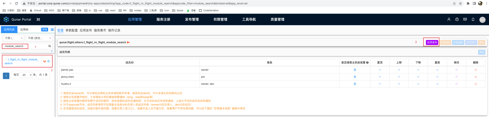
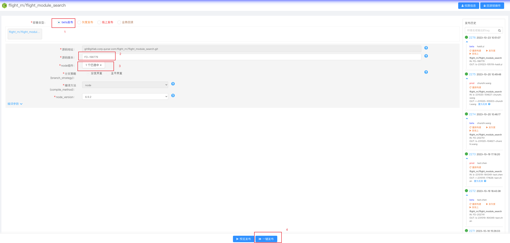
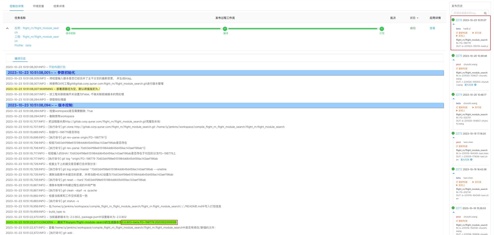

### 进入portal平台，选择要打包的库，点击应用发布按钮

### 选择好要发布的分支，点击一键发布按钮

### 打包成功后，可以看到右侧的打包记录，打包详情中可以看到打包后的版本号

1. flight-module-search工程在portal平台打包后，会生成一个版本号：`模块下@qnpm/flight-module-search的生成版本为2.0.795`
2. 将此版本号填写到flight_major_bundle工程下的package.json中：`"@qnpm/flight-module-search": "2.0.795"`。在本地开发阶段版本号是这样的：`"@qnpm/flight-module-search":"git+ssh://git@gitlab.corp.qunar.com:flight_rn/flight_module_search.git#FD-200664"`
3. 执行`qrn install`（是为了更新qrn.lock文件）
4. 将代码提交到gitlab库

