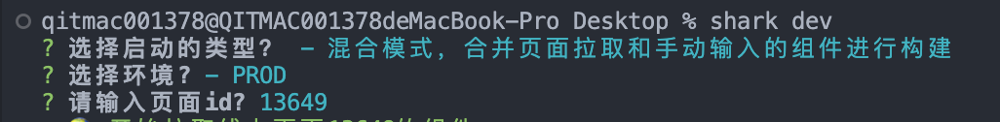
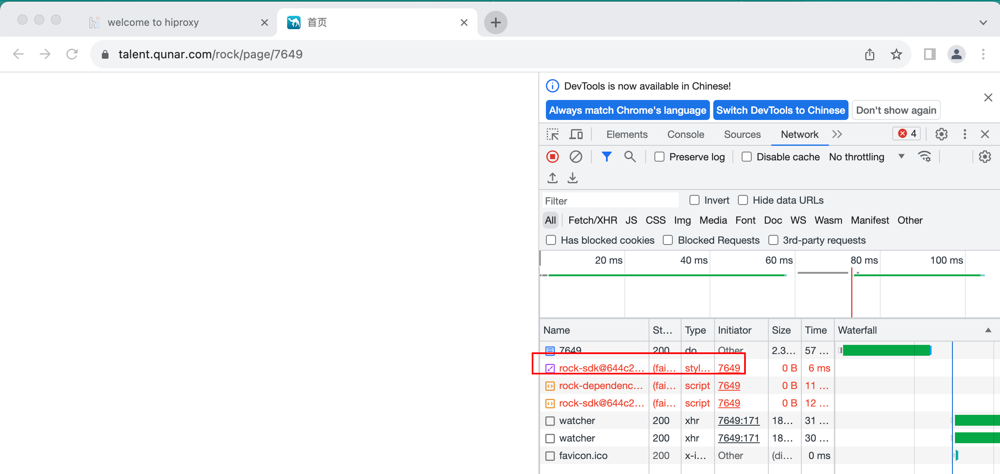

> 参考：
> [https://wiki.corp.qunar.com/confluence/pages/viewpage.action?pageId=543927700](https://wiki.corp.qunar.com/confluence/pages/viewpage.action?pageId=543927700)

安装脚手架：
```
npm install @qnpm/shark-cli -g
```
### 启动shark项目
进入shark项目的上级目录，执行：`shark dev`启动项目
### 启动本地项目
> 所需依赖：
> node版本：v14.20.1
> hiproxy

安装依赖：
```
npm install hiproxy -g
npm install -g @qnpm/ykit3-cli@1.0.9 --registry http://npmrepo.corp.qunar.com
npm install -g @qnpm/shark-cli@2.1.23 --registry http://npmrepo.corp.qunar.com
```
依赖安装好后，进入shark项目的上级目录，执行：`shark dev`启动项目，此时终端显示要选择的信息，选择相应模式，其中页面id是[https://flightfe.corp.qunar.com/pageconfig/newEditor?type=shark_public_product&id=13649](https://flightfe.corp.qunar.com/pageconfig/newEditor?type=shark_public_product&id=13649)网址最后的id数字。<br /><br />此时项目启动起来，`hiproxy`会弹出一个浏览器，此时在终端可能没有输出打开页面的链接，可以去[https://flightfe.corp.qunar.com/pageconfig/newEditor?type=shark_public_product&id=13649](https://flightfe.corp.qunar.com/pageconfig/newEditor?type=shark_public_product&id=13649)平台，点击复制链接。将复制到的链接粘贴到`hiproxy`弹出的浏览器。链接复制到`hiproxy`弹出的浏览器后，页面可能为空(没有渲染出来)，需要打开控制台：Network->双击打开红框处链接，打开这个链接后回来此页面刷新，页面内容就可以显示。<br />

