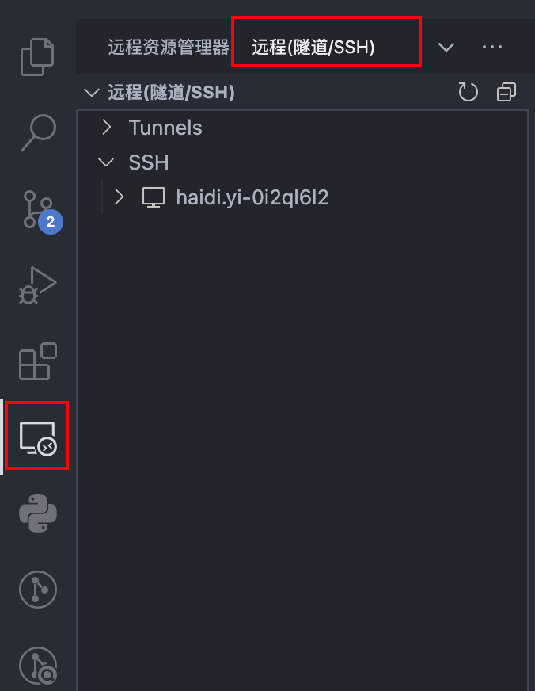
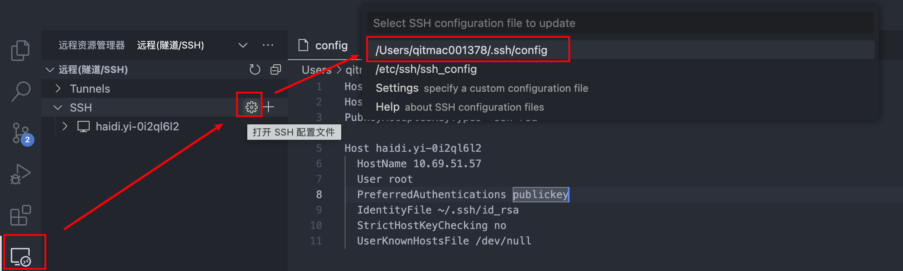
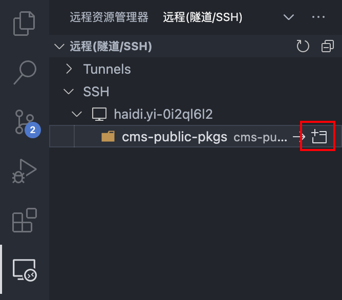

### 介绍
本地IDE连接云开发环境，就是最近比较流行的 Remote Development 远程开发模式，即使用用户本地的IDE，配合远程开发的扩展插件，远程连接云开发环境 进行开发，预览，调试的开发模式。

- 本地IDE：目前本地IDE只支持使用 vscode 
- 远程开发插件：vscode Remote Development插件（[介绍](https://marketplace.visualstudio.com/items?itemName=ms-vscode-remote.vscode-remote-extensionpack)），主要使用其中的 Remote - SSH 插件 
- 云开发环境：指通过云开发管理平台创建的WebIDE开发环境，是运行在k8s环境中的容器，除了可使用本地IDE SSH连接模式，也支持浏览器模式访问
### 配置
为了可以免密登录云开发环境，需要提前上传本地的SSH公钥和私钥：大前端统一平台 → 云开发 → 个人信息，粘贴本地的SSH公钥和私钥(gitlab的)，并保存。
#### 查看本地SSH密钥
终端执行：`cd ~/.ssh`进入密钥存放的路径。该路径下：`id_rsa`和`id_rsa.pub`分别是gitlab的私钥和公钥。<br />mac复制文件内容命令：`pbcopy < id_rsa`。使用该命令复制`id_rsa`文件中的内容粘贴到：大前端统一平台 → 云开发 → 个人信息。
### 本地IDE远程连接云开发环境
#### vscode安装插件：Remote Development
（Remote Development 是包含 Remote-SSH、Remote-Containers、Remote-WSL 3部分的一个组合，我们只需要使用 Remote-SSH）<br />安装成后，本地IDE左侧会多处一项，后续需要使用 “SSH” 下拉选项。<br />

#### 复制SSH配置
大前端统一平台 → 云开发 → 云开发列表：右侧操作处点击复制SSH配置
#### 连接远程开发环境
打开本地vscode，Remote Development插件左侧菜单，下拉选择“SSH”，点击 齿轮按钮，配置远程SSH信息<br />

此时会弹出config文件，将复制的SSH配置追加到此文件中。<br />复制的SSH配置内容：
```
Host haidi.yi-0i2ql6l2
  HostName 10.69.51.57
  User root
  PreferredAuthentications publickey
  IdentityFile ~/.ssh/id_rsa
  StrictHostKeyChecking no
  UserKnownHostsFile /dev/null
```
追加SSH配置后的config文件：
```
Host *
HostkeyAlgorithms +ssh-rsa
PubkeyAcceptedKeyTypes +ssh-rsa

Host haidi.yi-0i2ql6l2
  HostName 10.69.51.57
  User root
  PreferredAuthentications publickey
  IdentityFile ~/.ssh/id_rsa
  StrictHostKeyChecking no
  UserKnownHostsFile /dev/null
```
此时，SSH下会出现远程仓库的名字，点击右侧的文件夹图标即可打开远程仓库。
#### <br /><br />
