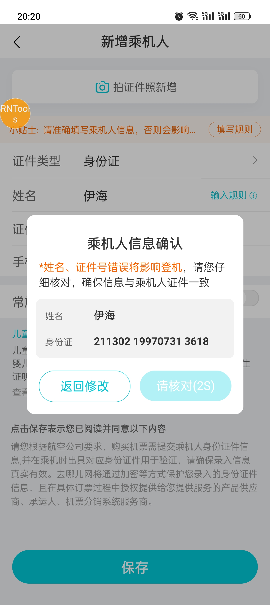

### 需要用到的系统
> 罗盘：[http://cmp.corp.qunar.com/compass/index.jsp](http://cmp.corp.qunar.com/compass/index.jsp)
> 用户中心后台管理系统：[http://admin.corp.qunar.com/main.jsp#](http://admin.corp.qunar.com/main.jsp#)
> Tamias数据平台：[http://tamias.corp.qunar.com/adhoc](http://tamias.corp.qunar.com/adhoc)

### 客服反馈的问题信息
```
订单号：gfw231128165618752
下单时间：2023-11-28 16:56:18
手机号：13450203103
username：kcbdosm7530  
uid：174859217
问题描述：黄芉羽，正确姓名是黄芊羽，辛苦核实用户在拍照识别的时候是否有风险提示用户需要确认
```
```
订单号：yxg231122111938609
下单时间：2023-11-22 11:19:38
手机号：15073156103
username：sypwbup6675    
uid：53E068D6-4DB4-4279-A522-DA508944DAEF      
问题描述：表示下单填写的是中文名何雪康，但是我司系统自动改成了拼音，辛苦核实
```
### 根据订单号去罗盘系统查
> 罗盘系统：[http://cmp.corp.qunar.com/compass/index.jsp](http://cmp.corp.qunar.com/compass/index.jsp)

在订单信息位置输入`订单号`，即可查询此次订单的详细信息。包括uid、用户名、trace等。<br />
#### 点击国内订单详情按钮，可以看到订单更详细的一些信息。
<br />在国内订单详情页面输入订单号可以查询到此用户的更详细的信息，包括此用户的用户名<br />

### 在用户中心后台管理系统查询用户的乘机人信息
> 用户中心后台管理系统：[http://admin.corp.qunar.com/main.jsp#](http://admin.corp.qunar.com/main.jsp#)

#### 首先在用户查询界面拿到用户的uid

#### 然后在常用联系人查询界面根据用户uid拿到此用户添加的所有乘机人

#### 在常用联系人变更日志中可以看到某个乘机人的信息变更

### 在Tamias数据平台查询数据
> Tamias数据平台：[http://tamias.corp.qunar.com/adhoc](http://tamias.corp.qunar.com/adhoc)

#### 查询埋点数据的sql：
##### 使用公共库（基本都用这个，数据比较全）
其中`pp_qav.dwd_flow_qav4ue_behavior_hi`是公共库的名字，里面包含所有埋点的信息。<br />`uid`：用户的设备的标识<br />`dt`：查询的日期<br />`hms`：查询的起始时间（小时，24小时制），查询结果为hms起的1小时内的数据。例：hms='16'表示查询16-17时的数据。
```sql
select * from pp_qav.dwd_flow_qav4ue_behavior_hi  
where dt = '2023-11-28' and hms = '16' and uid='0f0914a158cb9cc4' order by valtime asc
```
##### 使用机票库（没用公共库权限才用这个，只有机票的埋点数据）
其中`flight.dwd_flow_qav_di`是机票库的名字，里面只包含机票相关的埋点的信息。
```sql
select * from flight.dwd_flow_qav_di  
where dt = '2023-07-13' and hour = '08' and uid='b6ff4ed927afefa6' order by valtime asc
```
#### 根据trace查询响应数据的sql
其中`qlibra.flight_server_log`是trace数据库的名字。<br />`dt`：日期<br />`p_qtraceid`：trace
```sql
SELECT * from qlibra.flight_server_log
where dt LIKE '20231122'
and p_qtraceid= 'ops_slugger_231122.111938.10.90.75.124.1425675.8764054796_1'
order by time limit 5000
```
#### 根据T值查询请求和响应数据的sql
##### T值列表：
```
‘f_omPassengers’, //乘机人列表
'f_omUpdPassenger', // 编辑乘机人
'f_omAddPassenger', // 添加乘机人
'f_flight_rn_domestic_preseach',
'f_flight_rn_domestic_flightlist',
'f_flight_rn_domestic_otalist',
'f_flight_rn_domestic_book',
'f_flight_rn_domestic_submit',
'f_flight_cashierInfo',
```
##### T值sql
其中`p_t`是要查询的T值(接口)<br />`user_id`：用户设备的uid<br />`dt`：日期
```sql
SELECT * from qlibra.flight_server_log
where dt LIKE '20231024'
and (p_t='f_flight_rn_domestic_book' or p_t='f_omPassengers' or p_t='f_omUpdPassenger' or p_t='f_omAddPassenger' or p_t='f_flight_rn_domestic_submit')
and user_id= '32E6FBB9-3E74-4258-937F-F7F18F155020'
order by time asc limit 5000
```
### 金坷垃平台
> 金坷垃平台链接：[https://jinkela.corp.qunar.com/s/bu_flight_mdd_default/app/kibana#/discover?_g=(filters:!(),refreshInterval:(pause:!t,value:0),time:(from:now-60m,to:now))&_a=(columns:!(_source),filters:!(),index:'log_ops_deploy-*',interval:auto,query:(language:kuery,query:''),sort:!())](https://jinkela.corp.qunar.com/s/bu_flight_mdd_default/app/kibana#/discover?_g=(filters:!(),refreshInterval:(pause:!t,value:0),time:(from:now-60m,to:now))&_a=(columns:!(_source),filters:!(),index:'log_ops_deploy-*',interval:auto,query:(language:kuery,query:''),sort:!()))
> 使用教程：[https://wiki.corp.qunar.com/pages/viewpage.action?pageId=438572518](https://wiki.corp.qunar.com/pages/viewpage.action?pageId=438572518)
> 金坷垃使用指南：[https://wiki.corp.qunar.com/pages/viewpage.action?pageId=355086413](https://wiki.corp.qunar.com/pages/viewpage.action?pageId=355086413)

<br />标号1中 输入任意查询内容，比如traceid、订单号、uid等，选择标号2中 某个日志库，选择标号3某个时间段，就能查询服务端上传的日志。<br />上图选择某个日志库(标号2处)时，可能用到的appcode如下表。一般格式如 log_xxx 的形式，xxx即相应appcode。<br />appcode（代表某个项目，比如FE项目里面，对应每个项目hybridId，即首页f_home_rn、f_major_bundle_rn、f_order_rn等），而服务端对应打到的网关名字。

| **FE模块** | **服务端appcode** |
| --- | --- |
| booking | f_athena_domestic_tts |
| OTA | f_athena_domestic_search |
| 网关 | log_f_athena_gateway-* |
| 航班列表 | f_athena_domestic_search |
| 订单详情 | f_athena_order |

### 常见问题
#### 通过OCR方式添加乘机人，识别姓名错误。
识别成相近的字，例：芊 -> 芉，恩 -> 思<br />此类问题可搜索关键字：`ocrResult`、`下一步`、`messageVerifyLayer`。<br />`下一步`关键字对应`确认无误，下一个`按钮的点击埋点<br /><br />`messageVerifyLayer`关键字是下图乘机人信息确认弹窗的曝光埋点。<br />
