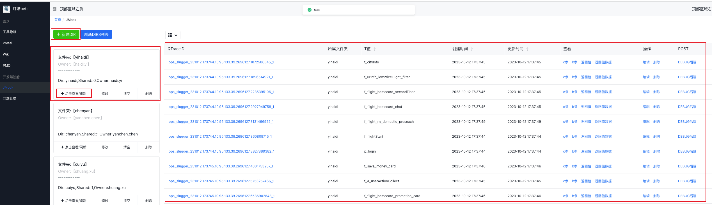
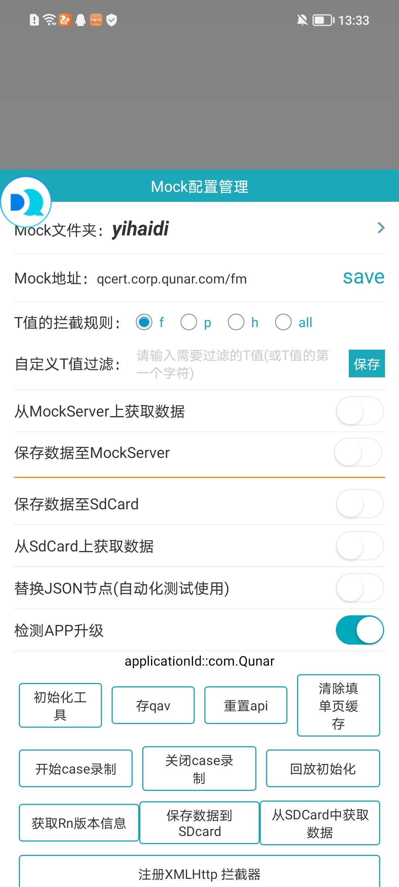
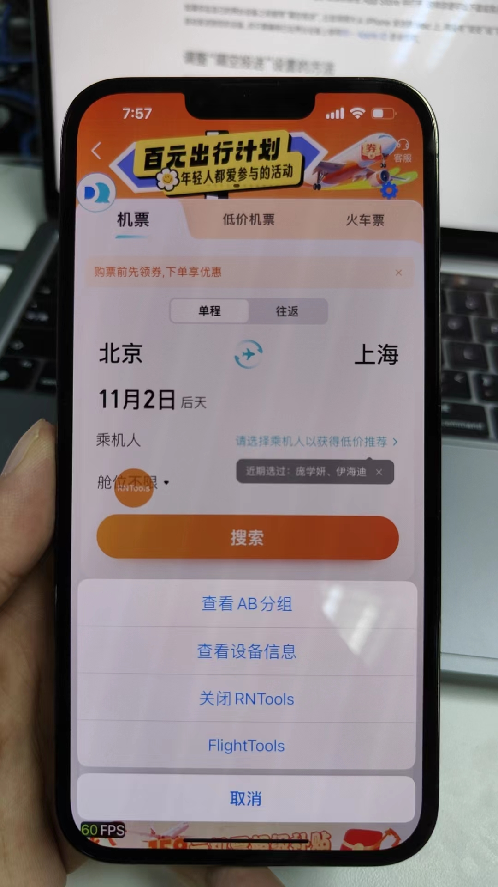
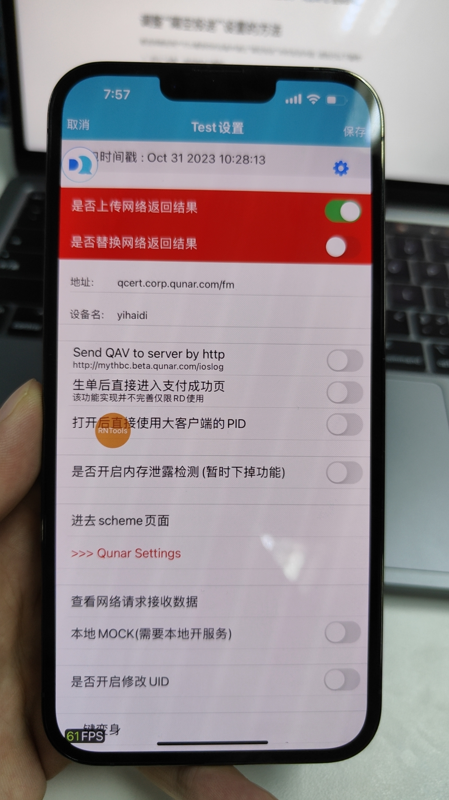
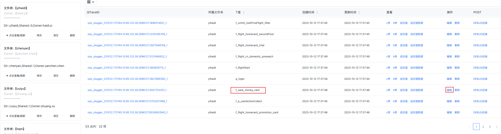

> 灯塔链接：
> [http://qcert.corp.qunar.com/home](http://qcert.corp.qunar.com/home)

### 进入灯塔平台后点击新建DIR建立一个自己名字命名(随意起的)的文件夹

### 手机debug -> 开发配置工具 -> Mock
#### 安卓设备
在Mock工具的第一个选项：Mock文件夹，可以找到并选择在灯塔平台创建的自己名字命名的文件夹，表示从这个文件夹中读取数据或者保存数据到这个文件夹。 下面的选项：从MockServer上获取数据：表示从灯塔yihaidi文件夹中读取数据。 保存数据至MockServer：表示把app运行时接口读取的数据保存到灯塔yihaidi文件夹中。 
#### IOS设备
点击RNToos -> FlightTools，然后选择mock平台的地址（一新一旧，用哪个都行），然后选择自己的文件夹保存即可。  
### 使用灯塔平台Mock数据的步骤
#### 打开`保存数据至MockServer`开关，将数据保存到灯塔yihaidi文件夹中。
#### 在灯塔yihaidi文件夹修改数据为新功能期待的样子。
找到要修改的接口名，点击编辑即可修改返回的数据。 
#### 打开`从MockServer上获取数据`开关，读取到刚刚修改过的数据。
