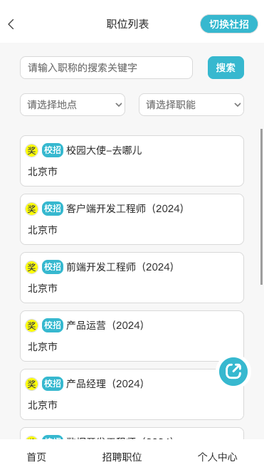
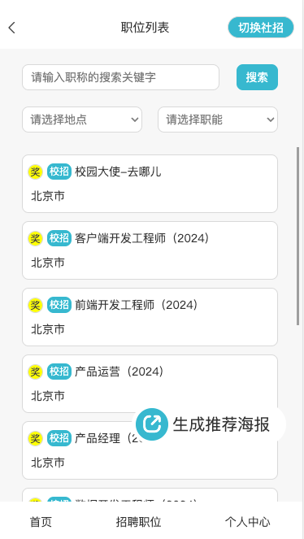

> 目标：鼠标经过悬浮按钮时，悬浮按钮展开显示工具框

鼠标未经过悬浮按钮时，按钮的样式：<br /><br />鼠标经过悬浮按钮时，按钮的样式：“生成推荐海报”字样从分享按钮出慢慢拉出来。<br />
### 实现代码：
#### js
```javascript
<View className="poster-generator-wrapper" >
  <View className="post-generator-circular">
  <View className="iconfont share-icon">
  &#xe547;
</View>
  </View>
  <View className="poster-generator-text" >
  <View className="poster-generator-text-inner" >生成推荐海报</View>
  </View>
  </View>}
```
#### css
```css
.poster-generator-wrapper {
  position: fixed;
  bottom: 1.2rem;
  right: 0.2rem;
  border-radius: 0.5rem;
  background-color: white;
  display: flex;
  flex-direction: row;
  align-items: center;
  justify-content: center;
  padding: 0.05rem;

  .post-generator-circular {
    width: 0.4rem;
    height: 0.4rem;
    border-radius: 0.4rem;
    background-color: #22b8cf;
    display: flex;
    align-items: center;
    justify-content: center;

    .share-icon {
      font-size: 0.25rem;
      color: white;
      font-weight: 900;
    }
  }

  .poster-generator-text {
    transition: width 0.5s ease-in-out;
    width: 0;
    overflow: hidden;
    white-space: nowrap; /* 强制文本不换行 */
    text-overflow: ellipsis; /* 在超出部分显示省略号 */
    overflow: hidden; /* 控制超出部分的隐藏 */


    .poster-generator-text-inner {
      margin-left: 0.05rem;
      width: 1.4rem;
      font-size: 0.2rem;
    }
  }

}
.poster-generator-wrapper:hover .poster-generator-text {
  width: 1.4rem;
}
```
### 原理

1. 汉字在`.poster-generator-text-inner`中，在`.poster-generator-text-inner`外面再包裹一层`.poster-generator-text`，设置`.poster-generator-text`宽度为0且`overflow: hidden`可以实现隐藏其内的`.poster-generator-text-inner`标签的内容。所以在鼠标未经过悬浮按钮时，显示的只有一个分享图标。
2. 给分享图标`.poster-generator-wrapper`添加鼠标悬停事件`:hover`，给`.poster-generator-text`标签添加宽度，让鼠标悬停时其宽度增加，可以显示其中的子元素`.poster-generator-text-inner`。同时，给`.poster-generator-text`设置`transition: all 0.5s`让其宽度变化在0.5秒时完成。

注：`.poster-generator-text-inner`需要指定足够的宽度，否则汉字会竖着排成一列。
