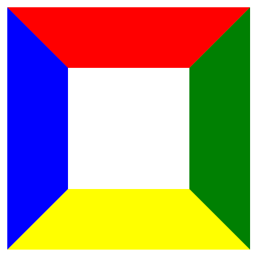

### 增大border值时，可以观察到边框样式为梯形且向内靠拢。
```css
.triangle1 {
  width: 100px;
  height: 100px;
  border: 50px solid;
  border-color: red green yellow blue;
}
```

### 所以可以推测，若div的宽高无限小，每一边的边框将会由梯形变成三角形。
```css
.triangle2 {
    width: 0;
    height: 0;
    border: 50px solid;
    border-color: red green yellow blue;
}
```

### 上图中的四种颜色的三角形就分别代表了div的4条边，所以如果想要实现一个三角形，只需要让一条边可见，其余三条边透明。
比如想要获得指向下方的三角形，可以使上边可见，其余三边透明：
```css
.triangle3 {
            width: 0;
            height: 0;
            border-top: 50px solid red;
            border-left: 50px solid transparent;
            border-right: 50px solid transparent;
        }
```
<br />其中border-top控制三角形的高度，border-left和border-right则分别控制三角形左右边的长度。
### 也可以只定义border的两个方向：
```css
.triangle3 {
    width: 0;
    height: 0;
    border-top: 50px solid red;
    border-left: 50px solid transparent;
    /* border-right: 50px solid transparent; */
}
```
<br />相比于步骤3，此时三角形没有设置border-right，所以面积减半了。
