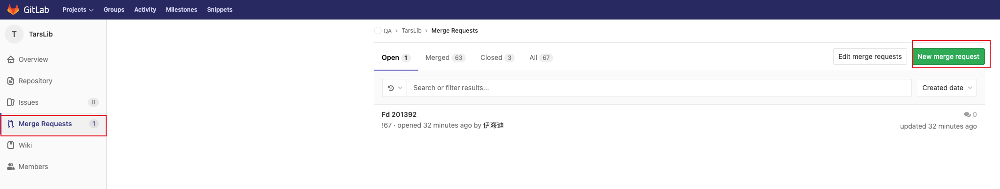
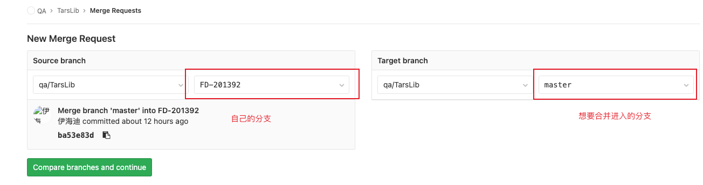
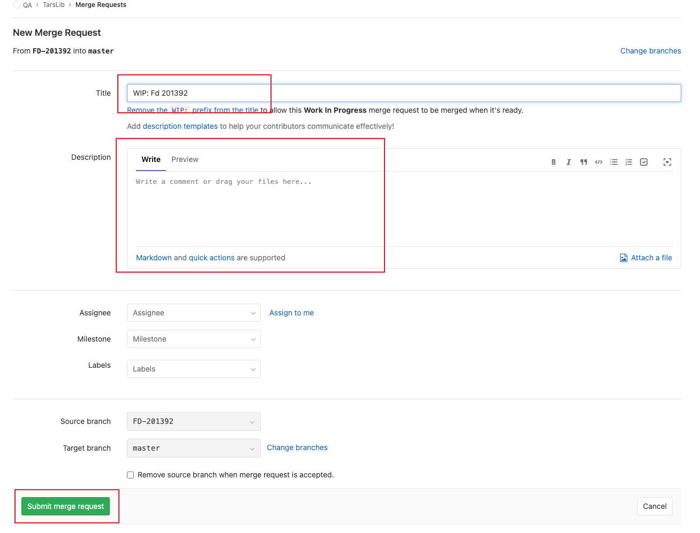
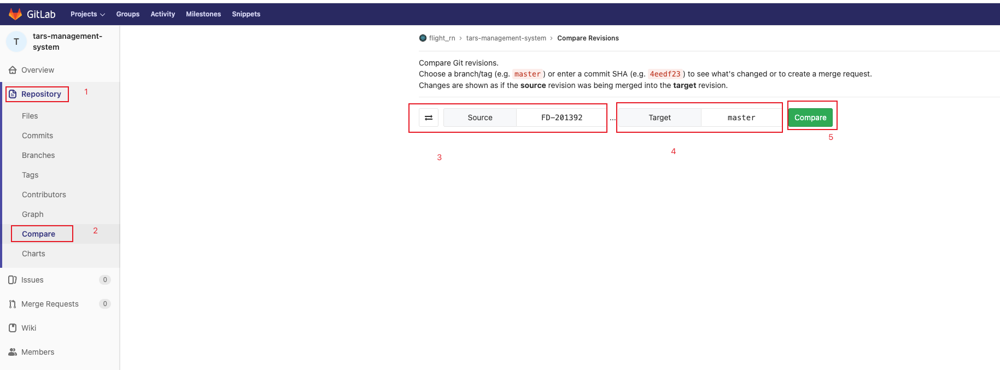
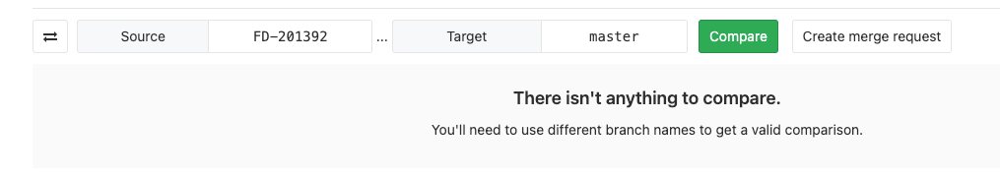
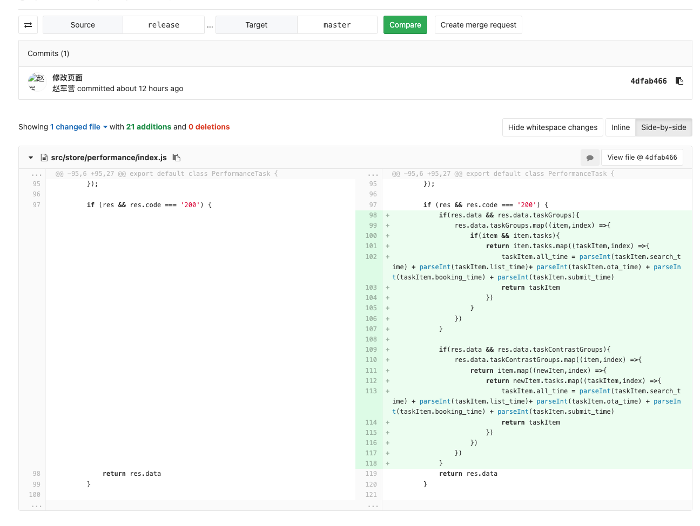

### Merge Requests。当自己没有权限向主分支(通常是master)合并代码(没有向远程master分支push代码的权限)时使用
#### gitlab选择Merge Requests，点击`New Merge Request`按钮。

#### 选好将哪个分支合并到哪个分支，点击`Compare branches and continue`按钮。
#### 
#### 填好信息后，点击`Submit merge request`按钮即可。

### 比较两个分支代码的区别(Compare功能)
#### 按照顺序选好要diff的两个分支

#### 可以看到两个分支的diff结果了。
##### 两个分支代码完全一样。

##### 两个分支代码存在区别。

