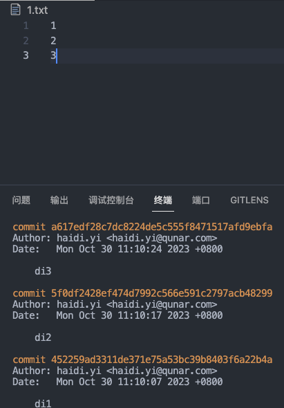

> 参考：
> [https://juejin.cn/post/7225126264663654461](https://juejin.cn/post/7225126264663654461)

回退到指定版本有两种方式：`git reset`和`git revert`，其中`git reset`方法回退版本后，被回退的那些提交历史就都没有了。而`git revert`方法回退版本后，会增加一次commit历史，表示回退过版本。

### git revert
使用方法：`git revert commitID`表示将这个commitID的提交撤销，也就是回退到这个commitID**之前**的状态，而不是回退到这个commitID的状态。commitID可以通过`git log`命令查看。 如下图每次提交增加一个数字，所以如果revert `commitID为di2`的那次提交，则`1.txt`文件中的内容`只剩下数字1`。在做测试时，发现revert相邻的commitID时基本不会产生冲突，但是revert间隔的commitID时基本都会产生冲突。 
