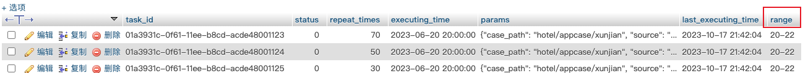

### sql语句中如果操作的数据库字段是sql保留字，需要用``将字段扩起来
下例中，数据库中有`range`字段，<br /><br />但是`range`是sql的保留字，所以在sql语句中需要使用````将`range`扩起来：``range``
```sql
sql = "update %s set params = '%s', `range` = '%s' where task_id = '%s'" % (
  TABLE_SCHEDULED_TASK, task_info.params, task_info.range, task_info.task_id)
```
