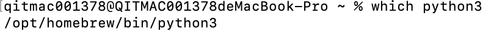
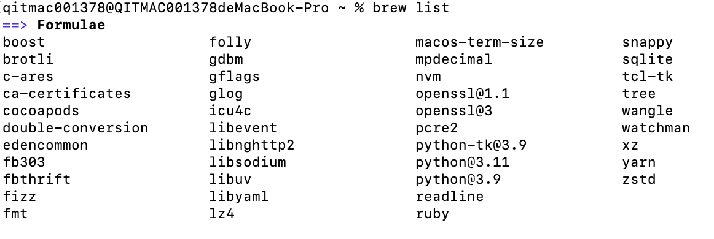

### mac中有多个python3版本，指定使用哪个版本运行python文件
#### 通过在终端指定python3版本区分
比如有python3.9和python3.11两个版本的python。<br />`python3.9 文件名.py`则使用3.9版本运行；`python3.11 文件名.py`则使用3.11版本运行。
> 不直接卸载其中一个版本python的原因是有其他裤对其有依赖关系，卸载时提示：Refusing to uninstall /opt/homebrew/Cellar/python@3.11/3.11.5 because it is required by watchman

#### 通过配置环境变量区分：修改.bash_profile文件，文件所在路径：~/.bash_profile
打开.bash_profile文件：`open ~/.bash_profile`，在文件最下方增加`alias python3='/opt/homebrew/bin/python3.9'`。<br />alias：这个命令告诉操作系统你要创建一个别名。<br />python3：别名的名称。<br />'/opt/homebrew/bin/python3.9'：给别名python3指定的值，当输入python3时系统应该执行的命令路径。<br />我把python和python3命令都指向了python3.9。
```shell
source /opt/homebrew/opt/nvm/nvm.sh
#export JAVA_HOME=/Library/Java/JavaVirtualMachines/jdk-1.8.jdk/Contents/Home
#THIS MUST BE AT THE END OF THE FILE FOR SDKMAN TO WORK!!!
export SDKMAN_DIR="$HOME/.sdkman"
[[ -s "$HOME/.sdkman/bin/sdkman-init.sh" ]] && source "$HOME/.sdkman/bin/sdkman-init.sh"

export JAVA8_HOME=/Library/Java/JavaVirtualMachines/jdk-1.8.jdk/Contents/Home
export JAVA11_HOME=/Library/Java/JavaVirtualMachines/jdk-11.jdk/Contents/Home
#快速在命令行切换jdk版本命令
alias jdk8='export JAVA_HOME=$JAVA8_HOME'
alias jdk11='export JAVA_HOME=$JAVA11_HOME'
#default java11
export JAVA_HOME=$JAVA11_HOME
#设置Android相关环境变量
export ANDROID_HOME=~/android-sdks;
export ANDROID_HOME_TOOLS=${ANDROID_HOME}/platform-tools;
export ANDROID_TOOLS=${ANDROID_HOME}/tools:${ANDROID_HOME}/build-tools/33.0.0:${ANDROID_HOME}/cmdline-tools/latest/bin;
export ANDROID_NDK_HOME=${ANDROID_HOME}/ndk-bundle;
#设置Gradle相关环境变量
export GRADLE_HOME=~/.sdkman/candidates/gradle/current/bin;
export PATH=${PATH}:${ANDROID_HOME}:${ANDROID_HOME_TOOLS}:${ANDROID_TOOLS}:${GRADLE_HOME}:${ANDROID_NDK_HOME}/toolchains/aarch64-linux-android-4.9/prebuilt/darwin-x86_64/bin;
#设置默认的python版本
alias python3='/opt/homebrew/bin/python3.9'
alias python='/opt/homebrew/bin/python3.9'
```
修改.bash_profile文件后，在终端执行`source ~/.bash_profile`命令使修改生效，但是此时生效只是在当前终端生效，脱离此终端配置是没有生效的。想要让`.bash_profile`文件的配置全局生效，可以打开`.zshrc`文件：`open ~/.zshrc`，在文件末尾添加命令：`source ~/.bash_profile`，添加后.zshrc文件如下：（这样每次打开终端都会执行一次source ~/.bash_profile命令）
> 参考：
> [https://blog.csdn.net/lanlangaogao/article/details/118928478](https://blog.csdn.net/lanlangaogao/article/details/118928478)

```shell
export NVM_DIR="$HOME/.nvm"
[ -s "/opt/homebrew/opt/nvm/nvm.sh" ] && \. "/opt/homebrew/opt/nvm/nvm.sh"  # This loads nvm
[ -s "/opt/homebrew/opt/nvm/etc/bash_completion.d/nvm" ] && \. "/opt/homebrew/opt/nvm/etc/bash_completion.d/nvm"  # This loads nvm bash_completion

#THIS MUST BE AT THE END OF THE FILE FOR SDKMAN TO WORK!!!
export SDKMAN_DIR="$HOME/.sdkman"
[[ -s "$HOME/.sdkman/bin/sdkman-init.sh" ]] && source "$HOME/.sdkman/bin/sdkman-init.sh"

# 使.bash_profile全局生效
source ~/.bash_profile
```
### 安装tkinter库：brew install python-tk@3.9
> 安装这个库的原因是启动项目的过程中报错：If this fails your Python may not be configured for Tk<br />ImportError: No [module](https://so.csdn.net/so/search?q=module&spm=1001.2101.3001.7020) named _tkinter
> 参考：[https://blog.csdn.net/blueheart20/article/details/78763208](https://blog.csdn.net/blueheart20/article/details/78763208)

终端执行：`brew install python-tk@3.9`
### mac查看python的安装路径命令：which python3
<br />但是此命令查看的是当前指定的默认python3版本的安装路径，如果电脑中存在多个python3版本(如同时存在python3.9和python3.11两个版本)，此命令依然只能展示默认使用的python3版本的安装路径。
### mac通过homebrew查看电脑中存在的所有python版本：`brew list`命令
`brew list`命令可以查看mac安装的所有第三方库，其中就包括了python。<br />
