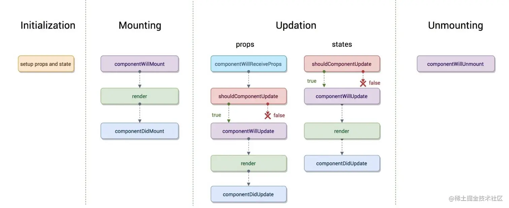

### Ext.registerView
```javascript
import './views/search';

Ext.registerView('OTAView', () => require('./views/ota'));
```
上述import和Ext.registerView两种引入页面的方式，通过import引入页面是将资源直接加载到内存，通过Ext.registerView()的方式是懒加载，先将此页面注册，然后在需要用到此页面时才将资源加载到内存，可以节省内存资源。
### 生命周期
先执行constructor()，再执行render()，然后执行componentDidMount()。<br />
### NativeNavigator.getPageStacks()方法：获取页面的压栈顺序
vsStacks数组中保存着页面的压栈顺序，栈顶元素即为当前活跃页面。
```javascript
if (NativeNavigator) {
    NativeNavigator.getPageStacks((vcStacks) => {
        if (ArrayUtils.isNotEmpty(vcStacks)) {
            console.log(vsStacks);
            }
        }
    });
}
```
### QSendNotification.addNotification()方法：接收广播通知

```javascript
//监听截屏广播
QSendNotification.addNotification({
    name: 'pp-share-screenshot',    // 监听的广播名
    subscriptionCallback: (subscription) => {
        this.screenshotSubscription = subscription;  // 广播的标识            
    },
    // 成功监听的回调
    dataCallback: (data) => {
        if (NativeNavigator) {
            NativeNavigator.getPageStacks((vcStacks) => {
                if (ArrayUtils.isNotEmpty(vcStacks)) {
                    if(vcStacks[vcStacks.length-1].moduleName === 'OTAView'){
                        this.checkIsShowScreenshotLayer()
                    }
                }
            });
        }

    },
    // 失败的回调
    errorCallback: (res) => {
    }

})
```
