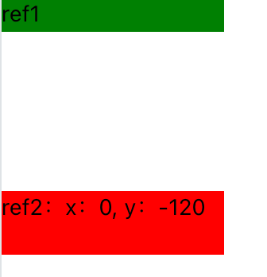

## View组件的一些常用属性
### style中的属性flexWrap: 'wrap'：子元素在父容器不够宽时自动换行。
下例中box在container宽度不足以容纳其时会换行。
```javascript
<View style={styles.container}>
  <View style={styles.box} />
  <View style={styles.box} />
  <View style={styles.box} />
</View>

const styles = StyleSheet.create({
  container: {
    flexDirection: 'row', // 默认是水平布局，可以根据需要更改为 'column' 进行垂直布局
    flexWrap: 'wrap',
  },
  box: {
    width: 50,
    height: 50,
    backgroundColor: 'skyblue',
    margin: 5,
  },
  });
```

## View组件的一些常用方法
### measureLayout()方法：用于测量一个视图相对于另一个视图的布局信息。
#### 使用方式：
给组件1和组件2都绑定一个引用，通过measureLayout方法测量组件1距离组件2的距离
```javascript
const measureLayout = () => {
    // 组件1的引用调用measureLayout方法，则为组件1距离组件2的距离
    ref1.current.measureLayout(
      ref2.current,	//组件2的引用
      // 测量成功的回调函数
      (x, y) => {
        setArr([x, y]);
        console.log(`haidi: ${x}, ${y}`);
      },
      // 测量失败的回调函数
      () => {
        console.log('haidi');
      }
    );
  };
```
#### 举例
<br />组件1（绿）距离组件2（红）的距离是组件1的顶部距离组件2的顶部的距离 = 组件1的高度（20）加上组件1和组件2的margin（100）。
```javascript
import {
  Text,
  View,
  TouchableOpacity,
  SafeAreaView,
  StyleSheet,
} from 'react-native';
import React, { useRef, useEffect, useState } from 'react';

export default function App() {
  const [arr, setArr] = useState([]);
  const ref1 = useRef(null);
  const ref2 = useRef(null);

  const measureLayout = () => {
    ref1.current.measureLayout(
      ref2.current,
      (x, y) => {
        setArr([x, y]);
        console.log(`haidi: ${x}, ${y}`);
      },
      () => {
        console.log('haidi');
      }
    );
  };

  useEffect(() => {
    measureLayout();
  }, []);

  return (
    <View>
      <View
        style={{ backgroundColor: 'green', width: 140, height: 20 }}
        ref={ref1}>
        <Text>ref1</Text>
      </View>
      <View
        ref={ref2}
        style={{
          backgroundColor: 'red',
          width: 140,
          height: 40,
          marginTop: 100,
        }}>
        <Text>{`ref2：x：${arr[0]}, y：${arr[1]}`}</Text>
      </View>
    </View>
  );
}
```
