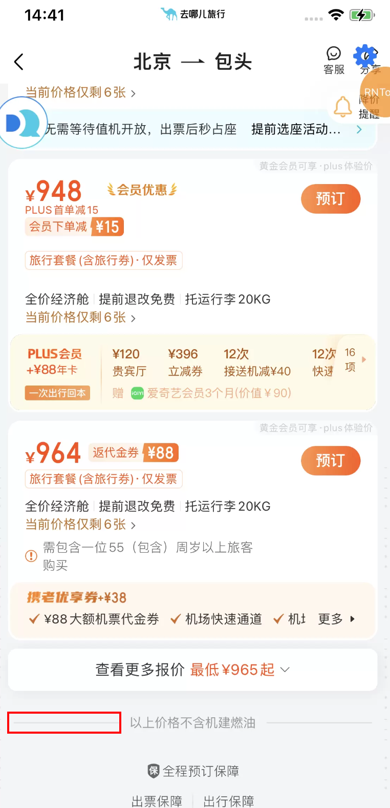

### react native核心组件
#### Alert：弹窗组件
```javascript
// 样式1
Alert.alert('弹出组件')
// 样式2
Alert.alert(
    "警告标题",
    "警告内容",
    [
      	{
            text:"取消",
            onPress: () => console.log("Cancel"),
            style: 'cancel'
      	},
      	{
            text:"确认",
            onPress: () => console.log("OK"),
            style: 'default'
      	},
    ]
)
```
#### Button：按钮组件
#### Switch：开关组件
```javascript
<Switch
    trackColor={{ false: 'red', true: 'green'}}		// 设置switch开关按钮打开和关闭状态的颜色
  	thumbColor={'blue'}	// switch开关按钮小圆点的颜色
/>
```
#### StatusBar：顶部状态条（就是电量、信号所在的那个条）
```javascript
<StatusBar 
  	hidden={false}	// 设置顶部条是否隐藏
    backgroundColor="red"	// 设置顶部条的背景色
    barStyle={'light-content'}	// 设置顶部条中每个小图标(电量、信号等)的颜色样式
  
/>
```
#### ActivityIndicator：等待时转圈的动画
```javascript
<ActivityIndicator color="blue" size={"large"}/>	// 设置转圈的颜色、大小
<ActivityIndicator color="blue" size={70}/>	// 通过数字设置转圈的大小只在Anr上有效
```
#### Platform：可以获取当前是IOS还是Adr设备
Platform.os会返回当前设备类型字符串
```javascript
Platform.os === 'android'
```
#### Image：图片组件
#### TextInput：输入框
#### Touchable：触控组件们
具体的触控组件名如下：

- TouchableOpacity：触碰时透明度变化（平时用的最多）
- TouchableHighlight：触碰时高量
- TouchableWithoutFeedback：触碰时无响应
#### ScrollView：滚动视图组件
可以水平也可以垂直滚动。 <br />在Anr机子上可能会有滚动不到底的情况，ios上是正常的，解决方式是，在Adr机子中ScrollView最后增加一个有高度的View。
```javascript
<View>
    // 水平滚动的滚动视图
    <ScrollView style={{backgroundColor: '#dfb'}} horizontal={true}>
        <Text style={[styles.nav]}>新闻</Text>
        <Text style={[styles.nav]}>娱乐</Text>
        <Text style={[styles.nav]}>体育</Text>
        <Text style={[styles.nav]}>财经</Text>
        <Text style={[styles.nav]}>军事</Text>
        <Text style={[styles.nav]}>时尚</Text>
        <Text style={[styles.nav]}>科技</Text>
    </ScrollView>
  	// 垂直滚动的滚动视图 
    <ScrollView
        style={[styles.scrollView]}
        contentContainerStyle={{margin: 30}}
        showsHorizontalScrollIndicator={false}
        showsVerticalScrollIndicator={false}>
        <Text style={[styles.text]}>
            Lorem ipsum dolor sit amet consectetur adipisicing elit.
            Consequuntur quibusdam accusamus rem quo distinctio harum recusandae
            cumque laboriosam, dolores accusantium voluptatibus, id, sint
            similique reprehenderit nulla repellat tempora natus neque corporis
            deserunt numquam. At, soluta? Totam nam velit reprehenderit vel sit,
            cupiditate nemo, dolorem dolores animi maiores, ipsam voluptates
            necessitatibus commodi? Molestiae adipisci distinctio libero
            veritatis? Laboriosam quasi facilis harum amet officia voluptatem ex
            repellat sit nobis animi. Explicabo, esse. Reprehenderit ratione
            voluptatem magni cum harum quia porro vero doloribus delectus
            placeat dicta repellat dolore consectetur, architecto sequi
            molestiae, odit rem. Culpa officiis quia id fuga sed, voluptatem
            quidem placeat?
        </Text>
        {/*解决ScrollView在安卓下滚动不到底的问题*/}
        <View style={{height: Platform.OS === 'ios' ? 0 : 100}} />
    </ScrollView>
</View>
```
#### SectionList：分组列表
可以在onEndReached中实现懒加载。
#### FlatList：不分组的列表
可以通过initialNumToRender属性，直接指定首次渲染的元素个数，从而实现懒加载。
#### WebView：APP中嵌入H5页面
#### Picker：选择器
#### Swiper：轮播器
Swiper要放到ScrollView中，放到View中是没有效果的。
```javascript
<ScrollView>
    <Swiper autoplay={true} showsButtons={true} style={[styles.wrapper]}>
        <Image
            style={[styles.slideImage]}
            source={require('./images/1.jpg')}
        />
        <Image
            style={[styles.slideImage]}
            source={require('./images/2.jpg')}
        />
        <Image
            style={[styles.slideImage]}
            source={require('./images/3.jpg')}
        />
    </Swiper>
</ScrollView>
```
#### AsyncStorage：持久化存储
#### Geolocation：定位组件
```javascript
componentDidMount() {
		const location = Storage.get('coords');
    // 组件加载时获取地理位置
    if (location === undefined || location === '') {
        /**
         * 如果在PC模拟器上测试需要开启此选项才能获取位置信息
         * enableHighAccuracy: true
         * 指示浏览器获取高精度的位置，默认为 false。
         * 当开启后，可能没有任何影响，
         * 也可能使浏览器花费更长的时间获取更精确的位置数据。
         */
        /**
         * 返回值
         * coords:
         *  accuracy: 5 //精确度
         *  altitude: 5 //高度
         *  heading: 0
         *  latitude: 37.421998333333335 //纬度
         *  longitude: -122.084 //经度
         *  speed: 0 //速度(如果拿着手机在移动这个值不为0)
         */
        Geolocation.getCurrentPosition(
            info => {
              	console.log(info);
              	// 获取地理位置成功后将其保存下来
              	AsyncStorage.setItem('coords', JSON.stringify(info.coords));
            },
            error => Alert.alert('报错', JSON.stringify(error)),
            {
              	enableHighAccuracy: true,
              	timeout: 20000,
            },
    		);
    } else {
    		console.log(location);
    }
}
```
#### Camera：摄像头组件
> 参考：[https://github.com/yam126/reactNativeStudio/blob/master/src_19_Camera/index.jsx](https://github.com/yam126/reactNativeStudio/blob/master/src_19_Camera/index.jsx)
> [https://blog.csdn.net/qq_44094296/article/details/131472192](https://blog.csdn.net/qq_44094296/article/details/131472192)

#### ImagePicker：本地相册选择图片或者访问摄像头
一般在换头像时会有两种选择：调用摄像头拍一张或者从本地相册选择一张。这个时候就可以使用ImagePicker组件实现。

### 父组件中设置opacity样式属性后，会使得其子组件的opacity值和父组件一致，即使子组件并没有设置opacity属性。
这是因为 CSS 中 opacity 属性应用于元素及其内容，会影响整个元素的可见度。当设置 TouchableOpacity 的透明度为 0.6 时，它会使容器的背景色和容器内的 Icon 都变得半透明，即它们的可见度都会降低。
```python
<TouchableOpacity style={{opacity: 0.4}} onPress={this.closeView}>
    <Icon name={'otaClose'} color={'#FFFFFF'} style={{ fontSize: 11, opacity: 0.6 }} />
</TouchableOpacity>
```
如果需要让 TouchableOpacity 的背景色半透明而保持 Icon 的不透明度，可以使用 rgba 格式的颜色值或者4位的16进制格式，rgba会设置父组件的背景色的透明度而不会影响其中的子组件。<br />`rgba(28, 32, 63, 0.95)`和`#1c203ff2`（4位16进制格式，最后1位是透明度，将透明度从0到1映射到00到ff）是等价的。
```python
<TouchableOpacity style={{opacity: 'rgba(0, 0, 0, 0.4)'}} onPress={this.closeView}>
    <Icon name={'otaClose'} color={'#FFFFFF'} style={{ fontSize: 11, opacity: 0.6 }} />
</TouchableOpacity>
```
### 遍历数组时，key的设置:`key={'outBoardTitel' + index}`,自己取个名字加上索引。
```javascript
flightAdditionInfos.map((item: any, index: number) => {
  return (
      <View
          key={'outBoardTitel' + index}
      >
    	</View>
)}
```
### 自适应布局：Dimensions组件
> 参考：[https://juejin.cn/post/7292036126268801034](https://juejin.cn/post/7292036126268801034)

Dimensions.get('window').width：获取屏幕的宽度。
### flexbox布局自动换行：flexWrap属性。
```javascript
const styles = StyleSheet.create({
  	container: {
        flexDirection: 'row',
        flexWrap: 'wrap'	// 超行自动换行
    }
})
```
### 扩大点击热区：hitSlop属性
TouchableOpacity组件中设置`hitSlop`属性：hitSlop={{ top: 60, bottom: 60, left: 80, right: 80 }}，<br />不会影响原本布局，但是貌似实际可点击的区域没发看到。
```objectivec
<TouchableOpacity
    activeOpacity={1}
    hitSlop={{ top: 60, bottom: 60, left: 80, right: 80 }}	// 点击热区扩大的范围
    onPress={() => {
        this.closeModal();
    }}>
    <Icon name='roundCloseNew' color='#FFFFFF' size={32} style={{ opacity: 0.92 }} />
</TouchableOpacity>
```
### 画一条横线：画一个高度为1的View
alignSelf属性：用于控制单个子元素在其父容器中的垂直对齐方式。通常，**alignSelf**属性用于覆盖父容器设置的**alignItems**属性，以便单个子元素可以具有与其余兄弟元素不同的对齐方式。<br />
```objectivec
// 横向分割线
horDivideLine: {
    height: 1,
    width: 100,
    backgroundColor: '#E1DFDF',
    alignSelf: 'center'	
}
```


## 易踩坑总结
### 渲染组件时不要使用：变量名 && 组件的形式，有变量为空字符串时会有概率崩溃
```python
{
    testVar && <Text> {testVar} </Text>
}
```
这种写法的本意是当`testVar`变量有值时，渲染后面的Text组件。但是`testVar`没有值时（布尔值为false时），可能会有问题，当`testVar`变量为空字符串时，其布尔值也为false，不会渲染后面的Text组件，但是此时会把`testVar`变量当作组件渲染，而`testVar`变量值是字符串，没有被Text组件包围，就会报错。<br />健壮的写法是使用三目运算符(以后就使用这种写法)：
```python
{
    testVar ? <Text> {testVar} </Text> : null
}
```
或者，也可以把testVar转成布尔值：
```python
{
    Boolean(testVar) && <Text> {testVar} </Text>
}
```
