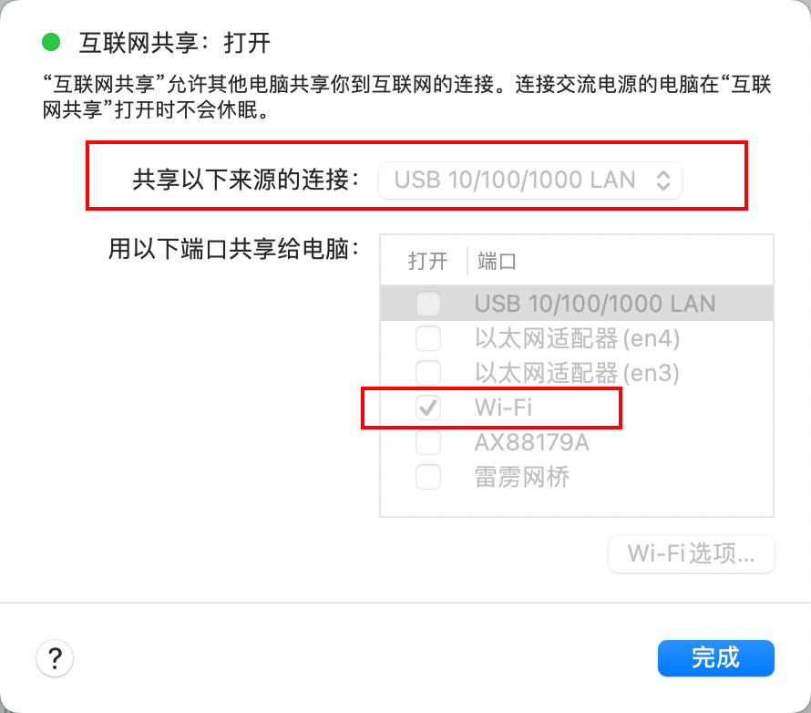

> QRN wiki
> [https://ued.qunar.com/qrn/start/start-project-init.html](https://ued.qunar.com/qrn/start/start-project-init.html)
> [https://wiki.corp.qunar.com/confluence/display/~jinghuangh.huang/QRN](https://wiki.corp.qunar.com/confluence/display/~jinghuangh.huang/QRN)

### 所需工具
#### 安装QRN
`npm install @qnpm/qrn-cli -g --registry=http://npmrepo.corp.qunar.com/ --unsafe-perm`<br />安装qrn需要16.x版本的node，所以需要先：`nvm use 16`<br />终端输入qrn出现各种功能命令则表示安装成功。
#### 安装watchman
`brew install watchman```
#### 安装react-native-cli
`brew install react-native-cli`
### 运行项目
#### 初始化项目
打开终端，执行：`qrn init AwesomeProject`<br />安装依赖：`qrn install`，后续需要的依赖包也用`qrn install`安装，使用npm貌似有些问题。
#### 启动react-native服务
```bash
cd AwesomeProject
qrn run
```
> 注：这一步中，qrn项目AwesomeProject所在路径不能有中文，否则会报错。

项目启动成功，会在终端生成一个二维码，供app扫描。<br />若启动别人项目后RN页面报错，原因可能是项目内使用的包版本较低。可以执行：`rm -rf node_modules`先删除原项目以来，然后执行`qrn clear`，重新`qrn install`，接着`qrn update`更新，最后启动项目：`qrn run`。n
#### 真机调试
> qunar app手机debug包下载地址：
> [http://md.corp.qunar.com/client_app/adr_llama_finn_app/appReleaseHistory](http://md.corp.qunar.com/client_app/adr_llama_finn_app/appReleaseHistory)

##### mac电脑开启热点
此步骤手机需要和电脑处于同一网络下，所以可以电脑开热点给手机连。<br />打开设置->搜索共享->点击互联网共享->共享来源是网线(电脑需要连接着有线)，共享方式是wifi<br />
##### RN调试
打开App点击悬浮球，然后点击扫一扫，扫描在电脑启动项目时终端生成的二维码。再次点击悬浮球，点击小齿轮按钮，点击QRN调试，然后点击打开RN页面即可看到项目创建的页面。
> QRN调试中点击Local Server，有Debug In The Chrome 和 Debug Mode等4个选项可以勾选。通常只勾选前2个中的一个，勾选Debug Mode可以实现热更新。

> 注：手机和开发的电脑需连接同一个公司无线wifi或手机直接连接由开发电脑发射的wifi

