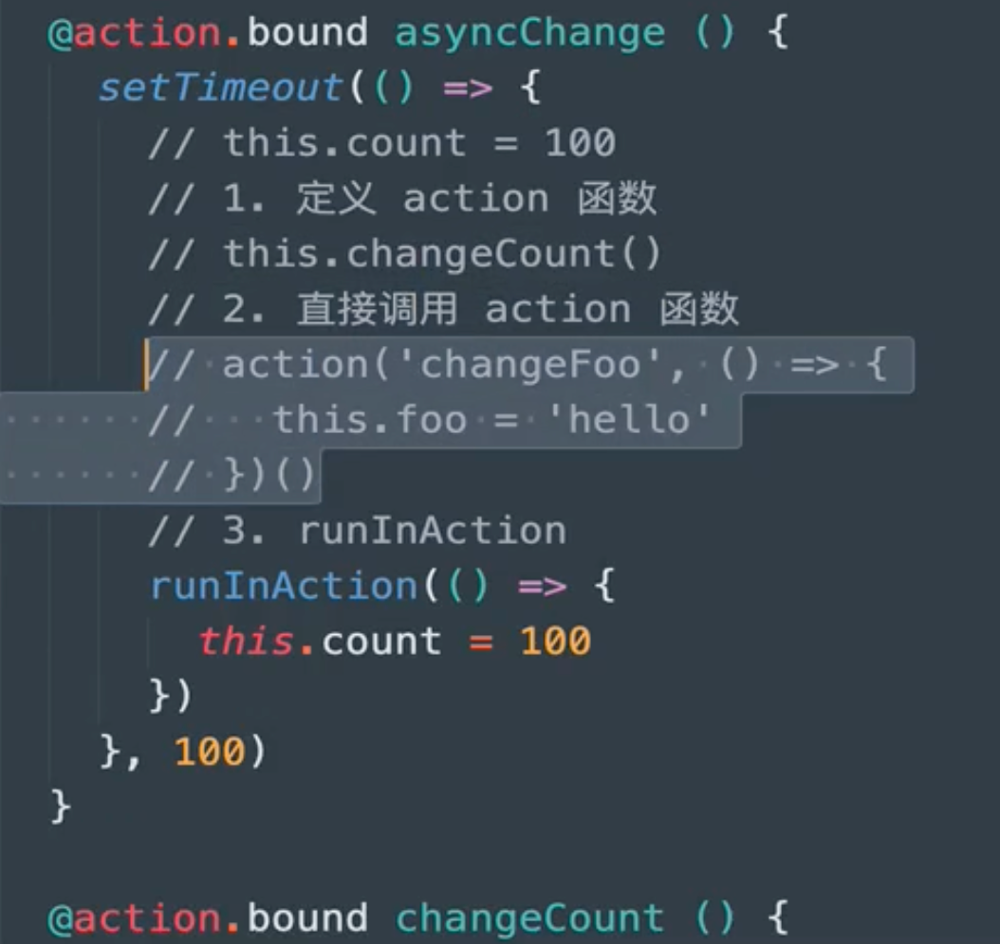

### mobx使用
安装mobx：`npm i mobx`，及mobx-react： `npm i mobx-react`

1.  声明Store类 
2.  项目index.js中引入Provider和store，用Provider包裹APP组件 
```javascript
import { Provider } from 'mobx-react'
import store from './10-mobx/04-router/mobx/store';
const root = ReactDOM.createRoot(document.getElementById('root'));
root.render(
    <Provider store={store}>
        <App></App>
    </Provider>

);
```

3.  在需要使用store数据的组件中引入inject和observer，在这个类组件里就可以通过：`this.props.store.isTabbarShow`访问store里定义的 `isTabbarShow`属性。 
```javascript
import { inject, observer } from 'mobx-react'

@inject('store')    // inject里的名字：store，需要与根目录index.js里<Provider store={store}>的store名字一致。
class App extends Component {
```
<br />**mobx6中，可以不使用装饰器语法了，更加方便：** 
```javascript
import { observer, inject } from 'mobx-react'
class CollectsList extends React.Component {

}
export default inject('store')(observer(CollectsList))		// mobx6注入store的语法
```
#### 设置支持装饰器语法(@开头)

1.  安装依赖：`npm i @babel/core @babel/plugin-proposal-decorators @babel/preset-env` 
2.  在项目根目录下创建 `.babelrc`和 `config-overrides.js`两个文件。 
   1.  `.babelrc`文件内容如下： 
```javascript
{
    "presets": [
        "@babel/preset-env"
    ],
    "plugins": [
        [
            "@babel/plugin-proposal-decorators",
            {
                "legacy": true
            }
        ]
    ]
}
```

   2.  `config-overrides.js`文件内容如下： 
```javascript
const path = require('path')
const { override, addDecoratorsLegacy } = require('customize-cra')

function resolve(dir) {
    return path.join(__dirname, dir)
}

const customize = () => (config, env) => {
    config.resolve.alias['@'] = resolve('src')
    if (env === 'production') {
        config.externals = {
            'react': 'React',
            'react-dom': 'ReactDOM'
        }
    }

    return config
};


module.exports = override(addDecoratorsLegacy(), customize())
```

3.  安装依赖：`npm i customize-cra react-app-rewired` 
4.  配置package.json文件： 
```json
  "scripts": {
    "start": "react-app-rewired start",
    "build": "react-app-rewired build",
    "test": "react-app-rewired test",
    "eject": "react-app-rewired eject"
  },
```
### autorun
autorun执行条件：

- autorun中的代码会默认执行一次（初始化时执行）（无论autorun里面的代码是什么）
- 当autorun中使用的observable属性改变时，autorun中的代码会再次执行。
```javascript
class Store {
	@observable count = 0
  foo = 'bar'
}

const store = new Store();
autorun(()=>{
  console.log(store.count)	// count值改变会导致autorun执行
  // console.log(store.foo)		// foo值改变autorun不会执行
})
```
### @observable.ref和@observable的区别
使用@observable.ref观察的对象只会跟踪对对象的引用更改，这意味着需要更改整个对象（引用本身被更改）（我的理解是将一个对象重新赋值给了@observable.ref观察的变量），才会触发通知。<br />使用@observable观察的对象，MobX会深度观察属性及其子属性，这意味着当属性的任何部分更改时，观察者都会被通知。
### @action和@action.bound
@action.bound声明的方法中的this会指向当前实例对象。<br />@action声明的话，this指向可能为undefined。
### runInAction
严格模式下，可观察对象必须在runInAction或@action.bound声明的函数中才能修改。<br />同时，在异步函数中，使用runInAction修改可观察对象的话，即使修改多个可观察对象，也只会执行一次状态更新，也就是让页面刷新一次就把多个可观察对象的值给改了。可以避免页面多次刷新。<br />看视频还有一种说法是在异步函数的回调函数中修改可观察对象的话，是需要用runInAction的。就是下面asyncChange函数中的setTimeout是异步函数，在其中要修改可观察对象的值的话只能通过图中的三种方法。<br />
### reaction
和autorun函数类似，也是监听内部使用的可观察对象的值是否发生改变，变化了则执行代码。但是初始化时reaction不会执行。即指定的数据发生变化时，自动执行一个回调函数。<br />下面这样在store中声明好reaction()函数即可自动监听indicator属性值的变化。<br />同时可以执行setupStore()方法停止reaction()函数的监听。（一般不写，或者写在组件卸载时）
```javascript
setupStore = reaction(
    () => {
        return this.otaNetModel ? this.otaNetModel.netIndicator.indicator : null;
    },
    (indicator) => {
        console.log(indicator)
    }
);
```
### when方法
在某些条件成立时再执行其中的回调函数，第一个回调中的返回值为true时，执行第二个回调中的代码。<br />执行startCheck()方法时，会先执行console.log('haidi, 进入');然后执行console.log('haidi 检查');，最后等Boolean(this.bottomTip)为true时执行console.log('haidi 执行');。
#### 应用场景
在组件挂载时需要执行某些方法，这些方法依赖于store中的数据，但是组件挂载时，数据可能还没有请求回来，所以可以在执行的方法中加入when函数，等数据请求回来后再做具体操作。
```javascript
import { when } from 'mobx';
// 开始检查是否符合展示调研问卷的逻辑。
startCheck = async () => {
    console.log('haidi, 进入');
    when(
        () => Boolean(this.bottomTip), 	// 这个回调
        () => {
            console.log('haidi 执行'); 
        }
    )
    console.log('haidi 检查');
```
