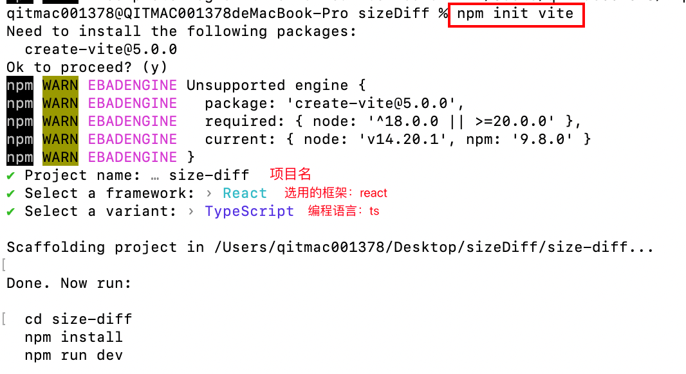
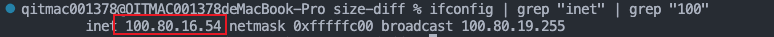
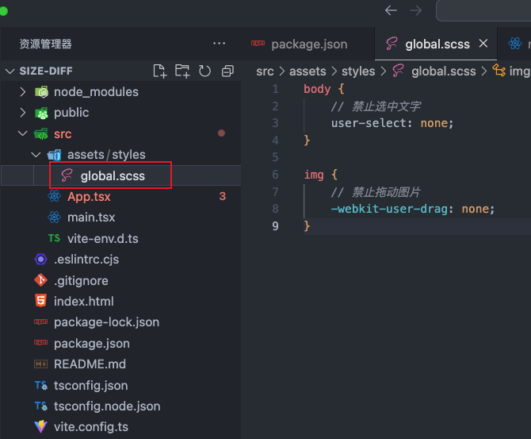
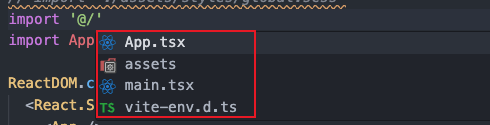

> 参考：[https://juejin.cn/post/7059236538923614216](https://juejin.cn/post/7059236538923614216)

> 环境配置：node（v16.17.1），npm（8.15.0），

### 初始化项目
```
npm init vite
```
初始化项目步骤如下：<br />
### 启动项目
#### **vite脚手架指定启动的ip**
在package.json中指定以自己的电脑ip启动项目：scripts中的dev后增加`--host`参数。--host后加上自己电脑的ip。
```javascript
"scripts": {
    "dev": "vite --host 100.80.16.54",
    "build": "vite build",
    "preview": "vite preview"
},
```
#### **查看电脑ip**
```javascript
ifconfig | grep "inet" | grep "100"
```

#### 安装依赖及启动项目
```
npm i		// 安装依赖
npm run dev		// 启动项目
```
在同一局域网下，即可通过我指定的ip访问到我启动的项目：[http://100.80.16.54:5173/](http://100.80.16.54:5173/)
### 初始化样式
#### 去除默认样式，使用`reset-css`库。
```javascript
npm i reset-css
```
#### 在根view：main.tsx中引入reset-css库
```javascript
import React from 'react'
import ReactDOM from 'react-dom/client'
// 初始化样式，用于清除默认样式，写在最前面，避免被覆盖
import "reset-css"
import App from './App.tsx'

ReactDOM.createRoot(document.getElementById('root')!).render(
  <React.StrictMode>
    <App />
  </React.StrictMode>,
)
```
#### 安装sass库
```javascript
npm i --save-dev sass
```
#### 定义全局样式
<br />在根view：main.tsx中引入global.scss：
```javascript
import React from 'react'
import ReactDOM from 'react-dom/client'
// 初始化样式，用于清除默认样式，写在最前面，避免被覆盖
import "reset-css"
// 全局样式
import './assets/styles/global.scss'
import App from './App.tsx'

ReactDOM.createRoot(document.getElementById('root')!).render(
  <React.StrictMode>
    <App />
  </React.StrictMode>,
)
```
### 配置路径别名（选做）
#### 在vite.config.ts中添加配置：引入`path`模块并添加`resolve`配置：
```javascript
import { defineConfig } from 'vite'
import react from '@vitejs/plugin-react'
import path from 'path'
// https://vitejs.dev/config/
export default defineConfig({
  plugins: [react()],
  resolve: {
    alias: {
        "@": path.resolve(__dirname, './src')
    }
}
})
```
#### 安装@types/node
```javascript
npm i -D @types/node
```
#### 配置路径别名
在tsconfig.json中"compilerOptions"下添加如下代码：
```json
"baseUrl": "./",
"paths": {
  "@/*": [
    "src/*"
  ]
}
```
添加后tsconfig.json文件如下：
```json
{
  "compilerOptions": {
    "target": "ES2020",
    "useDefineForClassFields": true,
    "lib": [
      "ES2020",
      "DOM",
      "DOM.Iterable"
    ],
    "module": "ESNext",
    "skipLibCheck": true,
    /* Bundler mode */
    "moduleResolution": "bundler",
    "allowImportingTsExtensions": true,
    "resolveJsonModule": true,
    "isolatedModules": true,
    "noEmit": true,
    "jsx": "react-jsx",
    /* Linting */
    "strict": true,
    "noUnusedLocals": true,
    "noUnusedParameters": true,
    "noFallthroughCasesInSwitch": true,
    "baseUrl": "./",
    "paths": {
      "@/*": [
        "src/*"
      ]
    }
  },
  "include": [
    "src"
  ],
  "references": [
    {
      "path": "./tsconfig.node.json"
    }
  ]
}
```
添加后输入`@/`就相当于输入了src文件夹路径，会有如下提示：<br />

### 模块化命名样式（避免样式污染）
样式命名中带入`.module`：container.module.scss，在引入样式时，把样式引入为styles变量：`import styles from './container.module.scss'`，把样式赋值为className：`className={styles.box}`，使用方式类似RN的样式：
```tsx
import React from 'react';
import styles from './container.module.scss'

export default function Container() {
  return (
    <div className={styles.box}>Container</div>
  )
}
```
### 配置Typescript，编辑tsconfig.json文件，编辑后文件内容如下：
```json
{
  "compilerOptions": {
    "target": "ES2020",
    "useDefineForClassFields": true,
    "lib": [
      "ES2020",
      "DOM",
      "DOM.Iterable"
    ],
    "allowImportingTsExtensions": true,
    "isolatedModules": true,
    "allowJs": true, // 允许编译 JavaScript 文件
    "skipLibCheck": true, // 跳过所有声明文件的类型检查
    "esModuleInterop": true, // 禁用命名空间引用 (import * as fs from "fs") 启用 CJS/AMD/UMD 风格引用 (import fs from "fs")
    "allowSyntheticDefaultImports": true, // 允许从没有默认导出的模块进行默认导入
    "strict": true, // 启用所有严格类型检查选项
    "forceConsistentCasingInFileNames": true, // 不允许对同一个文件使用不一致格式的引用
    "module": "ESNext", // 指定模块代码生成
    "moduleResolution": "bundler", // 使用 bundler 风格解析模块，还可把bundler换成node使用node.js风格解析模块
    "resolveJsonModule": true, // 允许使用 .json 扩展名导入的模块
    "noEmit": true, // 不输出(意思是不编译代码，只执行类型检查
    "jsx": "react-jsx", // 在.tsx文件中支持JSX
    "sourceMap": true, // 生成相应的.map文件
    "declaration": true, // 生成相应的.d.ts文件
    "noUnusedLocals": true, // 报告未使用的本地变量的错误
    "noUnusedParameters": true, // 报告未使用参数的错误
    "experimentalDecorators": true, // 启用对ES装饰器的实验性支持
    "incremental": true, // 通过从以前的编译中读取/写入信息到磁盘上的文件来启用增量编译
    "noFallthroughCasesInSwitch": true,
    "baseUrl": "./",
    "paths": {
      "@/*": [
        "src/*"
      ]
    }
  },
  "include": [
    "src"
  ],
  "references": [
    {
      "path": "./tsconfig.node.json"
    }
  ],
  "exclude": ["node_modules", "build"]
}
```
### 配置vite.config.ts文件
在这里是可以配置代理。<br />实际想请求的url：https://md.corp.qunar.com/md/app/task/qp/prod_histroy?timestamp=1701781951345&page_number=1&page_size=10&pmoId=&userName=&iosVid=&adrVid=&kw=f_major_bundle_rn&startTime=&endTime=&ios=&adr=&bInterval=false
```json
import { defineConfig } from 'vite'
import react from '@vitejs/plugin-react'
import path from 'path'
// https://vitejs.dev/config/
export default defineConfig({
    plugins: [react()],
    resolve: {
        alias: {
            "@": path.resolve(__dirname, './src')
        }
    },
    // 代理
    server: {
        port: 5173,		// 项目启动的端口
        proxy: {
            "/md": {	// 想请求的域名后的页面
                target: "https://md.corp.qunar.com",	//	想请求的域名
                changeOrigin: true,
                cookieDomainRewrite: "",
                secure: false,
            },
        },
    },

})
```
按照上述配置好后，在代码中实际请求的链接需要变为：/md/app/task/qp/prod_histroy?timestamp=1701781951345&page_number=1&page_size=10&pmoId=&userName=&iosVid=&adrVid=&kw=f_major_bundle_rn&startTime=&endTime=&ios=&adr=&bInterval=false'
### 配置Eslint
安装eslint：
```json
npm install eslint -g
```
安装eslint-plugin-react：
```json
npm install eslint-plugin-react
```
安装babel-eslint：
```json
npm install babel-eslint
```
配置.eslintrc.cjs文件：
```javascript
module.exports = {
  root: true,
  env: { browser: true, es2020: true, "node": true, "commonjs": true },
  extends: [
    'eslint:recommended',
    'plugin:@typescript-eslint/recommended',
    'plugin:react-hooks/recommended',
  ],
  ignorePatterns: ['dist', '.eslintrc.cjs'],
  parser: '@typescript-eslint/parser',
  plugins: ['react-refresh'],
  rules: {
    'react-refresh/only-export-components': [
      'warn',
      {
        "linebreak-style": ["error", "unix"],
        //"semi": ["error", "always"],
        "no-empty": 0,
        "comma-dangle": 0,
        "no-unused-vars": 0,
        "no-console": 0,
        "no-const-assign": 2,
        "no-dupe-class-members": 2,
        "no-duplicate-case": 2,
        "no-extra-parens": [2, "functions"],
        "no-self-compare": 2,
        "accessor-pairs": 2,
        "comma-spacing": [
          2,
          {
            "before": false,
            "after": true
          }
        ],
        "constructor-super": 2,
        "new-cap": [
          2,
          {
            "newIsCap": true,
            "capIsNew": false
          }
        ],
        "new-parens": 2,
        "no-array-constructor": 2,
        "no-class-assign": 2,
        "no-cond-assign": 2
      }
    ],
  },
}
```

### 配置mobx
安装mobx、mobx-react：
```json
npm i mobx
npm i mobx-react
```

### 制作图表
安装图表库：echarts-for-react
```json
npm i echarts-for-react
```
