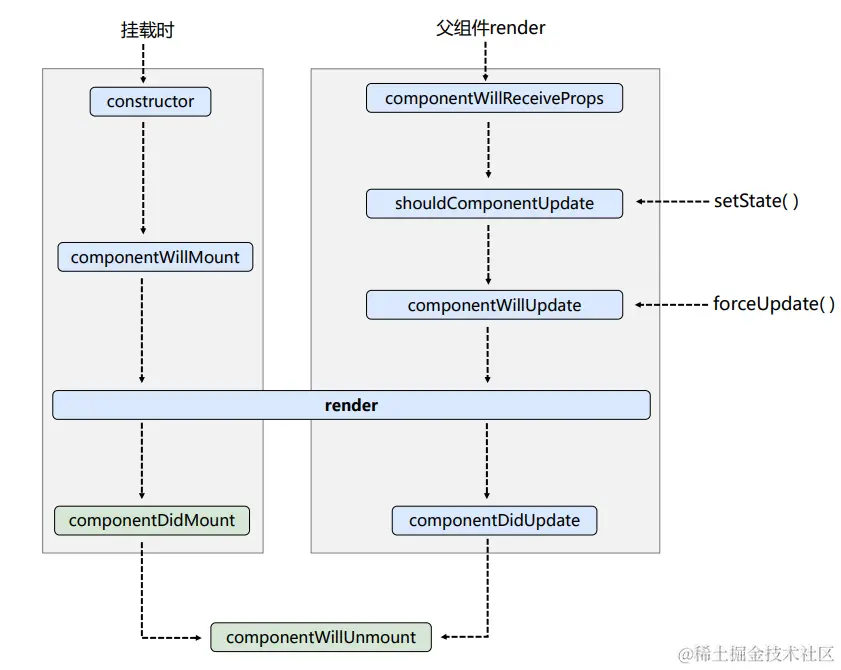

### 简介
> 参考：[https://juejin.cn/post/7096137407409422344](https://juejin.cn/post/7096137407409422344)
> 

react生命周期主要分为三个阶段：Mounting(挂载)、Updating(更新)、Unmounting(卸载)
#### react16

#### 挂载阶段执行顺序

- constructor（构造函数、通常用于初始化组件的状态和绑定方法）
- componentWillMount**(react17后不再使用)**
- render（用来返回组件的UI结构，是一个纯函数，render中不应该包含任何副作用或改变状态的操作(别在render里setState)）
- componentDidMount（在组件挂载到DOM后执行，通常在这里获取数据、进行一些异步请求）
#### 更新阶段执行顺序（组件更新发生在：调用this.setState()方法了、父组件传来的属性更新了、mobx的观察的值更新了）

- componentWillReceiveProps**(react17后不再使用)**
- shouldComponentUpdate
- componentWillUpdate**(react17后不再使用)**
- getDerivedStateFromProps

组件render前会执行getDerivedStateFromProps声明周期。getDerivedStateFromProps声明周期前需要加static关键字。在getDerivedStateFromProps中可以做些判断，决定是否对某些属性进行更新。正常的setState导致的render会正常执行的，只不过当getDerivedStateFromProps中做判断的条件成立时，会额外返回一些数据，相当于执行了一个setState。<br />使用getDerivedStateFromProps声明周期的场景：<br />state中的值由props传递进来，在render中使用的是state里的值，所以外部通过props传递进来的值改变时，不能直接导致state值的改变从而刷新页面，就需要用getDerivedStateFromProps改变state的值。
```javascript
constructor(props: IProps) {
    super(props);
    this.state = {
        isChangeOutViewPanelShow: props.defaultShowAllOutViewPanel || false,
        defaultShowAllOutViewPanel: props.defaultShowAllOutViewPanel || false,
    }
  
static getDerivedStateFromProps(nextProps: IProps, preState: IState) {        
    if (!nextProps || !preState) {
        return null;
    }
    const { defaultShowAllOutViewPanel: nextDefaultShowAllOutViewPanel = false } = nextProps;
    
    if (
        nextDefaultShowAllOutViewPanel !== preState.defaultShowAllOutViewPanel 
    ) {            
        return {
            isChangeOutViewPanelShow: nextDefaultShowAllOutViewPanel,
            defaultShowAllOutViewPanel: nextDefaultShowAllOutViewPanel
        };
    }
    return null;
}
```

- render
- componentDidUpdate（组件更新后触发，用于处理更新后的操作。该函数有两个参数prevProps, prevState，可以获取到本次更新前的数据，用于对比更新前后数据是否有改变）
#### 卸载阶段执行顺序

- componentWillUnmount

> 废弃部分生命周期的原因：有了**React Fiber的机制，**详细分析解释：[https://zhuanlan.zhihu.com/p/26027085](https://zhuanlan.zhihu.com/p/26027085)


#### 原来模糊的知识点：组件什么时候卸载？
比如 `isShow && <MyView><MyView/>`，当isShow的值变为false时，组件就被卸载，当isShow变为true时，组件又回被重新挂载。
