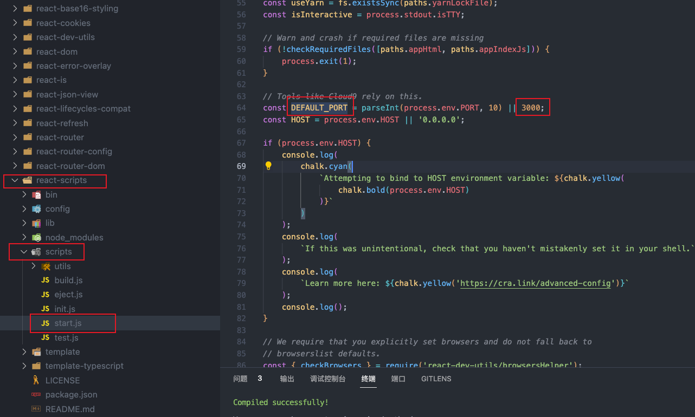
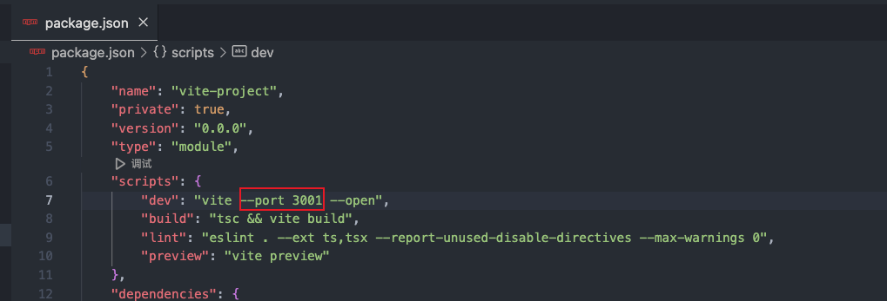

## 一. 工程方面
### 工程结构
```javascript
.
├── README.md
├── package-lock.json
├── package.json
├── public
│   ├── favicon.ico
│   ├── index.html
│   ├── logo192.png
│   ├── logo512.png
│   ├── manifest.json
│   └── robots.txt
├── src
│   ├── App.css
│   ├── App.js
│   ├── App.test.js
│   ├── components				// 存放其他页面组件
│   ├── index.css
│   ├── index.js
│   ├── logo.svg
│   ├── reportWebVitals.js
│   ├── router						// 存放路由文件
│   │   └── IndexRouter.js
│   ├── setupProxy.js
│   ├── setupTests.js
│   └── views							// 存放和路由相关的页面组件
└── tree.txt

6 directories, 20 files

```
### react修改默认启动端口
> [https://blog.csdn.net/weixin_69903461/article/details/131353700?spm=1001.2101.3001.6650.2&utm_medium=distribute.pc_relevant.none-task-blog-2~default~YuanLiJiHua~Position-2-131353700-blog-121686974.235%5Ev38%5Epc_relevant_sort_base3&depth_1-utm_source=distribute.pc_relevant.none-task-blog-2~default~YuanLiJiHua~Position-2-131353700-blog-121686974.235%5Ev38%5Epc_relevant_sort_base3&utm_relevant_index=5](https://blog.csdn.net/weixin_69903461/article/details/131353700?spm=1001.2101.3001.6650.2&utm_medium=distribute.pc_relevant.none-task-blog-2~default~YuanLiJiHua~Position-2-131353700-blog-121686974.235%5Ev38%5Epc_relevant_sort_base3&depth_1-utm_source=distribute.pc_relevant.none-task-blog-2~default~YuanLiJiHua~Position-2-131353700-blog-121686974.235%5Ev38%5Epc_relevant_sort_base3&utm_relevant_index=5)

node_modules -> react-script -> scripts -> start.js文件 -> DEFAULT_PORT变量<br />
#### 使用vite创建的项目修改默认端口
在package.json -> scripts -> dev中加入 `--port` 参数即可修改默认启动端口，加入`--open`参数可以在执行`npm run dev`启动项目后，自动打开页面。<br />
### 配置可以使用@符号作为路径引入文件
#### 在vite.config.ts中添加配置
```typescript
// 引入path模块
import path from 'path'
export default defineConfig({
  plugins: [react()],
  resolve: {
    // 定义@符号的别名，此时@符号就相当于src路径
    alias: {
      "@": path.resolve(__dirname, './src')
    }
  }
})
```
#### 安装关于node库的ts声明配置
上一步引入path模块会有红线提示，说明ts没有识别到node库。<br />终端执行：`npm i -D @types/node`
#### 增加输入@ 符号后的路径提示
执行完上述两步后已经可以通过`import '@/global.scss'`引入模块了，但是在输入@ 符号后没有路径提示。<br />解决方式：在tsconfig.json中添加配置：，在`compilerOptions`中添加`baseUrl`和`path`字段。
```typescript
{
    "compilerOptions": {
        "baseUrl": "./",
        "paths": {
            "@/*": [
                "src/*"
            ]
        }
    },
}
```

## 二. 语法方面
### **setState是同步还是异步**
结论：在同步代码中，setState()异步执行，在异步函数中，setState()同步执行。在react18中，所有位置，setState()都是异步执行的了。
> 参考：
> [https://www.bilibili.com/video/BV1yb4y1i7rP/?spm_id_from=333.337.search-card.all.click&vd_source=d2ee6de80aecd10f87a2ffa4e6eea5b8](https://www.bilibili.com/video/BV1yb4y1i7rP/?spm_id_from=333.337.search-card.all.click&vd_source=d2ee6de80aecd10f87a2ffa4e6eea5b8)

### render()什么时候会重新执行
组件的state改变（执行setState()时）和props改变时（父组件传递过来的值或者store里的值改变时），render()会重新执行
### constructor()只会在组件初始化时执行一次，render()重新执行时，constructor()不会重新执行的
