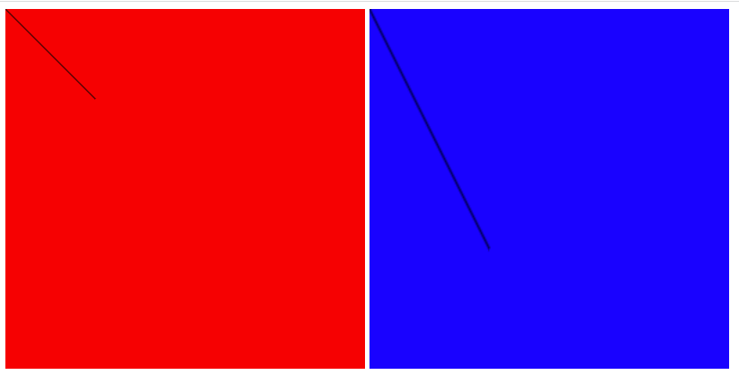
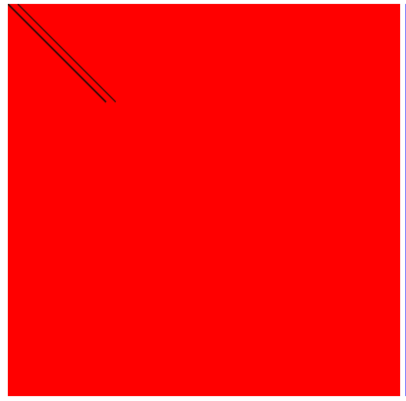

## 响应式布局
### rem
rem表示根元素字号，如果`html{font-size:16px;}`，则1rem相当于16px，通过在不同尺寸屏幕上设置不同根元素字号，可以实现一套以rem为单位的css布局适配多种尺寸的屏幕。<br />怎么在不同尺寸屏幕上设置不同根元素字号？-->flexible.js
#### flexible.js：根据不同的视口宽度，给html根结点设置不同的font-size。
怎么将设计稿的px单位转换为rem？<br />flexible设定根元素font-size为十分之一的视口宽度，如，视口宽度为375px，则根元素font-size=37.5px。<br />所以可以通过让设计稿中的尺寸除以37.5rem，对其进行转换。
#### 举例：
```css
@rootSize: 37.5rem;
.title {
    height: (80 / @rootSize);
    display: flex;
    font-size: (30 / @rootSize);
    justify-content: center;
    align-items: center;
    margin: 0;
}
```
### vw
vw表示视口宽度，1vw相当于1%的视口宽度。
#### postcss-px-to-viewport-8-plugin：自动转换px为vw
## 五子棋游戏
### canvas行内样式和外部样式不一致
在外部样式设置canvas宽高会拉伸画布内容的尺寸。<br />
```css
<style>
    .c1 {
        background-color: red;
    }

    .c2 {
        width: 400px;
        height: 400px;
    }
</style>

<script>
    const c1 = document.querySelector('.c1')
    const ctx1 = c1.getContext('2d')
    ctx1.beginPath()    // 开始一条路径
    ctx1.moveTo(0, 0)
    ctx1.lineTo(100, 100)
    ctx1.stroke()   // 进行绘制
    // // 画竖线
    // ctx1.beginPath()
    // ctx1.moveTo(10, 0)
    // ctx1.lineTo(110, 100)
    // ctx1.stroke()

    const c2 = document.querySelector('.c2')
    const ctx2 = c2.getContext('2d')
    ctx2.beginPath()    // 开始一条路径
    ctx2.moveTo(0, 0)
    ctx2.lineTo(100, 100)
    ctx2.stroke()   // 进行绘制
</script>
```
### canvas画线部分线条变粗问题
要绘制路径，必须首先调用`beginPath()`方法以表示要开始绘制新路径，否则前面画过的线可能会被重新画一遍。<br />
```css
const c1 = document.querySelector('.c1')
const ctx1 = c1.getContext('2d')
ctx1.beginPath()    // 开始一条路径
ctx1.moveTo(0, 0)
ctx1.lineTo(100, 100)
ctx1.stroke()   // 进行绘制
// 画竖线
// ctx1.beginPath()
ctx1.moveTo(10, 0)
ctx1.lineTo(110, 100)
ctx1.stroke()
```
### 调整屏幕大小后，棋盘尺寸没有自动刷新
监听窗口变化：window.addEventListener('resize',)，重新初始化棋盘。
### 触发媒体查询前后，使样式过度丝滑
使用rem+媒体查询。实现使用媒体查询前后丝滑过度，需要设定媒体查询的css样式和达到媒体查询临界值时的样式一致。
> 实际尺寸=font-size * 设计稿尺寸/37.5，此时视口宽度为450，又font-size为十分之一视口宽度，则实际尺寸=设计稿尺寸/(45/37.5)=设计稿尺寸/0.83

```css
@rootSize: 37.5rem; 
    .title {
        height: (80 / @rootSize);
        display: flex;
        font-size: (30 / @rootSize);
        justify-content: center;
        align-items: center;
        margin: 0;
    }

@rootSizeOfWeb: 0.83px; 
// 视口宽度大于450px时，设置一套新样式
@media screen and (min-width: 450px) {
    .title {
        height: (80 / @rootSizeOfWeb);
        display: flex;
        font-size: (30 / @rootSizeOfWeb);
        justify-content: center;
        align-items: center;
    }
```

