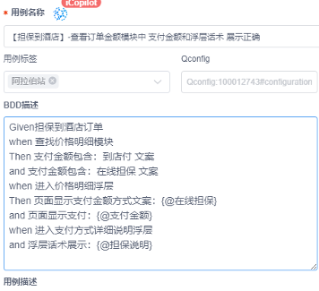

> 参考：[http://pages.release.ctripcorp.com/hotelnative/spirit/bdd/BDD_introduce.html](http://pages.release.ctripcorp.com/hotelnative/spirit/bdd/BDD_introduce.html)

### Gherkin语法
#### 关键字
Gherkin语言通常包括以下关键词和语法结构：

- Scenario（场景）：描述一个特定的测试场景或用例。
- Given（假设）：描述测试场景的前置条件。
- When（当）：描述测试场景中的操作或事件。
- Then（那么）：描述预期的结果或行为。
- And（并且）：可以跟在When或者Then后面，表示接下来的操作或预期。个人认为：when，And与When，When的用法是一样的，所以没有And关键字也行。
#### 例子
```python
如：一个因密码输入错误导致登录失败的场景，采用Gherkin语言编写如下：

Scenario:密码输入错误导致登录失败
Given:我已经进入登录页面
When:输入正确的用户名
And:输入错误的密码
And:点击登录按钮
Then:我会看到登录错误的提示
```

