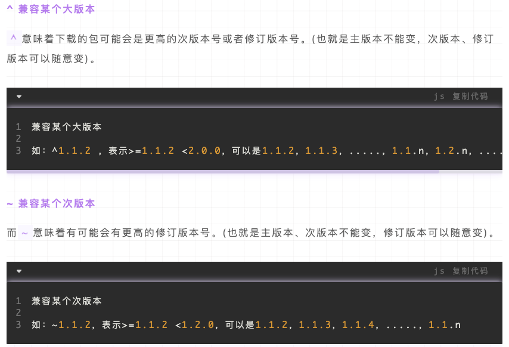
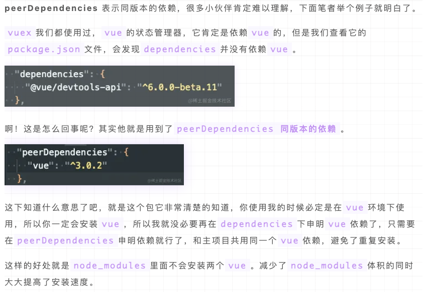

> 参考：
> [https://juejin.cn/post/7137110113277444126](https://juejin.cn/post/7137110113277444126)



### **peerDependencies**
举例：
```javascript

{
  "name": "your-package-name",
  "version": "1.0.0",
  "peerDependencies": {
    "other-package": "^2.0.0"
  }
}
```
表示我的包在运行时依赖于另一个模块，但不会将其打包到我的项目中。也就是我的包不是单独运行的，是作为子包让别人使用的，并且我明确使用者一定会安装我peerDependencies里的包。这样的话，我的依赖中就没有了`other-package`依赖，使用者的node_modules里就不会有两份一样的`other-package`了。<br />

