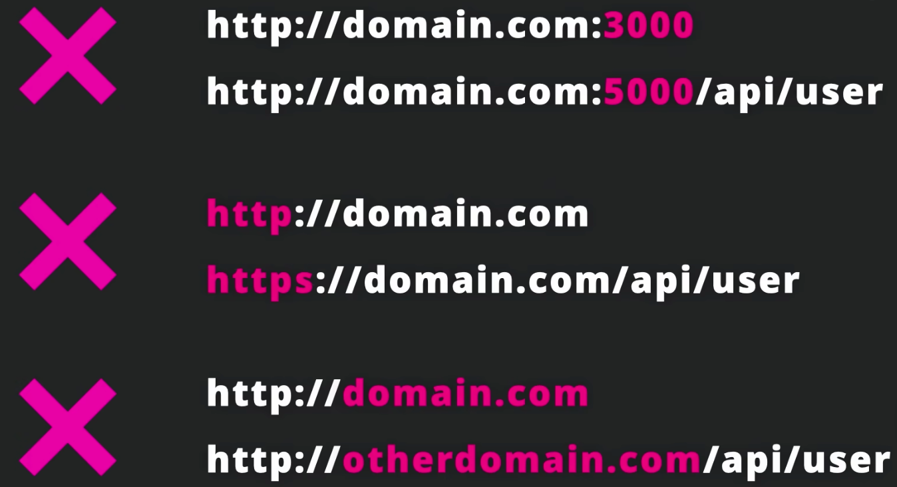
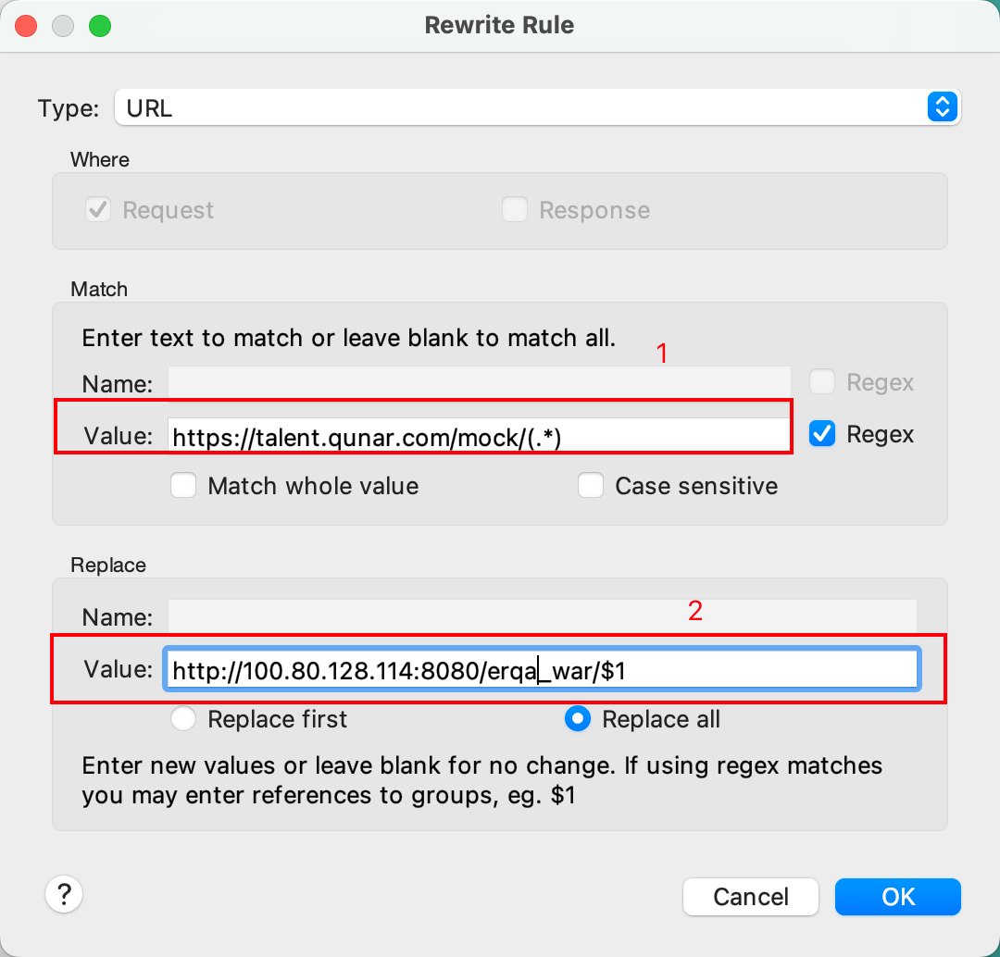

跨域全称为Cross-Origin Resource Sharing，意为跨域资源共享，是一种允许当前域（domain）的资源被其他域（domain）的脚本请求访问的机制，通常由于同源安全策略，浏览器会禁止这种跨域请求。 浏览器只允许请求同源的资源，同源的含义是：协议、域名、端口都一致。如下图所示： 

**当浏览器向服务器发起请求时，即使存在跨域问题，服务器依旧是会响应请求，并返回数据给浏览器，但当浏览器拿到数据后发现存在跨域问题了，这时候浏览器就不会将数据给页面，相当于把数据给扣留了**。 前端解决方式：配置代理发送请求，跨域是浏览器的保护机制，如果脱离浏览器发送请求则不会受到浏览器跨域保护机制的影响。 使用代理服务器时：代理服务器与前端页面同源（代理服务器需要与前端页面同源），但是由代理服务器返回的数据就不存在跨域的问题。 （原因是虽然代理服务器与服务器之间是非同源，但不存在跨域问题，因为**服务器之间采用的是http请求，而不是ajax技术**）
### 通过Charles解决跨域问题
配置rewrite，如下图： 

2中的链接是我实际想要访问的链接，目前我浏览器所处的域名为[https://talent.qunar.com](https://talent.qunar.com)，想要访问[https://yapi.corp.qunar.com](https://yapi.corp.qunar.com)，与我浏览器所处的域名不一致，所以存在跨域问题。所以配置1处的链接，通过1处的链接请求2处的链接，1处链接发出的请求即为代理服务器发出的请求，不存在跨域问题。在代码中实际请求的接口是1处的接口，Charles监听到有请求1处的接口时，会自动转发去请求2处的接口。
