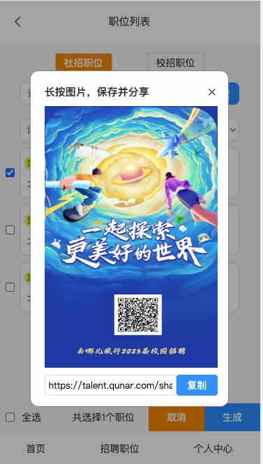
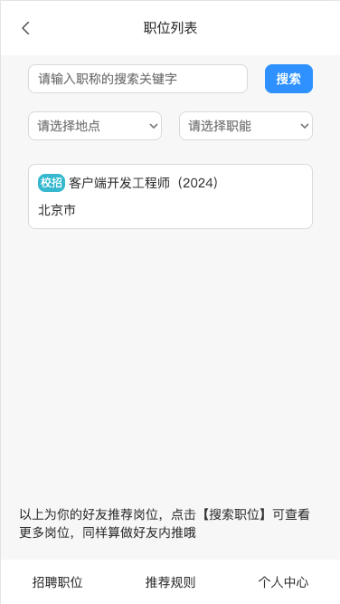

> 问题场景：
> 目前正在开发JobList页面：[https://talent.qunar.com/shark/active/57cc5197d1194c4184abaf1cdf5441b6?proxyWebIDEDomain=webide.beta.qunar.com/haidi-yi/0i2ql6l2/8009&proxyComponents=cmsQfcJobList](https://talent.qunar.com/shark/active/57cc5197d1194c4184abaf1cdf5441b6?proxyWebIDEDomain=webide.beta.qunar.com/haidi-yi/0i2ql6l2/8009&proxyComponents=cmsQfcJobList)
> 在JobList页面可以生成分享链接，点击分享链接后进入的是线上的内容，而不是自己开发的页面。

分享链接：[https://talent.qunar.com/shark/active/57cc5197d1194c4184abaf1cdf5441b6?userId=a3f817717c3c45d2ab3be15f1746c7cd&jobId=3818c825-b431-48cc-8b1a-fcd7f63b8fee&isTouch=1](https://talent.qunar.com/shark/active/57cc5197d1194c4184abaf1cdf5441b6?userId=a3f817717c3c45d2ab3be15f1746c7cd&jobId=3818c825-b431-48cc-8b1a-fcd7f63b8fee&isTouch=1)  点开分享链接，显示的是下图，与正在开发的页面不符：  这个问题的原因是：目前开发是在云环境中进行的，链接中有云环境的参数：proxyWebIDEDomain=webide.beta.qunar.com/haidi-yi/0i2ql6l2/8009&proxyComponents=cmsQfcJobList ，需要将上述参数拼接到分享链接中，拼接后的分享链接为：[https://talent.qunar.com/shark/active/57cc5197d1194c4184abaf1cdf5441b6?userId=a3f817717c3c45d2ab3be15f1746c7cd&jobId=3818c825-b431-48cc-8b1a-fcd7f63b8fee&isTouch=1&proxyWebIDEDomain=webide.beta.qunar.com/haidi-yi/0i2ql6l2/8009&proxyComponents=cmsQfcJobList](https://talent.qunar.com/shark/active/57cc5197d1194c4184abaf1cdf5441b6?userId=a3f817717c3c45d2ab3be15f1746c7cd&jobId=3818c825-b431-48cc-8b1a-fcd7f63b8fee&isTouch=1&proxyWebIDEDomain=webide.beta.qunar.com/haidi-yi/0i2ql6l2/8009&proxyComponents=cmsQfcJobList)
