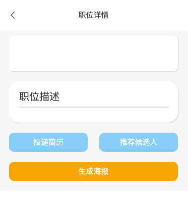
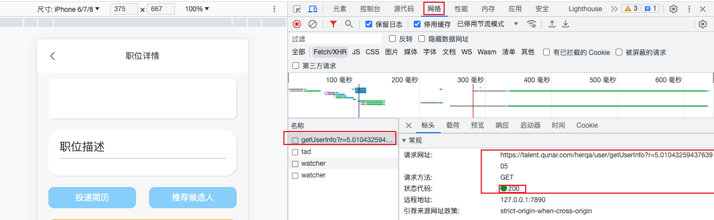
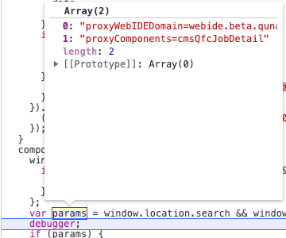

启动职位详情页组件后，提供的链接为：[https://m.flight.qunar.com/shark/active/272a13eb50ede8c6316e5b9477e551eb?proxyWebIDEDomain=webide.beta.qunar.com/haidi-yi/0i2ql6l2/8009&proxyComponents=cmsQfcJobDetail](https://m.flight.qunar.com/shark/active/272a13eb50ede8c6316e5b9477e551eb?proxyWebIDEDomain=webide.beta.qunar.com/haidi-yi/0i2ql6l2/8009&proxyComponents=cmsQfcJobDetail)<br />同样，需要将`m.flight.qunar.com`域名替换为`talent.qunar.com`，替换后输入手机号及验证码后页面的职位信息为空，如下图所示：<br /><br />打开控制台->网络，发现已经请求了<br />[https://talent.qunar.com/herqa/user/getUserInfo?r=5.0104325943763905]()接口，这是个GET请求，直接打开链接可以看到请求返回的信息：<br />
```json
// 20230816155818
// https://talent.qunar.com/herqa/user/getUserInfo?r=5.0104325943763905

{
  "code": 0,
  "message": "成功",
  "data": {
    "user": {
      "id": 1864,
      "userId": "a3f817717c3c45d2ab3be15f1746c7cd",
      "userName": "伊海迪",
      "userPhone": "13130813797",
      "userEmail": "haidi.yi@qunar.com",
      "userWechatId": null,
      "userType": 1,
      "createTime": "2023-08-08T16:00:00.000+00:00",
      "updateTime": "2023-08-08T16:00:00.000+00:00"
    }
  }
}
```
所以此时已经登陆成功，但是却没有获得职位信息，原因是CMS是每次启动单个页面，正常从职位列表页到职位详情页，会传递过去要请求的职位信息参数：`jobId=964d15e8-0e91-475d-bc20-2da898f2c1e9`。通过加入断点，也可以看到，此时参数只有两个，没有`jobId`参数：<br /><br />综上，请求职位信息接口的参数不足，所以无法获取数据。<br />解决方式：在原本请求链接的后面再拼接上`jobId`参数，拼接后链接为：<br />[https://talent.qunar.com/shark/active/272a13eb50ede8c6316e5b9477e551eb?proxyWebIDEDomain=webide.beta.qunar.com/haidi-yi/0i2ql6l2/8009&proxyComponents=cmsQfcJobDetail&jobId=964d15e8-0e91-475d-bc20-2da898f2c1e9](https://talent.qunar.com/shark/active/272a13eb50ede8c6316e5b9477e551eb?proxyWebIDEDomain=webide.beta.qunar.com/haidi-yi/0i2ql6l2/8009&proxyComponents=cmsQfcJobDetail&jobId=964d15e8-0e91-475d-bc20-2da898f2c1e9)
