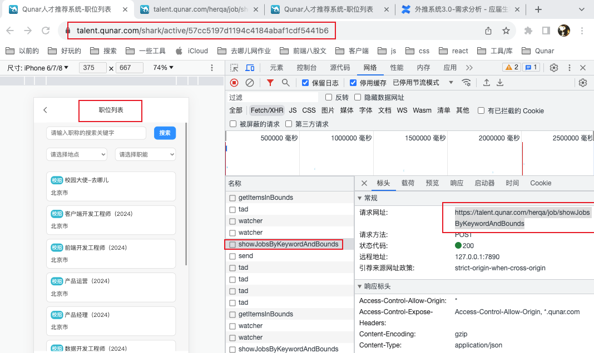

做外推系统3.0项目过程中，项目启动后职位列表页：[https://talent.qunar.com/shark/active/57cc5197d1194c4184abaf1cdf5441b6?proxyWebIDEDomain=webide.beta.qunar.com/haidi-yi/0i2ql6l2/8009&proxyComponents=cmsQfcJobList](https://talent.qunar.com/shark/active/57cc5197d1194c4184abaf1cdf5441b6?proxyWebIDEDomain=webide.beta.qunar.com/haidi-yi/0i2ql6l2/8009&proxyComponents=cmsQfcJobList)获取不到数据：请求https://m.flight.qunar.com/herqa/job/showJobsByKeywordAndBounds获取职位列表时，会重定向到https://m.flight.qunar.com/h5/flight/。 打开目前对外使用的外推系统2.0项目，进入职位列表页：[https://talent.qunar.com/shark/active/57cc5197d1194c4184abaf1cdf5441b6](https://talent.qunar.com/shark/active/57cc5197d1194c4184abaf1cdf5441b6)，发现实际请求的接口是：[https://talent.qunar.com/herqa/job/showJobsByKeywordAndBounds](https://talent.qunar.com/herqa/job/showJobsByKeywordAndBounds)  所以在启动外推系统3.0后，手动修改域名，将m.flight.qunar.com修改为talent.qunar.com，修改后的地址为：[https://talent.qunar.com/shark/active/57cc5197d1194c4184abaf1cdf5441b6?proxyWebIDEDomain=webide.beta.qunar.com/haidi-yi/0i2ql6l2/8009&proxyComponents=cmsQfcJobList](https://talent.qunar.com/shark/active/57cc5197d1194c4184abaf1cdf5441b6?proxyWebIDEDomain=webide.beta.qunar.com/haidi-yi/0i2ql6l2/8009&proxyComponents=cmsQfcJobList) 注：需要在网页控制台选择手机模式
