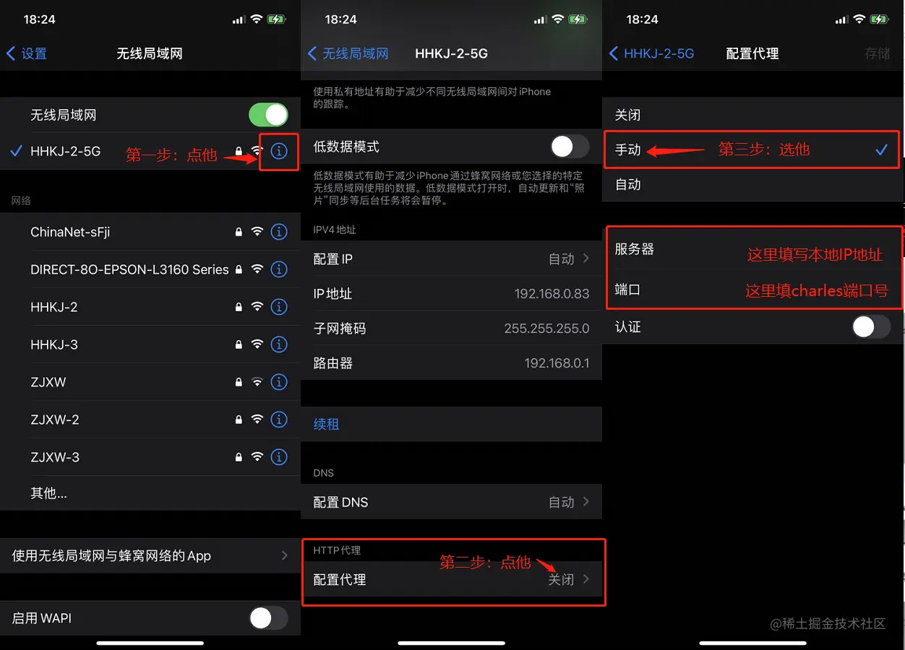
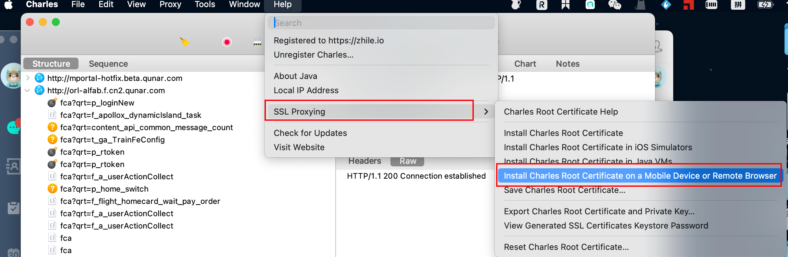

## charles代理YAPI
在项目中使用 YAPI 的 mock 接口会跨域，需要使用 Charles 进行代理。<br />比如YAPI接口的地址是 [https://yapi.corp.qunar.com/mock/96](https://yapi.corp.qunar.com/mock/9661)[61](http://wiki.corp.qunar.com/) ，项目的地址是 [https://talent.qunar.com](https://talent.qunar.com/) 
### 打开 Charles，选择 tools >> Rewrite Settings
### 
### 点击add添加规则

### 配置拦截URL格式

### 开启SSL代理并设置
<br />

### 原理
按照上述步骤配置好后，本机发出的`https://talent.qunar.com/mock`前缀的请求会被Charles拦截，实际访问的是`[https://yapi.corp.qunar.com/mock/96](https://yapi.corp.qunar.com/mock/9661)[61](http://wiki.corp.qunar.com/) `前缀的链接。<br />例：请求接口`[https://talent.qunar.com/mock](https://talent.qunar.com/mock)/herqa/job/getItemsInBounds`，通过Charles处理后实际访问的是`https://yapi.corp.qunar.com/mock/9661/herqa/job/getItemsInBounds`。
> 注：
> 实际数据接口为`https://talent.qunar.com/herqa/job/getItemsInBounds`，中间是没有`mock`字样的，所以可以定义常量BASE_URL：`const BASE_URL = "https://talent.qunar.com/mock"`，在请求数据的时候进行拼接，如：`url: BASE_URL + '/herqa/job/getItemsInBounds'`，这样在测试完成，接口上线服务后，只需要将BASE_URL里的mock去掉即可：`const BASE_URL = "https://talent.qunar.com"`

## charles手机抓包
> 参考：
> [https://www.jianshu.com/p/5539599c7a25](https://www.jianshu.com/p/5539599c7a25)
> [https://juejin.cn/post/7017013378291859486](https://juejin.cn/post/7017013378291859486)

### 查看电脑本地ip及charles端口
mac终端执行：
```objectivec
ifconfig | grep "inet" | grep "100"
```
<br />或者：charles软件 -> Help -> Local IP Address，<br /><br /><br />查看charles的端口：<br />
### 手机上配置代理
配置好后可以点右上角存储，这样就不用每次都配了。<br /><br />
### 手机上安装证书
`charles`软件按下图操作，拿到下载证书的url（在手机上打开，且打开时需要开启代理，不然可能不弹出下载证书的弹窗）：<br /><br /><br />在手机浏览器中输入url链接，访问网址：`chls.pro/ssl`（需要打开代理，不然可能不弹出下载证书的弹窗），会出现下载证书提示，下载后安装证书。<br />

### 慢网


