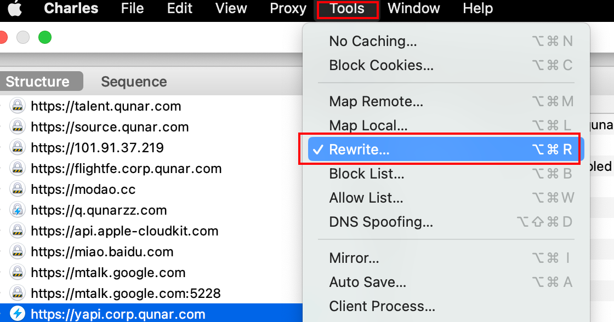
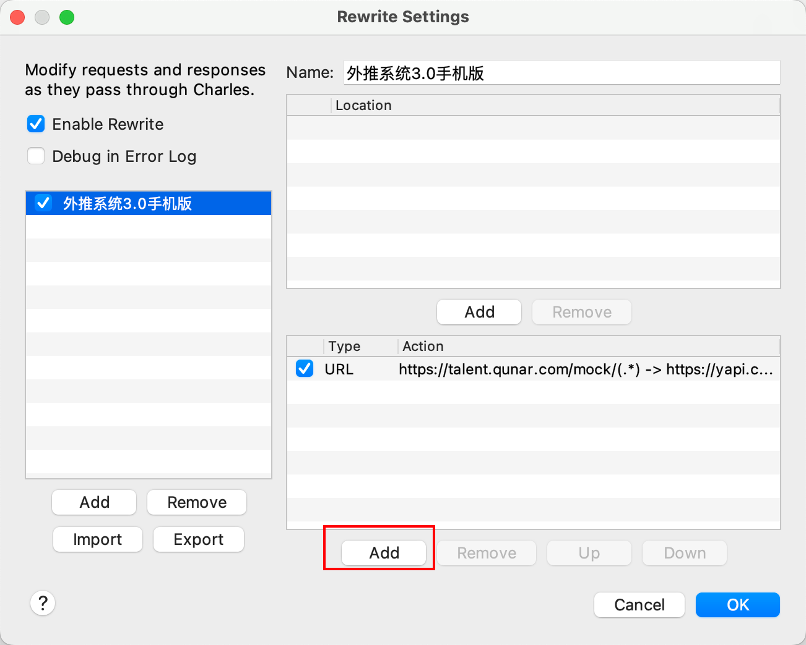
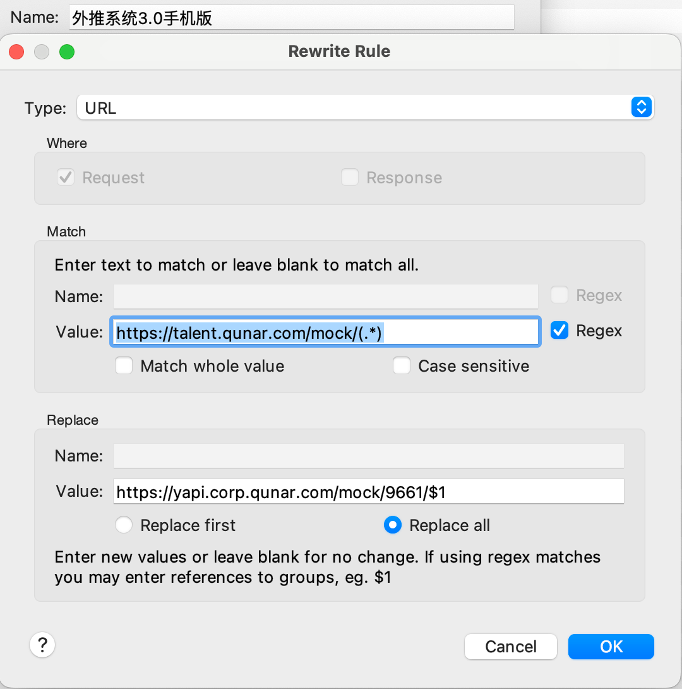
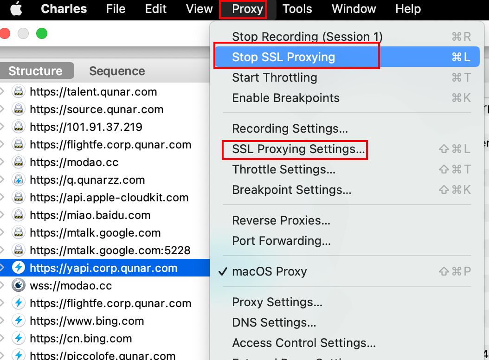
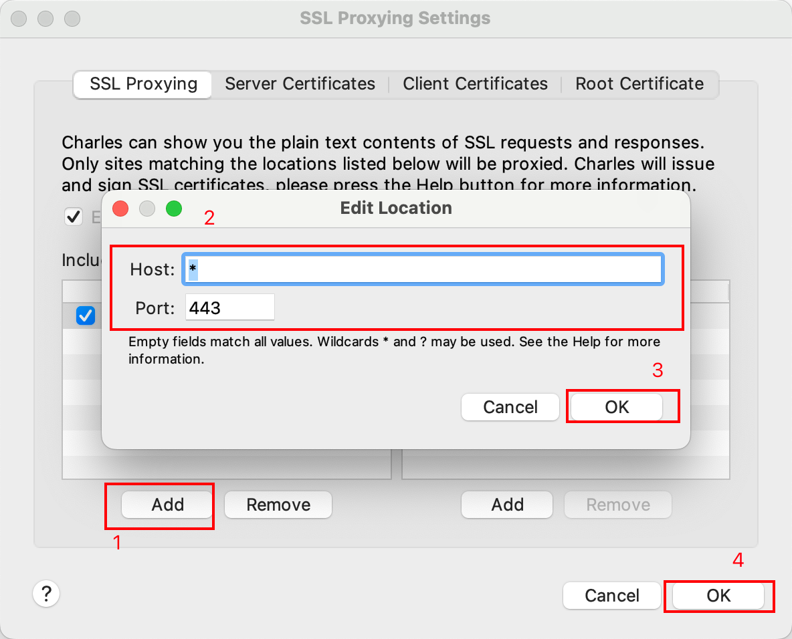

在项目中使用 YAPI 的 mock 接口会跨域，需要使用 Charles 进行代理。 比如YAPI接口的地址是 [https://yapi.corp.qunar.com/mock/96](https://yapi.corp.qunar.com/mock/9661)[61](http://wiki.corp.qunar.com/) ，项目的地址是 [https://talent.qunar.com](https://talent.qunar.com/) 
### 打开 Charles，选择 tools >> Rewrite Settings
### 
### 点击add添加规则

### 配置拦截URL格式

### 开启SSL代理并设置
 

### 原理
按照上述步骤配置好后，本机发出的`https://talent.qunar.com/mock`前缀的请求会被Charles拦截，实际访问的是`[https://yapi.corp.qunar.com/mock/96](https://yapi.corp.qunar.com/mock/9661)[61](http://wiki.corp.qunar.com/) `前缀的链接。 例：请求接口`[https://talent.qunar.com/mock](https://talent.qunar.com/mock)/herqa/job/getItemsInBounds`，通过Charles处理后实际访问的是`https://yapi.corp.qunar.com/mock/9661/herqa/job/getItemsInBounds`。
> 注：
> 实际数据接口为`https://talent.qunar.com/herqa/job/getItemsInBounds`，中间是没有`mock`字样的，所以可以定义常量BASE_URL：`const BASE_URL = "https://talent.qunar.com/mock"`，在请求数据的时候进行拼接，如：`url: BASE_URL + '/herqa/job/getItemsInBounds'`，这样在测试完成，接口上线服务后，只需要将BASE_URL里的mock去掉即可：`const BASE_URL = "https://talent.qunar.com"`

