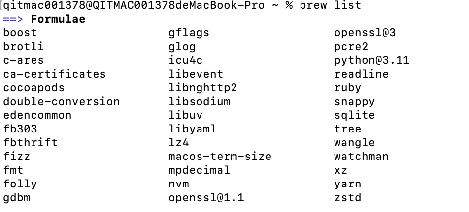

> 参考：
> [https://zhuanlan.zhihu.com/p/30704752](https://zhuanlan.zhihu.com/p/30704752)

Homebrew 是 macOS 的套件管理工具，用于下载存在依赖关系的软件包。
### 通过`brew list`命令可以查看mac中安装的库

### `brew install 库名`：安装库
### 通过`brew uninstall 库名`可以删除执行的库

