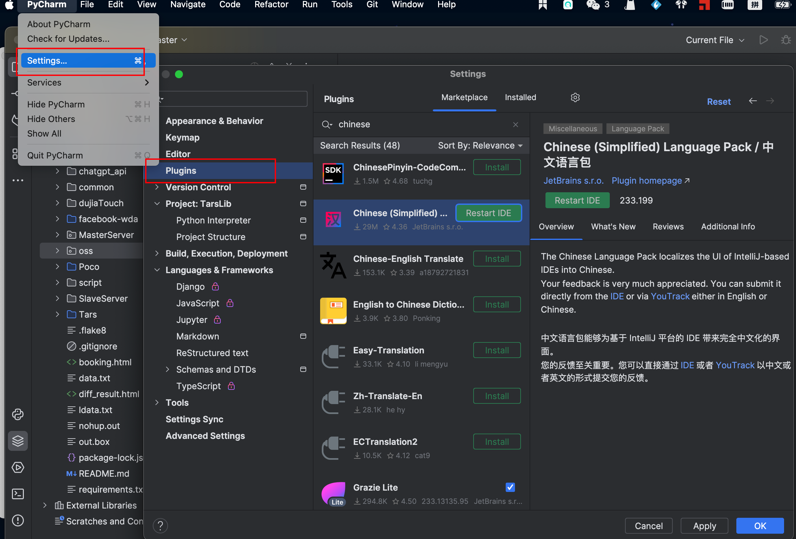
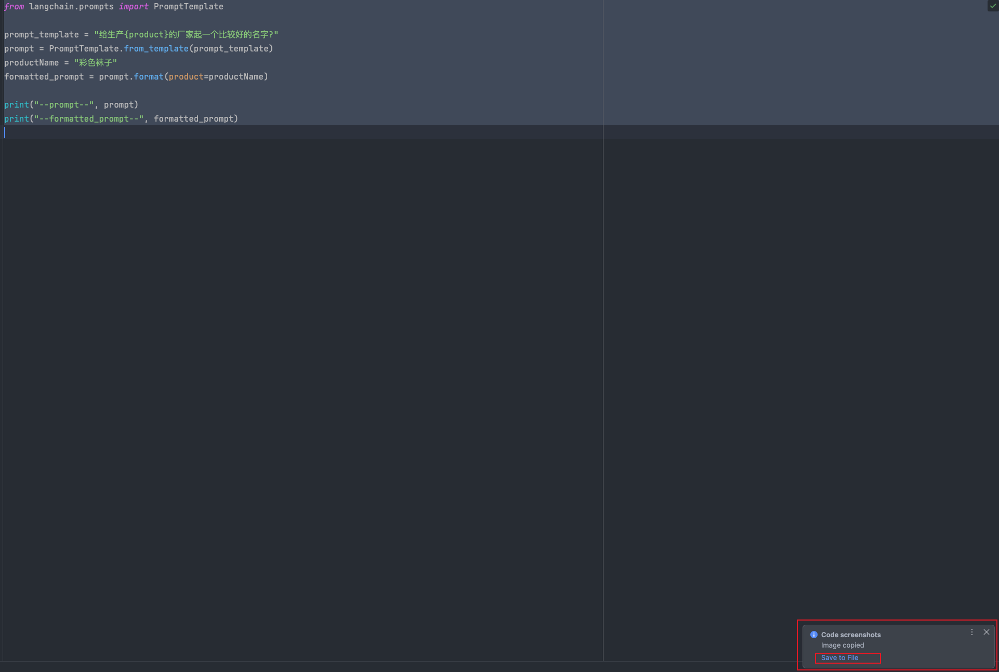
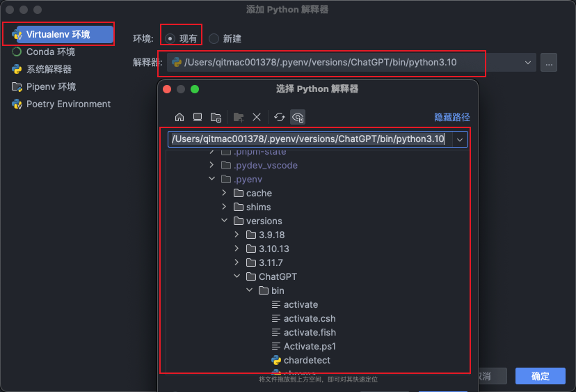

# Pycharm相关

## 插件
按下图方式进入插件安装界面，搜索要安装的插件安装即可。 
### 中文语言插件
Chinese(Simplified) Language Pack
### copilot插件
安装后，
### 截图插件：Easy Code ScreenShots
安装后，光标选中需要截图的区域，按快捷键：`command + shift + s`会将截图保存到剪切板 截图后，右下角会有提示，可以将截图保存到本地。 

## 使用
### 配置虚拟环境
> [https://juejin.cn/post/7127489582890745887](https://juejin.cn/post/7127489582890745887)

按下图顺序操作，可以找到在本地创建的虚拟环境  
###  
