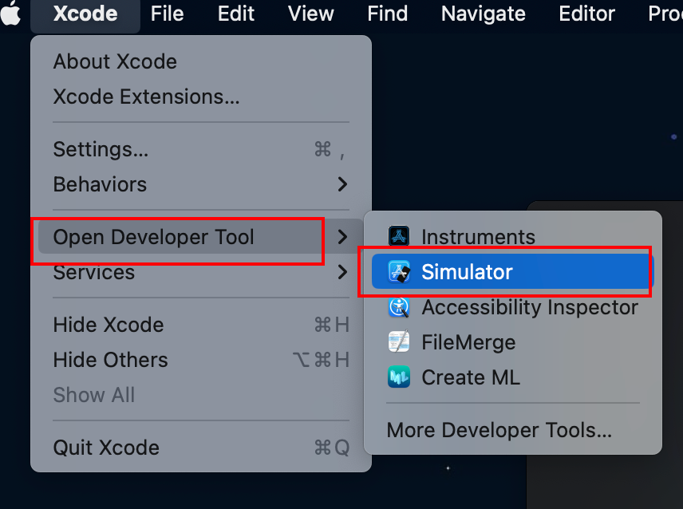
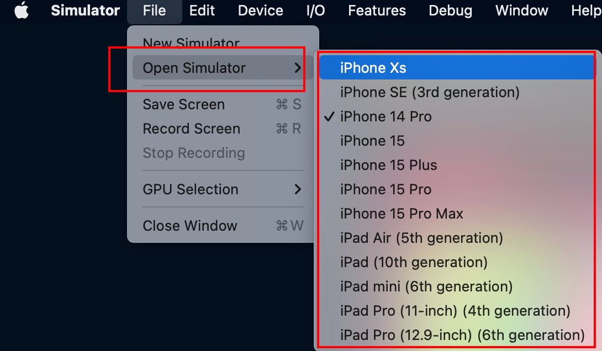
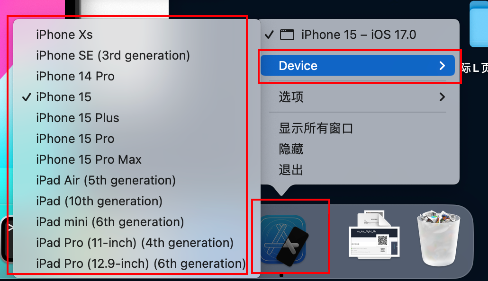
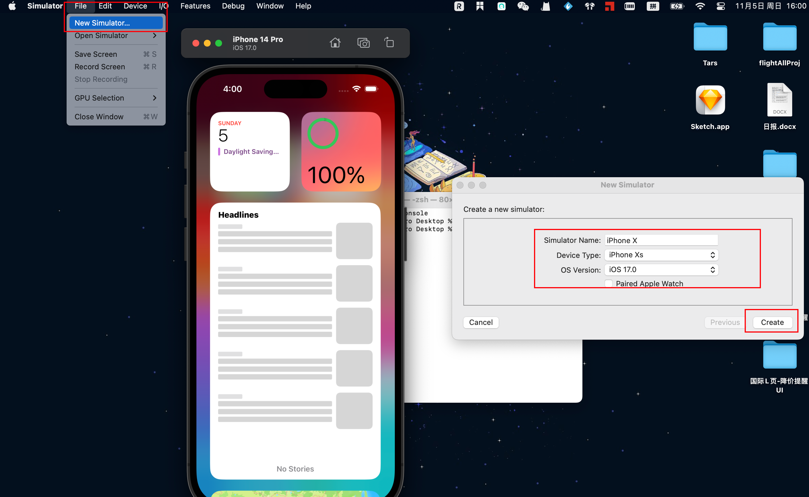
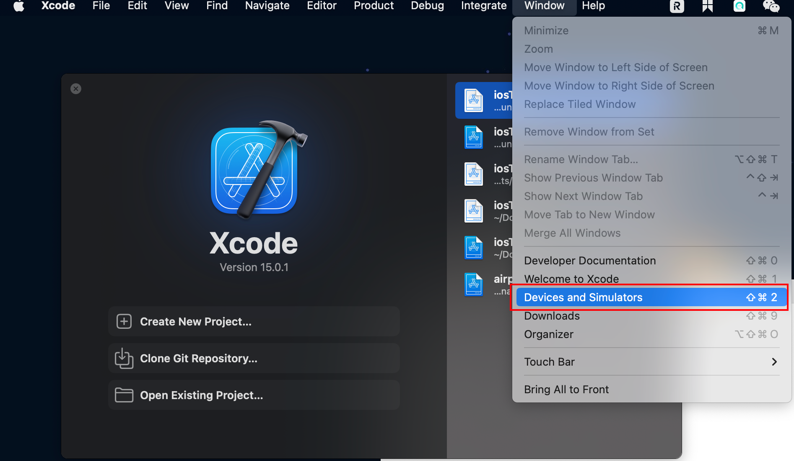
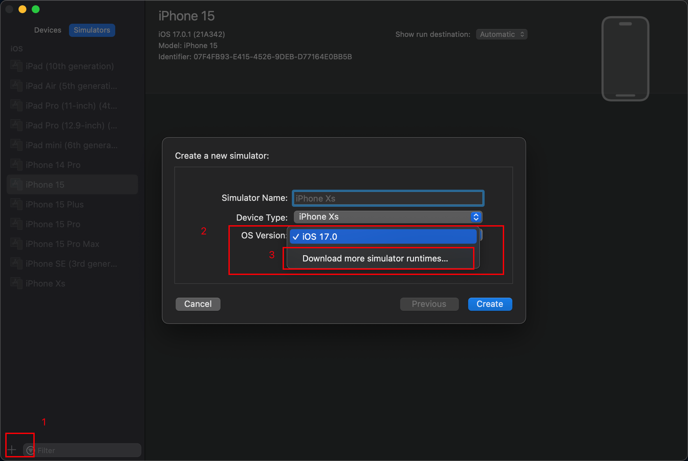
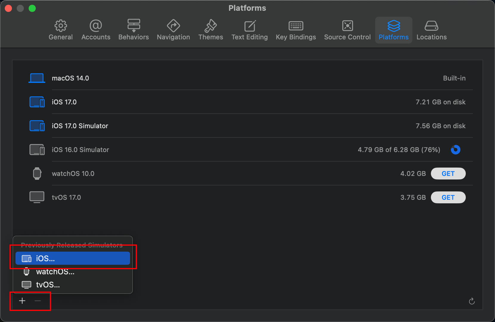
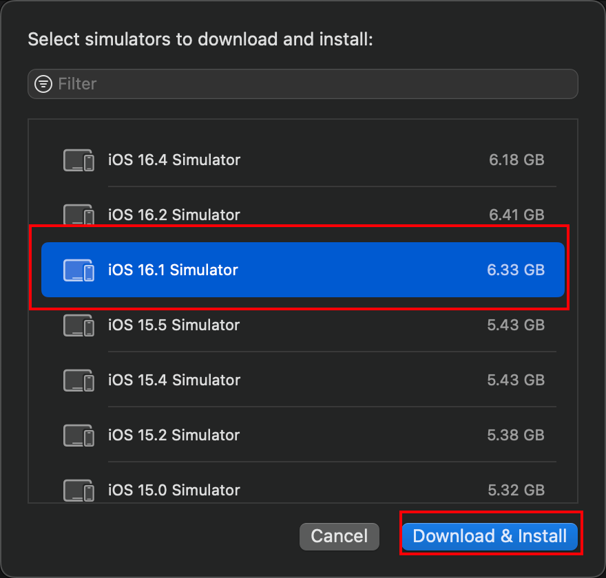
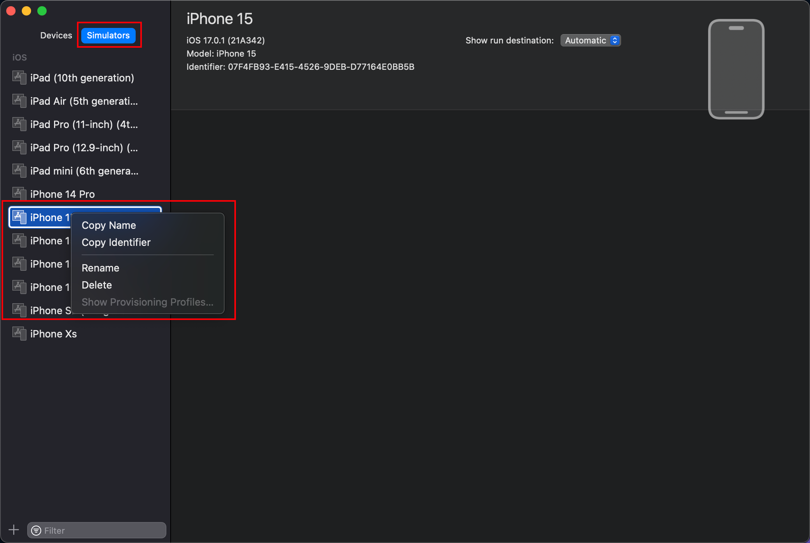
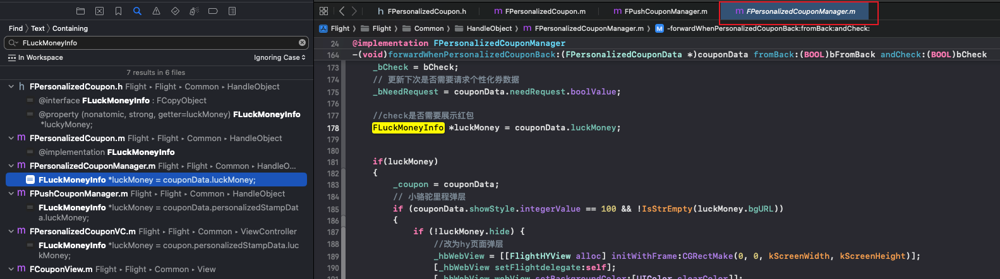

## 一. 模拟器相关
### 打开手机模拟器
#### 通过Xcode打开

#### 通过终端命令打开
```python
open -a Simulator
```
### 打开不同型号的手机模拟器
#### 方式1: 按下图操作。首先执行步骤1打开手机模拟器，然后按下图选择要打开的手机模拟器。

#### 方式2: 在扩展坞中右键Simulator，切换模拟器。

### 新建新的手机型号
#### 新建：填写手机名称、选择手机型号和操作系统版本即可

#### 注意：在新建模拟器时，有可能已有的IOS系统版本不支持较老的手机型号(比如此时只有IOS17，但是iphoneX及以前的手机最大只能使用IOS16系统)，此时需要再安装一个老版本的IOS系统。
此时，需要打开Xcode，Window -> Devices and Simulators<br /><br />点击左小角 加号 （新建模拟器的步骤），在OS Version中选择 下载更多模拟器运行环境。<br /><br />在弹出的界面点击左下角 加号，我们要安装手机的系统，则选择IOS<br /><br />选择要安装的系统，安装即可。安装完成后，新建手机模拟器时就可以选择使用此版本的系统了。<br />
### 删除手机模拟器（需要打开XCode）
打开XCode，Window -> Devices and Simulators<br /><br />在弹出的操作界面，选择你要操作的模拟器，右键即可操作。<br />


## 快捷键
### 定位到文件所在目录`command + shift + j`
### 在新标签页打开文件，而不是在当前标签页替换原有文件
搜索之后打开文件会像图中的红框中的文件一样是名字斜斜的，此时再点开新文件就会把此文件标签页改掉，所以需要先双击下这个斜斜的标签页，变成不斜的标签页，再在左侧搜索位置点开一个新文件就会在新标签页打开了。<br />

