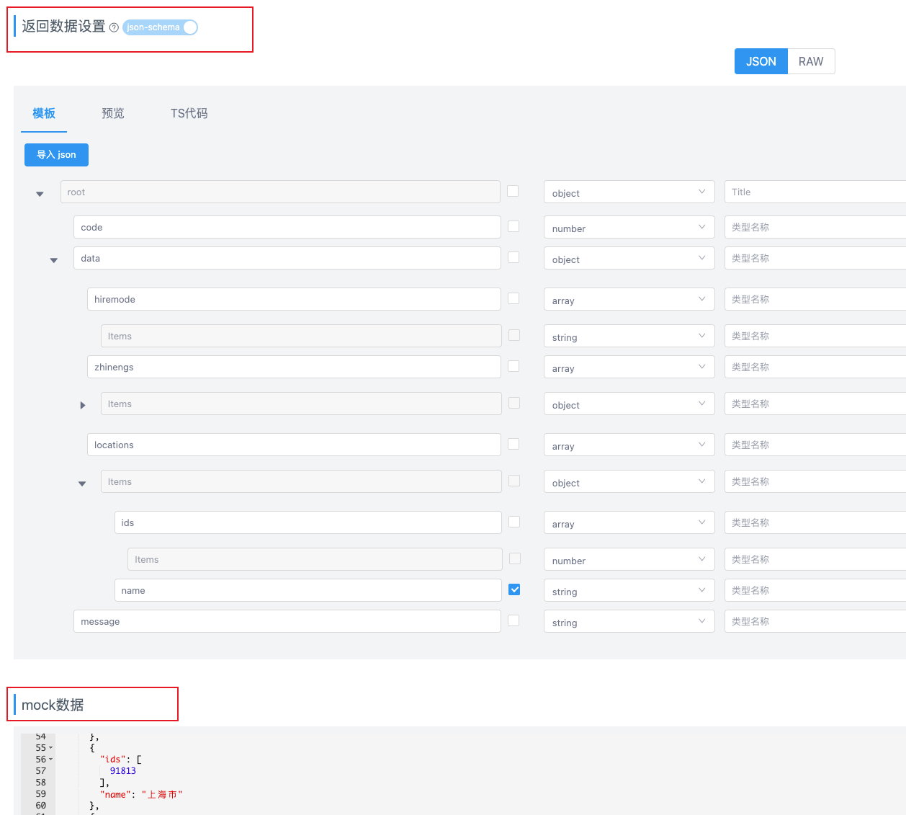

作用：接口管理，mock数据
> 参数：
> [https://hellosean1025.github.io/yapi/documents/api.html](https://hellosean1025.github.io/yapi/documents/api.html)

#### 新建接口
> 参考：
> [https://hellosean1025.github.io/yapi/documents/quickstart.html#%E6%96%B0%E5%BB%BA%E6%8E%A5%E5%8F%A3](https://hellosean1025.github.io/yapi/documents/quickstart.html#%E6%96%B0%E5%BB%BA%E6%8E%A5%E5%8F%A3)

#### mock数据
这一部分把后端给的数据返回格式粘进去就可以：
```json
{
  "code": 0,
  "message": "成功",
  "data": {
    "hiremode": [
      "social"
    ],
    "zhinengs": [
      {
        "id": 18242,
        "name": "市场类"
      },
      {
        "id": 18241,
        "name": "运营类"
      },
      {
        "id": 18240,
        "name": "设计类"
      },
      {
        "id": 15701,
        "name": "客服类"
      },
      {
        "id": 15431,
        "name": "技术类"
      },
      {
        "id": 15432,
        "name": "产品类"
      },
      {
        "id": 15436,
        "name": "职能类"
      },
      {
        "id": 15437,
        "name": "销售类"
      }
    ],
    "locations": [
      {
        "ids": [
          41841,
          41842,
          41844,
          41845,
          41846,
          289395,
          382197
        ],
        "name": "北京市"
      },
      {
        "ids": [
          91813
        ],
        "name": "上海市"
      },
      {
        "ids": [
          363410
        ],
        "name": "武汉市"
      },
      {
        "ids": [
          null
        ],
        "name": "其他"
      }
    ]
  }
}
```

#### 根据不同参数返回不同数据：文档中高级Mock->Mock期望
> 参考：
> [https://hellosean1025.github.io/yapi/documents/adv_mock.html#mock-%E6%9C%9F%E6%9C%9B](https://hellosean1025.github.io/yapi/documents/adv_mock.html#mock-%E6%9C%9F%E6%9C%9B)


