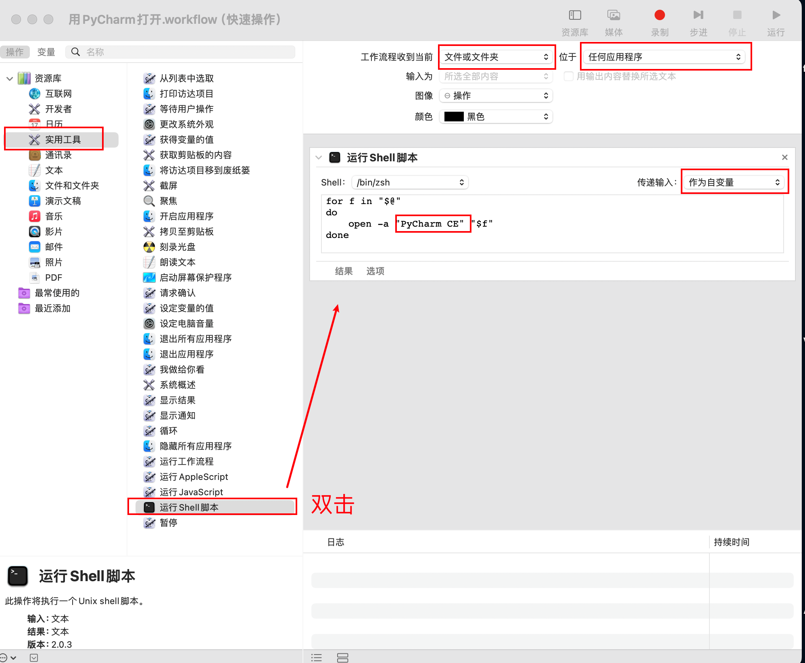
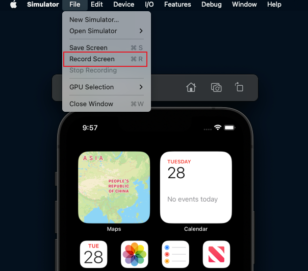
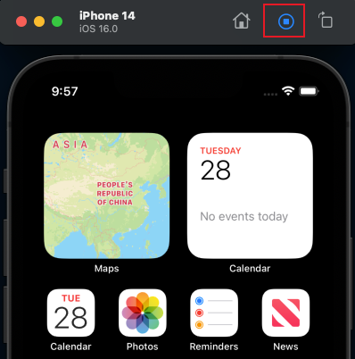

### mac命令行打开文件
```shell
open 文件名
```
此命令会使用mac的默认文本编辑器打开文件
### 右键文件夹 -> 快速操作 -> 通过指定软件打开
> 参考：[https://blog.csdn.net/qq_43690043/article/details/123093214](https://blog.csdn.net/qq_43690043/article/details/123093214)

按照系统填好信息，将open -a后的程序改为想要使用的app名即可。<br />
### mac电脑查看IP地址
```javascript
ifconfig | grep "inet" | grep "100"
```
### mac查看隐藏文件
启动访达后，键盘按下快捷键：`command + shift + .`即可。<br />但是显示隐藏文件后，是仍然看不到：`.DS_Store`文件的。
### 模拟器录屏：快捷键：`command + r`
或者按下图点击开始录屏。<br /><br />录屏后，右上角出现录屏开始样式，再次点击会结束录屏。<br />
### mac终端命令
#### grep
```javascript
grep FActionEnv(要搜索的关键字) libFlight_a.a(被搜索的文件名)
```
如果报错：Binary file libFlight_a.a matches，可以增加`-a`参数，如下：
```javascript
grep -a FActionEnv libFlight_a.a
```
其他参数：

- -c：显示符合条件的行数
