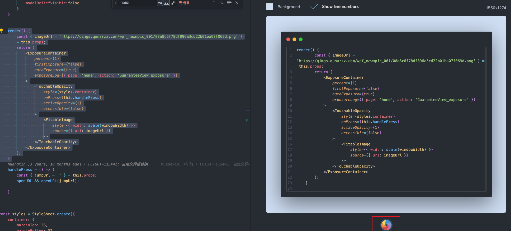
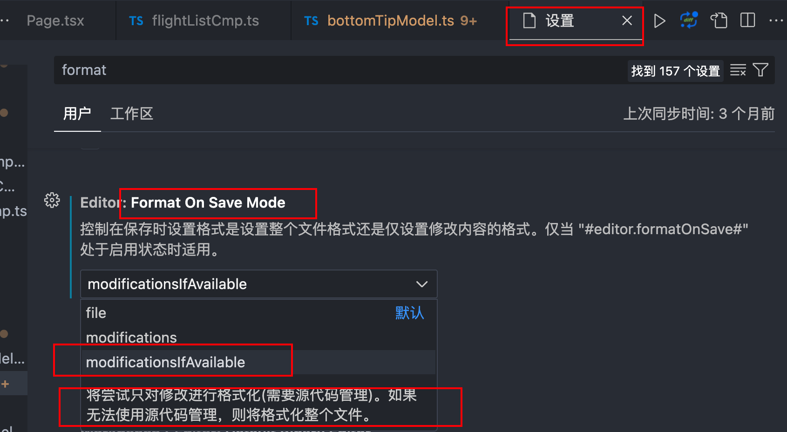
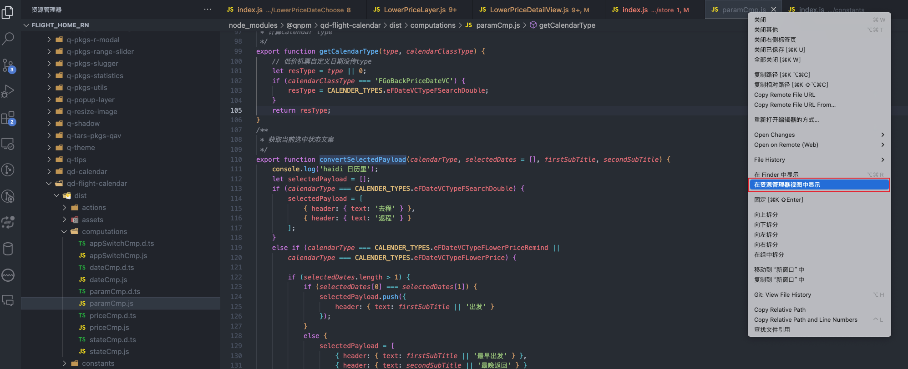
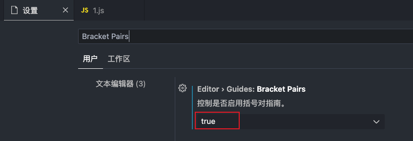
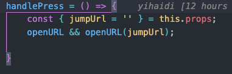

## 插件
### Live Server插件
该插件可以作为一个小型服务器，实时查看所开发网页或项目的效果。（在VSCode按ctrl+s保存后，浏览器页面就会刷新）
### 用VSCode编辑html中的scrip标签内容时，无法识别是js代码，使用快捷键注释添加的还是html的注释：`<!-- -->`。解决方式是禁用 `Jinja`插件，此时js注释恢复为 `//`
### Error Lens插件：可以在代码编辑页面展示报错信息
### Copy Relative Path and Line Numbers插件
`ctrl+l`可以复制光标所在行的代码的路径，复制内容如下：`node_modules/@qnpm/flight-module-search/src/ota/otaPage/views/vendorItem/vendorCard/index.tsx:85`
### Quick create log插件：快速生成console.log()的插件
光标选中需要输出的变量，按快捷键：`command + shift + l`快速生成log。
### 代码截屏插件：Code Snapshot，写ppt挺方便的
使用：`Cmd+Shift+P`，搜索Code Snapshot，选择后在代码栏选择要截取的代码片段，右侧会出现截屏后的图片，点击右侧下方的小圆圈按钮即可报错图片。 
## VSCode软件使用
> 参考：
> [https://juejin.cn/post/7273435446587211812?searchId=20240201103959CF96274424F58B0747CD](https://juejin.cn/post/7273435446587211812?searchId=20240201103959CF96274424F58B0747CD)

### Ctrl + Shift + F（左侧边栏搜索按钮）：在当前项目目录下搜索所有相关文本。
### 设置vscode启动时打开上次编辑的项目：设置->用户->工作台->编辑管理->Reveal If Open(勾选)
### 格式化代码快捷键：
#### win：`shifr+alt+f`，mac：`shift + option + f`。（最好把保存时自动格式化代码关掉，不然在code diff的时候会有很多不是你修改的文件由于格式化代码也被diff）
#### mac只格式化选中代码：`shift + option + command + f`(我修改过的)
#### 自动保存时格式化，也可以设置只格式化修改部分，而不是全部文件。

### 从文件定位到左侧目录位置

### 开启带颜色的缩进线
设置：**Editor → Guides: Bracket Pairs**，选择 true  效果：点击括号时会有连接线提示到括号范围。 
## 写代码
### 在.html文件中输入！可以直接生成一个html页面的框架
