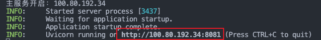
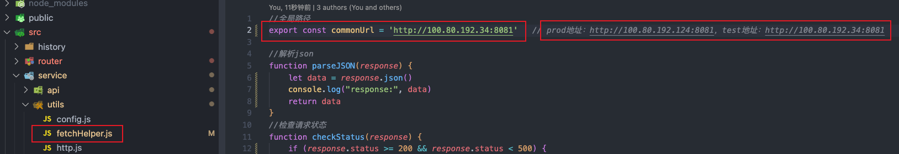
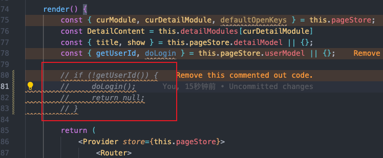
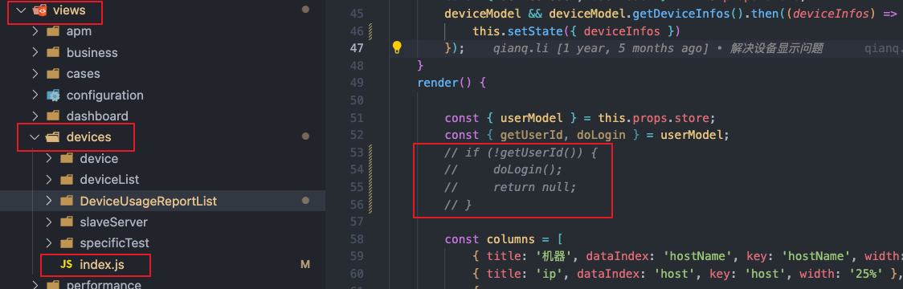

> node版本：12.22.12
> 

### 本地开发需要改url地址。
`TarsLib`工程为后端接口项目，启动项目时可以选择连接的数据库，本地开发时，启动TarsLib后会输出接口url：  在前端项目`tars-management-system`中需要将请求的url做对应修改：src -> service -> utils -> fetchHelper.js文件中修改`commonUrl`变量的值。 
### 注释掉登录代码（开发完成后，再取消掉注释）
src -> App.js -> 80~83行 

如果想要进入 设备管理 -> 查看设备状态页面，需要将如下代码注释：src -> views -> devices -> index.js -> 53～56行 
### 启动项目
终端执行：`npm run start`

## 发布新代码
> 此工程下有master和release两个分支，master分支只有宇哥有权限提交代码，所以就搞了个release分支，所有人都能提，服务器中运行的就是release分支的代码

登录主服务器，把release代码pull下来就可以了。
