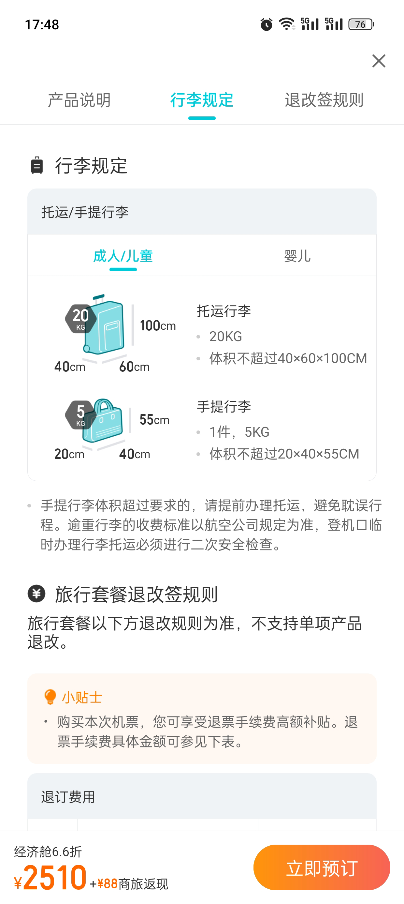
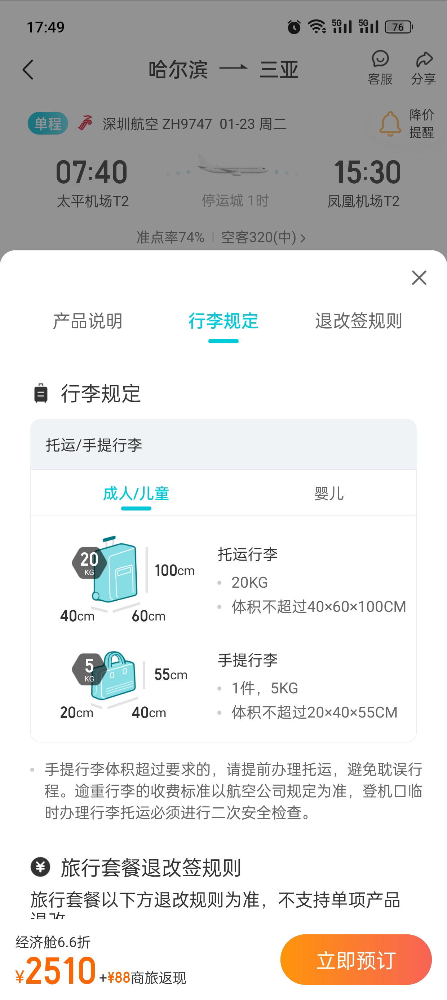

## 组件结构
<br />QGestureFloat组件是在native侧实现的。<br />QGestureFloat手势浮层组件本身是个框架，有全屏和半屏两种样式形式，整体的样式分成了4个部分，分别是：fixedHeader（固定的头部，手势浮窗为全屏幕样式时，头部可以固定住）、header（头部）、content（内容）、footer（底部）。这四个部分的数据和渲染样式的组件通过pageViewList参数传入，如下
```javascript
<QGestureFloat pageViewList={pageViewList}/>

const pageViewList = [
    {
        key: 'page0',
      	fixedHeader: FixedHeaderView,		// 渲染固定的头部的组件
        fixedHeaderData: fixedHeaderData,	// 数据
        header: HeaderView,
        headerData: headerData,
        content: ContentView,
        contentData: contentData,
        footer: FooterView,
        footerData: footerData
    }
];
```
在`QGestureFloat`组件中会根据pageViewList里的数据（如footerData）和组件（如FooterView）渲染相应样式，比如：`<item.footer data={item.footerData}/>`就是使用`FooterView`组件渲染底部样式，`FooterView`组件所需的数据为`footerData`。
```javascript
buildViewListIos() {
    const { pageViewList = [], forbidFullScreen } = this.props;
    if (!pageViewList || pageViewList.length === 0) {
        return [];
    }
    const QGestureFloatPage = forbidFullScreen
        ? QDGestureFloatHalfPage
        : QDGestureFloatPage;
    const viewList = pageViewList.map((item, index) => {
        return (<QGestureFloatPage 
        // @ts-ignore
        style={styles.container} key={index}>
                
                {!forbidFullScreen ? (<QGestureFloatView>
                        {item.fixedHeader ? (<item.fixedHeader data={item.fixedHeaderData}/>) : null}
                    </QGestureFloatView>) : null}

                
                <QGestureFloatView>
                    {item.header ? (<item.header data={item.headerData}/>) : null}
                </QGestureFloatView>

                
                <QGestureFloatView>
                    {item.content ? (<item.content data={item.contentData}/>) : item.tabContents ? (<View>
                            {item.tabContents.map((ContentView, order) => {
            return (<View onLayout={(e) => {
                this.onTabContentSubViewLayout(e, order, item.tabContents.length);
            }} key={order}>
                                        <ContentView data={item.tabContentsData &&
                item.tabContentsData[order]}/>
                                    </View>);
        })}
                        </View>) : null}
                </QGestureFloatView>

                
                {item.footer ? (<QGestureFloatView>
                        <item.footer data={item.footerData}/>
                    </QGestureFloatView>) : null}
            </QGestureFloatPage>);
    });
    return viewList;
}
```
