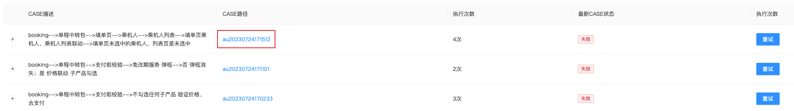

启动`AndroidPlayBack`服务，把`"[http://100.80.192.124:8081/static/autocase/au20230724171101/casedata.txt",](http://100.80.192.124:8081/static/autocase/au20230724171101/casedata.txt",)`中的case路径：au20230724171101替换为想要跑的case的路径。<br />case路径可以在TARS平台查看：<br />
```
{
    "name": "Python: AndroidPlayBack",
    "type": "python",
    "request": "launch",
    "program": "${cwd}/../TarsLib/Tars/tars/cli/custom_launcher.py",
    "console": "integratedTerminal",
    "args": [
        "${cwd}/playLookBackUpon/lookBackUponBusiness/auto_case.air",
        "--device",
        "Android:///",
        "--log",
        "${cwd}/mock",
        "--playbackpath",
        "${cwd}/mock",
        "--playbacksource",
        "app",
        "--playbackbusiz",
        "flight",
        "--playbacktype",
        "4",
        "--playbackkey",
        "",
        "--playbackurl",
        "http://100.80.192.124:8081/static/autocase/au20230724171101/casedata.txt",
        "--assertion",
        "待支付"
    ]
},
```
